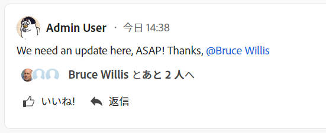
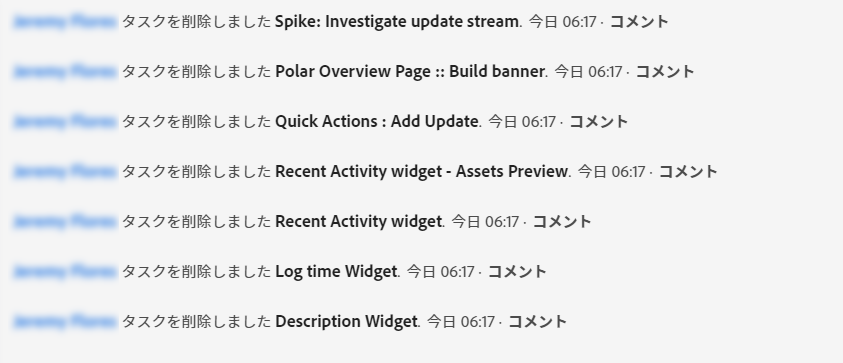

# システムで追跡される更新

このページで強調表示されている情報は、プレビュー環境でのみ使用できます。 <!--and in the Production environment for customers who have opted for the fast release process. For information about fast releases, see [Enable or disable fast releases for your organization](/help/quicksilver/administration-and-setup/set-up-workfront/configure-system-defaults/enable-fast-release-process.md). For information about the current release schedule, see [First Quarter 2024 release overview](/help/quicksilver/product-announcements/product-releases/24-q2-release-activity/24-q2-release-overview.md).-->

<!--remove new experience and legacy notes when we remove legacy in the UI - Jan 24???-->

[!DNL Adobe Workfront] は、オブジェクトの[!UICONTROL 更新]エリアのステータス情報をログに記録することで、特定のオブジェクトに対して行われるアクティビティを記録します。

[!UICONTROL 更新]エリアには、次のタイプの更新が含まれます。

* **ユーザー更新：**&#x200B;ユーザーが手動で入力したもの。コメント、返信、メモとも呼ばれます。

  ユーザーの更新の設定について詳しくは、[ユーザー更新の環境設定の指](../../../administration-and-setup/set-up-workfront/system-tracked-update-feeds/configure-preferences-user-updates.md)を参照してください。

  

* **システム更新：** システムによって自動的に行われたもの。システム更新には、項目に発生した変更の種類を説明する簡単なメモが含まれます。

  システム更新フィードおよびそれらを有効にする方法について詳しくは、[システム更新の設定](../../../administration-and-setup/set-up-workfront/system-tracked-update-feeds/configure-system-updates.md)を参照してください。

  

  <!--
  DRAFTED IN FLARE:
  Timestamps for system updates are based on your operating system's timezone.
  
  -->

## システムで追跡された更新に関する考慮事項

[ 更新 ] 領域を持つすべてのオブジェクトに対して、システムで追跡された更新を利用できるわけではありません。

* [!UICONTROL 更新]エリアは、次のオブジェクトで使用できます。

   * [!UICONTROL プロジェクト]
   * [!UICONTROL タスク]
   * [!UICONTROL イシュー]
   * [!UICONTROL ポートフォリオ]
   * [!UICONTROL プログラム]
   * [!UICONTROL ユーザー]
   * [!UICONTROL テンプレート]
   * [!UICONTROL テンプレート タスク]
   * [!UICONTROL チーム]
   * [!UICONTROL ドキュメント]
   * [!UICONTROL タイムシート]
   * [!UICONTROL ストーリー]

     [!DNL Workfront]では、ストーリーはタスクです。
   * [!UICONTROL 反復]
   * [!UICONTROL 目標]

     [!UICONTROL 目標]エリアにアクセス権するには、追加のライセンスが必要です。詳しくは、[Workfront Goals の使用要件](../../../workfront-goals/goal-management/access-needed-for-wf-goals.md)を参照してください。
   * ボード上の[!UICONTROL カード]

     カードの更新について詳しくは、[ボードでの接続されたカードの使用](../../../agile/get-started-with-boards/connected-cards.md)を参照してください。

* [!DNL Workfront] は、次のオブジェクトのシステム更新を追跡しません。

   * [!UICONTROL チーム]
   * [!UICONTROL テンプレート]
   * [!UICONTROL テンプレート タスク]
   * アドホック[!UICONTROL カード]
   * [!UICONTROL イテレーション]

<!--hiding this bit because this is not true, at this time (August 2023). Users with a Work or Review license can see system updates by default as well.

Your [!DNL Workfront] license determines whether system updates display by default in the [!UICONTROL Updates] area of objects. [!DNL Workfront] users with a [!UICONTROL Plan] license have system updates displayed in the [!UICONTROL Updates] area by default. However, users can filter out system updates, as described in the [Enable or disable system updates](../../../workfront-basics/updating-work-items-and-viewing-updates/update-work.md#enable) section in [Update work](../../../workfront-basics/updating-work-items-and-viewing-updates/update-work.md). All other [!DNL Workfront] licenses filter system updates by default.
-->

* 新しいコメントエクスペリエンスと従来のコメントエクスペリエンスの違いを次に示します。

   * 新しいコメントエクスペリエンスを使用する場合、ユーザーの更新が「コメント」タブに表示され、システムの更新が「システムアクティビティ」に表示されます そして全員 タブ。

     新しいコメントエクスペリエンスについて詳しくは、[新しいコメントエクスペリエンス](../../../product-announcements/betas/new-commenting-experience-beta/unified-commenting-experience.md)を参照してください。

   * 新しいコメント作成機能を使用する場合、システム更新にコメントを追加することはできません。 ただし、従来のコメント作成エクスペリエンスのシステムアクティビティレコードに対する返信は、新しいコメント作成エクスペリエンスの「システムアクティビティ」タブに読み取り専用として入力されます。
   * 従来のコメントエクスペリエンスを使用する場合、システムとユーザーの更新は 1 つの連続したフィードに表示されます。

   * 従来のコメントエクスペリエンスを使用する場合、ユーザーはデフォルトでシステムの更新を表示したり、表示しないように選択したりできます。 新しいコメントエクスペリエンスを使用する場合、システムの更新を無効にすることはできません。

     システム更新の表示を無効にする方法について詳しくは、[作業を更新](../../../workfront-basics/updating-work-items-and-viewing-updates/update-work.md)の記事にある[システムアップデートを有効化または無効化](../../../workfront-basics/updating-work-items-and-viewing-updates/update-work.md#enable)の節を参照してください。

* Workfront は、次のオブジェクトに関するシステムで追跡された更新を記録しますが、これらについては表示を無効にするオプションはありません。

   * [!UICONTROL ポートフォリオ]
   * [!UICONTROL プログラム]
   * [!UICONTROL 反復]

* [!DNL Workfront] 管理者は、[!UICONTROL 更新]エリアでシステムで追跡する必要のある変更の種類を定義できます。[!UICONTROL 更新]エリアを持つすべてのオブジェクトに、設定可能な[!UICONTROL 更新]フィードがあるとは限りません。次のオブジェクトには[!UICONTROL 更新]エリアがあり、システムで追跡された更新フィードを記録しますが、設定可能な更新フィードはありません。

   * [!UICONTROL ドキュメント]
   * [!UICONTROL タイムシート]
   * [!UICONTROL イテレーション]
   * [!UICONTROL 目標]

