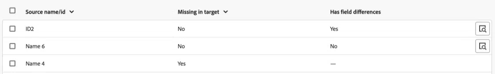

# 環境間でのオブジェクトの比較

環境間でオブジェクトを比較して、環境プロモーションパッケージに必要なオブジェクトが含まれていることを確認できます。

比較する環境とオブジェクトのタイプを選択します。 Workfrontは、両方の環境で選択したタイプのすべてのオブジェクトを比較し、オブジェクトの違いに関するデータを表示します。

## アクセス要件

以下が必要です。

<table>
  <tr>
   <td>Adobe Workfront パッケージ
   </td>
   <td> 
PrimeまたはUltimate

   </td>
  </tr>
  <tr>
   <td><strong>Workfront ライセンス </strong>
   </td>
   <td> 
標準
&gt;
   </td>
  </tr>
   <tr>
   <td>アクセスレベル設定
   </td>
   <td>
Workfront 管理者である必要があります。

   </td>
  </tr>
</table>

詳しくは、[Workfront ドキュメントのアクセス要件](/help/quicksilver/administration-and-setup/add-users/access-levels-and-object-permissions/access-level-requirements-in-documentation.md)を参照してください。

## 前提条件

環境間でオブジェクトを比較するには、Adobe Business Platformを使用している必要があります。

## オブジェクト比較の生成

1. オブジェクトを比較する環境に移動します。
1. Adobe Workfront の右上隅にある&#x200B;**[!UICONTROL メインメニュー]**&#x200B;アイコンをクリックするか、または（使用可能な場合）左上隅にある&#x200B;**[!UICONTROL メインメニュー]**&#x200B;アイコン、「**[!UICONTROL 設定]**」の順にクリックします。
1. 左側のナビゲーションで「**システム**」を選択し、「**環境プロモーション**」を選択します。
1. 画面の右上隅付近にある「**環境を比較**」をクリックします。
1. **Source environment** フィールドで、パッケージを作成する環境を選択します。 これは、オブジェクト **を**&#x200B;からコピーする環境です。
1. **Target環境** フィールドで、パッケージをインストールする環境を選択します。 これは、オブジェクト **を**&#x200B;にコピーする環境です。
1. **比較するオブジェクト**&#x200B;領域で、環境間で比較するオブジェクトタイプを選択します。
1. 画面の右上隅付近にある「**比較を生成**」をクリックします。

   比較オブジェクトの数とサイズによっては、比較の生成に時間がかかる場合があります。

## オブジェクトの比較を表示

比較の生成が完了すると、比較が表示されます。

リストには、ソース環境に存在する選択したタイプのオブジェクト、それらのオブジェクトがターゲット環境に存在しないかどうか、およびそれらの間にフィールドの違いがあるかどうかが含まれます。

>[!BEGINSHADEBOX]

この例では、次のようになります。

* 最初の行は、ターゲット環境に存在するオブジェクトを示していますが、ソース環境とは異なります。
* 2行目は、ターゲット環境に存在し、ソース環境と同じオブジェクトを示します。
* 3行目には、ターゲット環境に存在しないオブジェクトが表示されます。

>[!ENDSHADEBOX]

特定のオブジェクトの違いを表示するには：

1. そのオブジェクトの行の虫眼鏡アイコン をクリックします。

   ウィンドウが開き、そのオブジェクトのすべてのフィールドが表示されます。 違いは赤で示されます。

## オブジェクトの比較からパッケージを作成する

オブジェクトの比較から直接パッケージを作成できます。

手順については、環境プロモーションパッケージの作成または編集の記事の「[&#x200B; オブジェクト比較からパッケージを作成する](/help/quicksilver/administration-and-setup/set-up-workfront/workfront-testing-environments/environment-promotion-create-package.md#create-a-package-from-an-object-comparison)」を参照してください。
