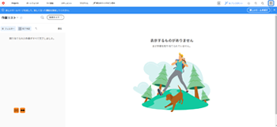

# この [!DNL Adobe Workfront] サンドボックス環境をプレビュー

次の 2 つのテスト環境があります。 [!DNL Workfront] のレプリカ [!DNL Workfront] 実稼動環境：

* プレビューサンドボックス

   プレビューサンドボックスは、ライブ環境のレプリカとして機能するテスト環境で、毎週末に [!DNL Workfront]. ライブ環境に追加されたデータは、金曜日に次の月曜日までにプレビューサンドボックスに表示されます。

   すべてのサポートパッケージは、プレビューサンドボックスにアクセスできます。

* カスタム更新サンドボックス

   カスタム更新サンドボックスは、個別のテスト環境で、手動で更新されます。 カスタム更新サンドボックスを取得するには、追加のコストが必要です。 この環境について詳しくは、 [この [!DNL Adobe Workfront] カスタム更新サンドボックス環境](../../../administration-and-setup/set-up-workfront/workfront-testing-environments/wf-custom-refresh-sandbox-environment.md).

<table style="table-layout:auto"> 
 <col> 
 <col> 
 <col> 
 <thead> 
  <tr> 
   <th> 
 
 </th> 
   <th> 
<strong>[!UICONTROL Standard] サポートパッケージ</strong> 
 </th> 
   <th> 
<strong>[!UICONTROL Plus]、[!UICONTROL Preferred] および [!UICONTROL Enterprise] サポートパッケージ</strong> 
 </th> 
  </tr> 
 </thead> 
 <tbody> 
  <tr> 
   <td scope="col"> 
サンドボックスをプレビュー
 </td> 
   <td scope="col"> 
✔
 </td> 
   <td scope="col"> 
✔
 </td> 
  </tr> 
  <tr> 
   <td scope="col"> 
カスタム更新サンドボックス
 </td> 
   <td scope="col"> 
 
 </td> 
   <td scope="col"> 
✔
 </td> 
  </tr> 
 </tbody> 
</table>

## サンドボックスをプレビュー

プレビューサンドボックスは、組織のユーザーが実稼動環境に影響を与えることなく、実稼動環境のデータを安全にテストし、操作できる環境の役割を果たします。

プレビューサンドボックスには、実際の実稼動データが含まれています。ただし、毎週末に更新されるので、実稼動環境で最大 1 週間遅れるデータを保持できます。 最後の更新時間以降に作成された項目は、次の更新がおこなわれるまで、プレビューサンドボックス環境にあります。

データフローは、実稼動からプレビューに一方向に（逆方向ではなく）流れます。 プレビュー環境の更新は、次の条件で常にスケジュールされます。 [!DNL Workfront] 毎週末。

プレビューサンドボックスでは、 [!DNL Workfront] 新しい機能を実稼動環境にデプロイする前に、安全な環境にデプロイする場合。 新機能をテストし、 [!DNL Workfront] プレビューサンドボックスにアクセスして機能に関するフィードバック。 このため、プレビューサンドボックスのコードは、週に 1 回のデータ更新がおこなわれるものの、実稼動コードよりも常に優先されています。

プレビュー環境は、トレーニングの実行、新機能のテスト、セットアップ機能の決定に最適です。

>[!NOTE]
>
>プレビューサンドボックスにアクセスすると、画面の上部に青いバナーが表示されます。 この環境で作業中は、バナーを削除できません。
>
>アクセスする環境の名前（プレビュー）とコードのリリースバージョンがバナーに表示されます。 クリック **[!UICONTROL 新機能]** 」を参照してください。
>
>

## プレビューサンドボックスへのアクセス

デフォルトでは、 [!DNL Workfront] 管理者、 [!UICONTROL プレビュー] サンドボックス環境。 次にアクセスできない場合： [!UICONTROL プレビュー] この節で説明するサンドボックス環境は、 [!DNL Workfront] 管理者またはカスタマーサポートチームに問い合わせます。

* [からプレビューサンドボックスにアクセスする [!DNL Workfront] インターフェイス](#accessing-the-preview-sandbox-from-the-workfront-interface)
* [URL を使用したプレビューサンドボックスへのアクセス](#accessing-the-preview-sandbox-using-a-url)

### からプレビューサンドボックスにアクセスする [!DNL Workfront] インターフェイス {#accessing-the-preview-sandbox-from-the-workfront-interface}

As a [!DNL Workfront] 管理者は、 [!DNL Workfront] インターフェイス。

プレビューサンドボックスにアクセスするには：

1. 次をクリック： **[!UICONTROL メインメニュー]** アイコン  右上隅に [!DNL Adobe Workfront]を選択し、「 **[!UICONTROL 設定]** .

1. クリック **[!UICONTROL システム]** > **[!UICONTROL 環境設定]**.

1. 内 **[!UICONTROL テスト環境]** セクションで、 **[!UICONTROL サンドボックスプレビュー]**.

1. プレビュー資格情報を使用してログインします。

   プレビューの更新後に実稼動環境で変更した場合を除き、これらは実稼動環境の資格情報と同じにする必要があります。 ログインは、更新が発生した場合にのみ同期されます。 自動的には同期されません。

### URL を使用したプレビューサンドボックスへのアクセス {#accessing-the-preview-sandbox-using-a-url}

* [クラスター 1、2、3、5 のアカウントのプレビューサンドボックスへのアクセス](#accessing-the-preview-sandbox-for-accounts-on-cluster-1-2-3-and-5)
* [クラスター 4 のアカウント（EMEA アカウント）のプレビューサンドボックスへのアクセス](#accessing-the-preview-sandbox-for-accounts-on-cluster-4-emea-accounts)

#### クラスター 1、2、3、5 のアカウントのプレビューサンドボックスへのアクセス {#accessing-the-preview-sandbox-for-accounts-on-cluster-1-2-3-and-5}

プレビューサンドボックスの URL は次のとおりです。 `https://companyname.preview.workfront.com/`.

>[!NOTE]
>
>プレビューサンドボックス用の古い URL にブックマークをリンクしていた場合は、この変更をメモして、ブックマークの URL を更新してください。

URL を使用してプレビューサンドボックスにログインするには：

1. 次の URL に移動します。 `https://companyname.preview.workfront.com/`.

   EMEA のお客様で、お客様のアカウントがクラスター 4 にある場合は、の節を参照してください。 [クラスター 4 のアカウント（EMEA アカウント）のプレビューサンドボックスへのアクセス](#accessing-the-preview-sandbox-for-accounts-on-cluster-4-emea-accounts) 」を参照してください。

1. プレビュー資格情報を使用してログインします。

   プレビューの更新後に実稼動環境で変更した場合を除き、プレビューの資格情報は実稼動環境の資格情報と同じにする必要があります。 ログインは、更新が発生した場合にのみ同期されます。 自動的には同期されません。

#### クラスター 4 のアカウント（EMEA アカウント）のプレビューサンドボックスへのアクセス {#accessing-the-preview-sandbox-for-accounts-on-cluster-4-emea-accounts}

URL を使用してプレビューサンドボックスにログインするには：

1. 次の URL に移動します。 `https://companyname.preview.workfront.com/`.

   また、プレビューサンドボックスには、 [https://cl04.preview.workfront.com/login](https://cl04.preview.workfront.com/login).

1. プレビュー資格情報を使用してログインします。

   プレビューの更新後に実稼動環境で変更した場合を除き、プレビューの資格情報は実稼動環境の資格情報と同じにする必要があります。 ログインは、更新が発生した場合にのみ同期されます。 自動的には同期されません。

## プレビューサンドボックスからの電子メールの受信

Workfrontは、プレビューサンドボックス環境からのすべての電子メール通信を無効にします。 プレビューサンドボックス環境から電子メール通知を受け取る場合は、ユーザー設定でこの機能を有効にする必要があります。 プレビューサンドボックス環境で電子メール通知を有効にする方法について詳しくは、 [プレビューサンドボックス環境からの E メールの配信を有効にする](../../../workfront-basics/using-notifications/enable-delivery-emails-from-preview-sandbox-environment.md).

>[!NOTE]
>
>モバイルアプリのレポート配信とプッシュ通知は、プレビューサンドボックス環境では常に無効になります。 あなたも [!DNL Workfront] 管理者は、プレビューサンドボックス環境にアクセスする際に、モバイルアプリのレポート配信またはプッシュ通知を有効にすることができます。
>
>実稼動環境向けのレポート配信について詳しくは、 [レポート配信の概要](../../../reports-and-dashboards/reports/creating-and-managing-reports/set-up-report-deliveries.md).

## シングルサインオン(SSO)

SSO を使用している場合は、カスタマーサポートチームと協力して、SSO 資格情報を使用してにログインできるように設定が正しく行われていることを確認してください。 [!UICONTROL プレビュー] サンドボックス。 初回ログインに失敗した場合は、通常のサポート担当者または [!DNL Workfront] 管理者に問い合わせてください。

シングルサインオンの詳細については、 [Adobe Workfrontでのシングルサインオンの概要](../../../administration-and-setup/add-users/single-sign-on/sso-in-workfront.md).

## プレビューサンドボックスでのシングルサインオンの設定

>[!IMPORTANT]
>
>このページで説明する手順は、まだ [!DNL Adobe Admin Console]. 組織が [!DNL Adobe Admin Console]に値を指定する場合、アクションは必要ありません。
>
>組織が [!DNL Adobe Admin Console]を参照してください。 [プラットフォームベースの管理上の違い ([!UICONTROL Adobe Workfront]/[!UICONTROL Adobeビジネスプラットフォーム])](../../../administration-and-setup/get-started-wf-administration/actions-in-admin-console.md).

プレビューサンドボックスをシングルサインオンソリューションと連携するように設定する場合は、実稼動環境とは別に設定することで設定できます。 プレビューサンドボックスの SSO 設定は、実稼動環境の SSO 設定とは独立しています。

プレビューサンドボックスが（週末に）更新されると、SSO 情報は実稼動環境からコピーされず、プレビューサンドボックス設定が上書きされます。

プレビューサンドボックスでシングルサインオンを設定する手順は、実稼動環境で設定する手順と似ています。

設定に関する詳細 [!DNL Workfront] SSO を使用する場合は、 [Adobe Workfrontでのシングルサインオンの概要](../../../administration-and-setup/add-users/single-sign-on/sso-in-workfront.md).

## 環境のパフォーマンスと可用性のプレビュー

[!DNL Workfront] プレビュー環境は、パフォーマンスや負荷のテストを目的としていません。 代わりに、これらの環境を使用して、組織の既存のワークフローとの機能を検証します。

[!DNL Workfront] プレビュー環境は、常に使用できるようにすることを目的としています。

の停止 [!DNL Workfront] 通常の営業時間中のプレビュー環境は、実稼動環境での問題が発生した場合は、その問題が解決された直後に優先されます。

の停止 [!DNL Workfront] 週末（土曜日と日曜日）のプレビュー環境に対処し、月曜日の営業時間に対応します。
