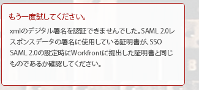

# エラーメッセージ：XML デジタル署名を検証できませんでした

## 問題

ADFS への接続が正常に確立できません。

>[!NOTE]
>
>正常なテスト接続を確立しても問題が発生する場合は、属性マッピングが正しくないか、フェデレーション ID に問題が発生する可能性があります。 ご質問は、カスタマーサポートにお問い合わせください。

## アクセス要件

この記事の手順を実行するには、次のアクセス権が必要です。

<table style="table-layout:auto"> 
 <col> 
 <col> 
 <tbody> 
  <tr> 
   <td role="rowheader">[!DNL Adobe Workfront] 計画</td> 
   <td>任意</td> 
  </tr> 
  <tr> 
   <td role="rowheader">[!DNL Adobe Workfront] ライセンス</td> 
   <td>計画</td> 
  </tr> 
  <tr> 
   <td role="rowheader">アクセスレベル設定</td> 
   <td> 
次の条件を満たす必要があります。 [!DNL Workfront] 管理者。 詳しくは、 <a href="../../administration-and-setup/add-users/configure-and-grant-access/grant-a-user-full-administrative-access.md" class="MCXref xref">ユーザーに完全な管理アクセス権を付与する</a>.
 
<b>注意</b>:まだアクセス権がない場合は、 [!DNL Workfront] 管理者（アクセスレベルに追加の制限を設定している場合） を参照してください。 [!DNL Workfront] 管理者はアクセスレベルを変更できます。詳しくは、 <a href="../../administration-and-setup/add-users/configure-and-grant-access/create-modify-access-levels.md" class="MCXref xref">カスタムアクセスレベルの作成または変更</a>.
 </td> 
  </tr> 
 </tbody> 
</table>

## 原因 1:証明書が正しくありません

### 解決策

ADFS サーバーから手動で署名証明書を取得します。

1. In [!DNL Windows]をクリックし、 **[!UICONTROL 開始]** > **[!UICONTROL 管理]** > **[!UICONTROL ADFS 2.0 管理]**.\
   [ADFS 2.0 管理 ] ダイアログボックスが表示されます。

1. 選択 **[!UICONTROL 信頼関係]** > **[!UICONTROL 証明書利用者信託]** をクリックします。

1. 右クリック **[!UICONTROL 証明書利用者信頼]**&#x200B;を選択し、 **[!UICONTROL プロパティ]**.

1. をクリックします。 **[!UICONTROL 署名]** タブをクリックします。
1. 署名証明書の名前をクリックし、 **[!UICONTROL 表示]**.
1. コピー先をクリックします。 **[!UICONTROL ファイル]**...」、「 **[!UICONTROL 次へ]**.

1. 選択 **[!UICONTROL Base-64 エンコード済み x.509(CER)]**&#x200B;をクリックし、 **[!UICONTROL 次へ]**.

1. ファイル名を指定し、 **[!UICONTROL 次へ]**.
1. クリック **[!UICONTROL 完了]**.
1. In [!DNL Adobe Workfront]に移動します。 **[!UICONTROL 設定]** > **[!UICONTROL システム]** > **[!UICONTROL シングルサインオン (SSO)]** 署名証明書を手動でアップロードします。

## 原因 2:証明書は、DSA を使用して署名されます。 [!DNL Workfront] は RSA 署名を期待しています

### 解決策

証明書を再作成し、DSA の代わりに RSA 署名を使用します。

## 原因 3:XML データが正しくありません

### 解決策

ADFS 管理システムから XML メタデータを再書き出しおよび再読み込みします。

## 原因 4:SAML 側でのエラーが原因で、リクエストを実行できませんでした

### 解決策

SAML プロバイダーに問い合わせてください。
