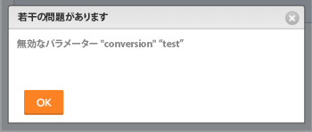

# エラーメッセージ：無効なパラメータ：コンバージョン値

## 問題

既存のカスタムフォームでカスタムフィールドの形式を変更しようとすると、次のエラーメッセージが表示されます。&quot;無効なパラメータ：コンバージョン値&quot;&lt;...>&quot;&quot;\

## 原因

このメッセージは、次のシナリオで発生します。

例えば、テキスト形式のカスタムフィールドがあるとします。  次に、カスタムフィールドの形式を通貨に変更します。 任意の場所に [!DNL Adobe Workfront] インスタンス、このフィールドは既にオブジェクトにアタッチされており、既にオブジェクトに指定されている情報を持ちます。 少なくとも 1 つのフィールドの既存の情報は、既にテキスト形式で書式設定されています。 したがって、フィールドの形式を通貨に変更することはできません。

<table style="table-layout:auto"> 
 <col> 
 <col> 
 <tbody> 
  <tr> 
   <td role="rowheader"> 
<a href="https://www.workfront.com/plans" target="_blank">[!DNL Workfront] 計画</a>*
 </td> 
   <td>任意</td> 
  </tr> 
  <tr> 
   <td role="rowheader"> 
<a href="../../administration-and-setup/add-users/access-levels-and-object-permissions/wf-licenses.md" class="MCXref xref">Adobe [!DNL Workfront] ライセンスの概要</a>*
 </td> 
   <td>計画</td> 
  </tr> 
  <tr data-mc-conditions=""> 
   <td role="rowheader"><strong>アクセスレベル*</strong> </td> 
   <td> 
次へのアクセスを編集：
 
    <ul> 
     <li> 
レポート、ダッシュボードおよびカレンダーの作成
 </li> 
     <li> 
フィルター、ビュー、グループの作成
 </li> 
    </ul> 
<b>注意</b>:まだアクセス権がない場合は、 [!DNL Workfront] 管理者（アクセスレベルに追加の制限を設定している場合） を参照してください。 [!DNL Workfront] 管理者は、 <a href="../../administration-and-setup/add-users/configure-and-grant-access/create-modify-access-levels.md" class="MCXref xref">カスタムアクセスレベルの作成または変更</a>.
 </td> 
  </tr> 
 </tbody> 
</table>

## 解決策

次の操作を実行します。

1. このフィールドがカスタムFormsに関連付けられている可能性のあるすべてのオブジェクトのレポートを作成します。\
   レポートの作成について詳しくは、 [カスタムレポートの作成](../../reports-and-dashboards/reports/creating-and-managing-reports/create-custom-report.md).

1. 編集しようとしているカスタムフィールドをレポートのビューに含めて、このフィールドにテキスト値が入力されているオブジェクトを確認できます。
1. テキスト形式で表示されるオブジェクトのカスタムフィールド値を修正し、通貨形式の値を指定します。次に、カスタムフォームの「形式」フィールドをもう一度変更しようとします。\
   または\
   既にテキスト形式の情報が入力されているフィールド値が多すぎる場合は、新しいカスタムフィールドをカスタムフォームに追加して通貨形式にすることを検討してください。
