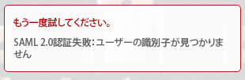

# エラーメッセージ：SAML 2.0 エラー：ユーザー識別子が見つかりません

## 問題

ADFS への接続が正常に確立できません。

>[!NOTE]
>
>正常なテスト接続を確立しても問題が発生する場合は、属性マッピングが正しくないか、連合 ID に問題が発生する可能性があります。ご質問は、カスタマーサポートにお問い合わせください。

## 原因：

ADFS サーバーの要求が正しくありません

## アクセス要件

この記事の手順を実行するには、次のアクセス権が必要です。

<table style="table-layout:auto"> 
 <col> 
 <col> 
 <tbody> 
  <tr> 
   <td role="rowheader">[!DNL Adobe Workfront] プラン</td> 
   <td>任意</td> 
  </tr> 
  <tr> 
   <td role="rowheader">[!DNL Adobe Workfront] ライセンス</td> 
   <td>プラン</td> 
  </tr> 
  <tr> 
   <td role="rowheader">アクセスレベル設定</td> 
   <td> 
[!DNL Workfront] 管理者である必要があります。詳しくは、<a href="../../administration-and-setup/add-users/configure-and-grant-access/grant-a-user-full-administrative-access.md" class="MCXref xref">ユーザーに完全な管理アクセス権を付与</a>を参照してください。
 
<b>メモ</b>：まだアクセス権がない場合は、アクセスレベルに追加の制限が設定されていないかどうか [!DNL Workfront] 管理者にお問い合わせください。[!DNL Workfront] 管理者がアクセスレベルを変更する方法について詳しくは、<a href="../../administration-and-setup/add-users/configure-and-grant-access/create-modify-access-levels.md" class="MCXref xref">カスタムアクセスレベルの作成または変更</a>を参照してください。
 </td> 
  </tr> 
 </tbody> 
</table>

## ソリューション

ADFS サーバーで、名前 ID の要求があることを確認します。

1. Windows の場合、**[!UICONTROL 開始]**／**[!UICONTROL 管理]**／**[!UICONTROL ADFS 2.0 管理]**&#x200B;をクリックします。\
   ADFS 2.0 管理ダイアログボックスが表示されます。

1. 左側のペインで&#x200B;**[!UICONTROL 信頼関係]**／**[!UICONTROL 証明書利用者の信頼]**&#x200B;を選択します。

1. Adobe Workfront に関連する証明書利用者の信頼を右クリックし、「**[!UICONTROL 要求ルールを編集]**」を選択します。
1. 要求に&#x200B;**[!UICONTROL 名前 ID]** の&#x200B;**[!UICONTROL 送信する要求のタイプ]**&#x200B;があることを確認します。

