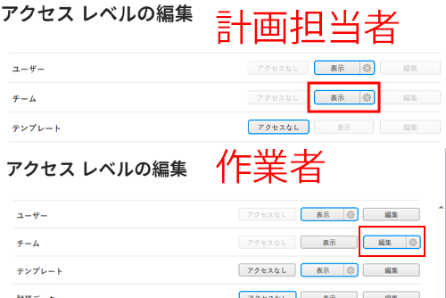
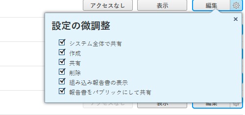

# グループ管理者は、管理しているグループ管理者よりも高いアクセス権を持っている必要があります

グループ管理者が、管理するアクセスレベルよりも低いアクセスレベルの権限を持っている場合、低いアクセスレベルの表示、変更、割り当てを行うことはできません。

## 問題

グループ管理者にチームの表示権限を持つ変更済 Planner アクセス・レベルが割り当てられているが、特定のユーザーにチームの編集権限を持つ Worker アクセス・レベルが割り当てられている場合、グループ管理者は変更済 Worker アクセス・レベルを操作できません。

>[!NOTE]
>
>このロジックは、「設定を微調整」ドロップダウンメニューにも適用されます。 両方のアクセスレベルに編集アクセス権を持つことができますが、設定を微調整ドロップダウンメニューの設定は、グループ管理者にとってより高い値にする必要があります。
> 

## 解決策

グループ管理者は、管理している権限よりもアクセスレベルのすべての領域に対して、高い権限を持つ必要があります。