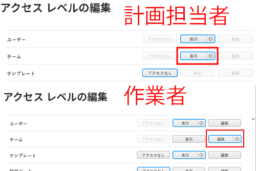
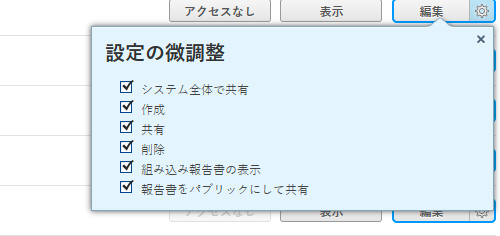

# グループ管理者には管理対象のユーザーより高いアクセス権が必要

グループ管理者が管理するアクセスレベルよりも低い権限を持っている場合、低いアクセスレベルを表示、変更、割り当てることはできません。

## 問題

チームの表示権限を持つ変更済みのプランナーアクセスレベルがグループ管理者に割り当てられており、チームの編集権限を持つ作業者アクセスレベルが特定のユーザーに割り当てられている場合、グループ管理者は変更済みの作業者アクセスレベルを操作できません。

>[!NOTE]
>
>このロジックは、設定の微調整ドロップダウンメニューにも適用されます。両方のアクセスレベルで編集アクセス権を持つことができますが、グループ管理者の場合は、設定の微調整ドロップダウンメニューの設定を高くする必要があります。
> 

## ソリューション

グループ管理者には、アクセスレベルのすべての領域において、管理対象のユーザーよりも高い権限が必要です。
