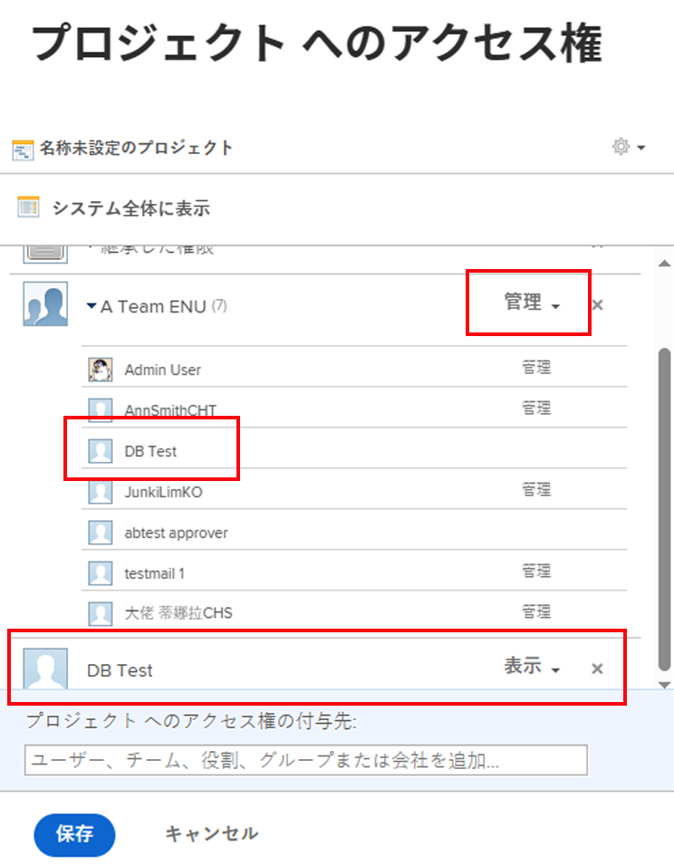

# 共有で複数の権限が表示されました

## 質問

共有ウィンドウには、1 人のユーザーに対する 2 つの異なる権限が表示されます。 どれが使用されていますか？

## 回答

ユーザーは、共有画面に表示される最も高い権限を持っています。 権限の詳細については、「 [オブジェクトに対する共有権限の概要](../../workfront-basics/grant-and-request-access-to-objects/sharing-permissions-on-objects-overview.md).

