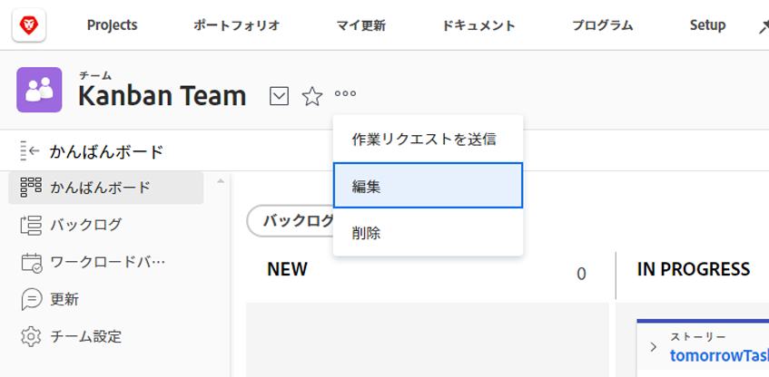
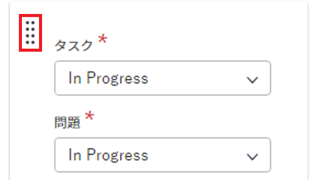
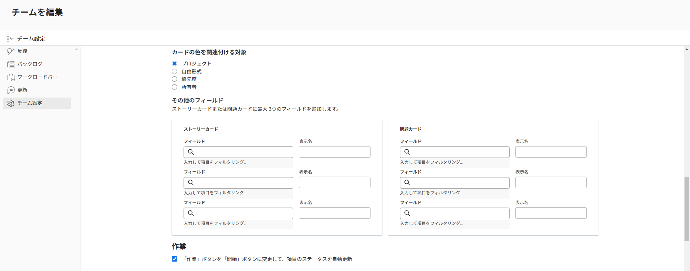
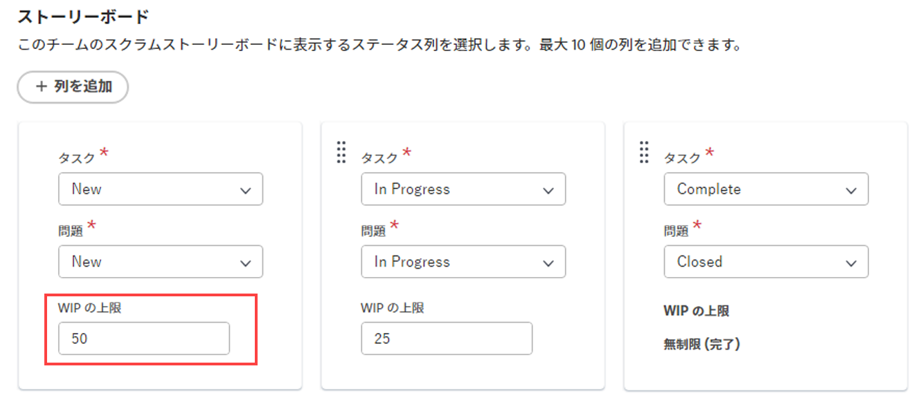

# 設定 [!UICONTROL かんばん]

でアジャイルチームを作成できます。 [!DNL Adobe Workfront] の説明に従って、 [アジャイルチームの作成](../../agile/get-started-with-agile-in-workfront/create-an-agile-team.md). 機敏なチームを作成する際に、チームが作業を完了するために使用する方法を選択できます。 次のオプションから選択できます。

* スクラム
* カンバン

この記事では、かんばんチームの設定を構成する方法について説明します。 アジャイルチームを作成し、かんばん手法を選択した後、この記事を参照して次の設定を更新できます。

* ストーリーをポイント単位で推定するか、時間単位で推定するか
* アジャイルストーリーボードのステータス列
* アジャイルストーリーボード上のストーリーカードに表示する追加のフィールド
* 進行中 (WIP) の制限
* バックログからストーリーを自動的に追加する方法
* かんばんボードにカードが残る期間

Scrum チームの設定について詳しくは、 [スクラムの設定](../get-started-with-agile-in-workfront/configure-scrum.md).

## アクセス要件

この記事の手順を実行するには、次のアクセス権が必要です。

<table style="table-layout:auto"> 
 <col> 
 </col> 
 <col> 
 </col> 
 <tbody> 
  <tr> 
   <td role="rowheader">[!DNL Adobe Workfront] plan*</td> 
   <td> 
任意
 </td> 
  </tr>

<tr> 
   <td role="rowheader">[!DNL Adobe Workfront] ライセンス*</td> 
   <td> 
新規： [!UICONTROL Standard]
 
   または
   
現在： [!UICONTROL Work] 以降
 </td> 
  </tr>

<tr> 
   <td role="rowheader">アクセスレベル</td> 
   <td> 
チームへのアクセスを編集
  </td> 
  </tr>

</tbody> 
</table>

*お持ちのプランやライセンスの種類を確認するには、 [!DNL Workfront] 管理者。

## ストーリーをポイント単位または時間単位で見積もるかどうかを設定します

ポイントまたは時間を使用して、ストーリーの推定を設定できます。

ストーリーをアジャイルチームに対して評価する方法を設定するには：

{{step1-to-team}}

1. 次をクリック： **[!UICONTROL チームの切り替え]** アイコン をクリックし、ドロップダウンメニューから新しいチームを選択するか、検索ボックスでチームを検索します。
1. 管理するアジャイルチームを選択します。
1. 次をクリック： **[!UICONTROL その他]** メニュー  を選択し、「 **[!UICONTROL 編集]**.

   

1. Adobe Analytics の **[!UICONTROL アジャイル]** セクション内の **[!UICONTROL でストーリーを推定]** 領域で、ストーリーのサイズ（作業負荷）の見積もりにポイントまたは時間を使用するかどうかを選択します。 [ ポイント ] を選択した場合は、1 ポイントに等しい時間数を指定します。 （デフォルトは 1 ポイント= 8 時間です）。 これは、ストーリーに追加される予定時間数です。

   **例：** ストーリーをポイント単位で推定し、1 ポイントが 8 時間に等しく、ストーリーが 3 ポイントで推定される場合は、24 時間の予定時間がストーリーに追加されます。

1. 「**[!UICONTROL 変更を保存]**」をクリックします。

## アジャイルストーリーボードのステータス列の設定

ストーリーボードに存在するステータスを定義して、アジャイルチームに適用できます。 これらは、ストーリーボードに表示される唯一のステータスです。

アジャイルチームに関連付けられたストーリーボードで使用できるステータスを定義するには、次の手順を実行します。

{{step1-to-team}}

1. 次をクリック： **[!UICONTROL チームの切り替え]** アイコン をクリックし、ドロップダウンメニューから新しいチームを選択するか、検索バーでチームを検索します。

1. 管理するアジャイルチームを選択します。
1. 次をクリック： **[!UICONTROL その他]** メニューから、「 **[!UICONTROL 編集]**.

   

1. Adobe Analytics の **[!UICONTROL アジャイル]** セクションで、 **[!UICONTROL ストーリーボード]** 領域。

1. （オプション）「 **[!UICONTROL 列を追加]** をクリックして、ストーリーボードにステータス列を追加します。
1. （オプション）ドラッグ&amp;ドロップのインジケーターを使用してステータス列をドラッグし、ストーリーボード上のステータス列を並べ替えます。 最初の列は移動できません。また、最初の列の前に別の列をドラッグすることはできません。

   

1. タスクのステータスを選択します。

   >[!IMPORTANT]
   >
   >選択できるのは、ロックされたシステム全体のステータスのみです。 グループ固有のステータスは選択できません。 最初の列のステータスは、常に **[!UICONTROL 新規]**.

   カスタムステータスは、 [!DNL Workfront] 管理者が設定しました。 詳しくは、 [ステータスの作成または編集](../../administration-and-setup/customize-workfront/creating-custom-status-and-priority-labels/create-or-edit-a-status.md).

1. 「**[!UICONTROL 変更を保存]**」をクリックします。

## アジャイルストーリーボード上のストーリーカードに表示する追加のフィールドを設定します

ストーリーカードにフィールドを追加すると、フィールドは表示のみで、フィールドに値が入力された場合にのみ表示されます。

デフォルトでは、次のタイプのデータがタスクおよびタスクのストーリーカードに表示されます。

* タスクまたはイシューへの直接リンクを含むストーリー名
* プロジェクトに直接リンクされたプロジェクト名
* このリンクはストーリーに対してのみ表示され、サブタスクには表示されません
* タスクまたは問題の説明
* 現在のコミットメント
* 完了率を表示および編集するには、完了率自体を調整するか、完了したポイント数または時間数を調整します
* 割り当てられたユーザー

追加のデータ（カスタムデータを含む）をストーリーカードに表示できます。 ストーリーカードに追加のフィールドを表示する理由はいくつでもあります。 例えば、複数の顧客のストーリーを繰り返し処理する場合には顧客 ID を表示したい場合や、プロジェクトの開始日またはプロジェクトの完了日を表示したい場合があります。

>[!NOTE]
>
>ストーリーカードでカスタムフィールドを使用する場合、名前にピリオド（ドット）を含めることはできません。

アジャイルチームに割り当てられたストーリーカードを設定して、追加のフィールドを表示するには、次の手順を実行します。

{{step1-to-team}}

1. 次をクリック： **[!UICONTROL チームの切り替え]** アイコン をクリックし、ドロップダウンメニューから新しいチームを選択するか、検索バーでチームを検索します。

1. 管理するアジャイルチームを選択します。
1. 次をクリック： **[!UICONTROL その他]** メニューから、「 **[!UICONTROL 編集]**.\

   

1. Adobe Analytics の **[!UICONTROL アジャイル]** 「 」セクションで、検索するフィールド名を入力します。

   

1. 追加するフィールドの名前を選択します。
1. 次を入力します。 **[!UICONTROL 表示名]** ストーリーまたはイシューカードに表示するフィールドの代わりに使用します。
1. 「**[!UICONTROL 変更を保存]**」をクリックします。

## 進行中 (WIP) の制限を設定

かんばんチームの WIP 限度を定義する場合、チームが現在作業中の品目の数を制御するには、カンバンチームに表示できるタスクの数を制限します [!UICONTROL 新規] または [!UICONTROL 処理中] 列 [!UICONTROL かんばん] ボード。

かんばんチームに対して WIP 制限を設定した後、WIP 制限を表示し、次の場所から更新できます。 [!UICONTROL かんばん] アジャイルストーリーボード ( [WIP の上限に対する進行中の作業 (WIP) を管理 [!UICONTROL かんばん] ボード](../../agile/use-kanban-in-an-agile-team/work-in-progress-limit-on-the-kanban-board.md).

カンバン・チームの WIP を制限する手順は、次のとおりです。

{{step1-to-team}}

1. 次をクリック： **[!UICONTROL チームの切り替え]** アイコン をクリックし、ドロップダウンメニューから新しいチームを選択するか、検索バーでチームを検索します。

1. 管理するかんばんチームを選択します。
1. 次をクリック： **[!UICONTROL その他]** メニュー を選択し、「 **[!UICONTROL 編集]**.

   

1. Adobe Analytics の **[!UICONTROL アジャイル]** セクション内の **[!UICONTROL 方法]** 「 」セクションで、かんばんが選択されていることを確認します。

1. Adobe Analytics の **[!UICONTROL ストーリーボード]** セクション内の **[!UICONTROL WIP 制限]** フィールドで、 [!UICONTROL かんばん] アジャイルストーリーボード。 各列に異なる制限を設定できます。 各列に設定できる最大値は 100 です。\
   設定すると、WIP 制限により、 [!UICONTROL かんばん] ストーリーボード上の任意の列の制限を超えたときは常に、アジャイルストーリーボードを使用できます。 この警告メッセージは、WIP の上限を初めて超えたときにのみ表示されます。 この警告メッセージは、ステータスがと等しい列には表示されません。 [!UICONTROL 完了].\
   WIP 制限は単に視覚的な警告であり、設定した制限よりも 1 つの列に複数の品目が含まれることをチームに制限するものではありません。

   

1. 「**変更を保存**」をクリックします。

## バックログからストーリーを自動的に追加する設定

<!-- this functionality needs to be verified-->

バックログのストーリーが [!UICONTROL かんばん] 項目がその列から移動された直後のボード。

{{step1-to-team}}

1. 次をクリック： **[!UICONTROL チームの切り替え]** アイコン をクリックし、ドロップダウンメニューから新しいチームを選択するか、検索バーでチームを検索します。

1. 管理するかんばんチームを選択します。
1. 次をクリック： **[!UICONTROL その他]** メニュー を選択し、「 **[!UICONTROL 編集]**.

   

1. 選択 **[!UICONTROL バックログから次のストーリーを自動的に追加]** バックログから次の品目を自動的に **[!UICONTROL 新規]** 列 ( 項目が **[!UICONTROL 処理中]** 列。

   ユーザーは、 **バックログを表示** の設定 [!UICONTROL かんばん] この機能が有効になるためのボード。 ユーザーが [!UICONTROL バックログを表示] の設定 [!UICONTROL かんばんボード]に設定されている場合、次の機能が実行されます。

   ストーリーが [!UICONTROL 処理中] ストーリーボードの柱に柱を作り、その柱は [!UICONTROL 完了] ステータス ( または [!UICONTROL 完了]) の場合、「バックログ」列のストーリーは、 [!UICONTROL 新規] 列 [!UICONTROL かんばんボード].
バックログから追加すると、優先度が最も高いストーリーがストーリーボードに追加されます。

1. 「**[!UICONTROL 変更を保存]**」をクリックします。

## カードが常に表示される時間の設定 [!UICONTROL かんばん] ボード

完了したカードがに残る期間を選択できます [!UICONTROL かんばん] ボード。 次に該当するタスク [!UICONTROL かんばん] ボードは、元のプロジェクトで引き続きアクセスできます。

{{step1-to-team}}

1. （オプション） **[!UICONTROL チームの切り替え]** アイコン 」をクリックし、ドロップダウンメニューから新しいかんばんチームを選択するか、検索バーでチームを検索します。
1. かんばんチームを選択します。
1. 次をクリック： **[!UICONTROL その他]** メニュー  を選択し、「 **[!UICONTROL 編集]**.

   

1. Adobe Analytics の **[!UICONTROL 完了したカードがかんばんボードに残る日数]** ドロップダウンメニューから、値を選択します。

   1 ～ 30 日の数値を選択できます。
1. 「**[!UICONTROL 変更を保存]**」をクリックします。
