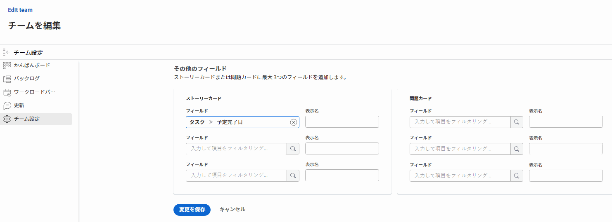

# [!UICONTROL スクラム]の設定

でアジャイルチームを作成できます。 [!DNL Adobe Workfront] の説明に従って、 [アジャイルチームの作成](/help/quicksilver/agile/get-started-with-agile-in-workfront/create-an-agile-team.md). 機敏なチームを作成する際に、チームが作業を完了するために使用する方法を選択できます。 次のオプションから選択できます。

* スクラム
* かんばん

この記事では、スクラムチームの設定を行う方法について説明します。 アジャイルチームを作成し、スクラム手法を選択した後、この記事を参照して、次の設定を更新できます。

* ストーリーをポイント単位で推定するか、時間単位で推定するか
* 繰り返しとプロジェクトのアジャイルストーリーボードのステータス列
* アジャイルストーリーボード上のストーリーカードに表示する追加のフィールド
* アジャイルストーリーボード上のストーリーにカラーインジケーターを使用する方法
* 作業項目を反復に追加する際の日付の適用方法

かんばんチームの構成の詳細は、「 [かんばんの構成](/help/quicksilver/agile/get-started-with-agile-in-workfront/configure-kanban.md).

## アクセス要件

この記事の手順を実行するには、次のアクセス権が必要です。

<table style="table-layout:auto"> 
 <col> 
 </col> 
 <col> 
 </col> 
 <tbody> 
  <tr> 
   <td role="rowheader">[!DNL Adobe Workfront] プラン*</td> 
   <td> 
任意
 </td> 
  </tr>

<tr> 
   <td role="rowheader">[!DNL Adobe Workfront] ライセンス*</td> 
   <td> 
新規： [!UICONTROL Standard]
 
   または
   
現在： [!UICONTROL Work] 以降
 </td> 
  </tr>

<tr> 
   <td role="rowheader">アクセスレベル</td> 
   <td> 
チームへのアクセスを編集
  </td> 
  </tr>

</tbody> 
</table>

*ご利用のプランやライセンスタイプを確認するには、[!DNL Workfront] 管理者にお問い合わせください。

## ストーリーをポイント単位で見積もるか、時間単位で見積もるかを設定

>[!NOTE]
>
>チームに現在進行中のイテレーションがある場合、この設定は変更できません。

ポイントまたは時間のいずれかを使用してストーリーを見積もるように設定できます。

アジャイルチーム向けにストーリーを見積もる方法を設定するには、次の手順を実行します。

1. [!UICONTROL Workfront] の右上隅にある&#x200B;**[!UICONTROL メインメニュー]**&#x200B;アイコン 、**[!UICONTROL チーム]**&#x200B;の順にクリック。

1. **[!UICONTROL チームを切り替え]**&#x200B;アイコンをクリックし、ドロップダウンメニューから新しいチームを選択するか、検索バーでチームを検索します。
1. 管理するアジャイルチームを選択します。
1. **[!UICONTROL 詳細]**&#x200B;メニューをクリックして、「**[!UICONTROL 編集]**」を選択します。

   このオプションは、[!UICONTROL プラン]または[!UICONTROL ワーク]ライセンスを持つチームメンバーのみに表示されます。\
   

1. **[!UICONTROL アジャイル]**&#x200B;セクションの&#x200B;**[!UICONTROL ストーリーを見積もり]**&#x200B;エリアで、ストーリーのサイズ（作業負荷）の見積もりにポイントと時間を使用するかどうかを選択します。ポイントを選択した場合は、1 ポイントが何時間に相当するかを指定します。（デフォルトは 1 ポイント= 8 時間です。）これは、ストーリーに追加される予定時間数です。

   **例：**&#x200B;ストーリーをポイント単位で見積もることを選択し、1 ポイントが 8 時間に相当し、ストーリーが 3 ポイントと見積もられる場合、24 予定時間数がストーリーに追加されます。

1. 「**[!UICONTROL 変更を保存]**」をクリックします。

## アジャイルストーリーボードでステータス列を設定

チームに割り当てられたすべてのイテレーションまたは特定のプロジェクトに対して、アジャイルストーリーボードに表示される列を設定できます。

* [イテレーションのステータス列を設定](#configure-status-columns-for-iterations)
* [プロジェクトのステータス列を設定](#configure-status-columns-for-projects)

### イテレーションのステータス列を設定 {#configure-status-columns-for-iterations}

アジャイルチームのストーリーボードに存在するステータスを定義できます。ストーリーボードに表示されるステータスはこれらのみです。

アジャイルチームに関連付けられたストーリーボードで使用できるステータスを定義するには、次の手順を実行します。

1. [!DNL Workfront] の右上隅にある&#x200B;**[!UICONTROL メインメニュー]**&#x200B;アイコン 、**[!UICONTROL チーム]**&#x200B;の順にクリックします。

1. **[!UICONTROL チームの切り替え]**&#x200B;アイコン  をクリックし、さらにドロップダウンメニューから新しいチームを選択するか、検索バーでチームを検索します。

1. 管理するアジャイルチームを選択します。
1. **[!UICONTROL 詳細]**&#x200B;メニューをクリックして、「**[!UICONTROL 編集]**」を選択します。

   このオプションは、[!UICONTROL プラン]または[!UICONTROL ワーク]ライセンスを持つチームメンバーのみに表示されます。

   

1. 「**[!UICONTROL アジャイル]**」セクションで、**[!UICONTROL ストーリーボード]**&#x200B;エリアを見つけます。

1. （オプション）「**[!UICONTROL 列を追加]**」をクリックして、ストーリーボードにステータス列を追加します。
1. （オプション）ドラッグ＆ドロップインジケーターを使用してステータス列をドラッグし、ストーリーボード上のステータス列の順序を変更します。最初の列は移動できません。また、最初の列の前に別の列をドラッグすることもできません。

   

1. タスクとイシューの両方のステータスを選択します。タスクのステータスは、ストーリーボード上の各列の列タイトルとして表示されます。選択したイシューのステータスはタスクのステータスにマップされます。つまり、イシューをストーリーボードの別の列に移動すると、イシューのステータスは、ストーリーボード上の列の名前（タスクのステータスを反映する）ではなく、ここに表示されているイシューのステータスに変更されます。

   >[!IMPORTANT]
   >
   >選択できるのは、ロックされたシステム全体のステータスのみです。グループ固有のステータスを選択することはできません。また、最初の列のステータスは常に、**[!UICONTROL 新規]**&#x200B;に該当します。

   [!DNL Workfront] 管理者がカスタムステータスを設定している場合は、カスタムステータスを追加できます。カスタムステータスは、[ステータスの作成または編集](../../administration-and-setup/customize-workfront/creating-custom-status-and-priority-labels/create-or-edit-a-status.md)で説明されているように設定できます。

   >[!NOTE]
   >
   >イシューのステータスを選択すると、3 列目のデフォルトは常に[!UICONTROL クローズ]になります。3 つ以上の列がある場合は、適切なステータスを反映するように列を手動で更新してください。

1. 「**[!UICONTROL 変更を保存]**」をクリックします。

### プロジェクトのステータス列を設定 {#configure-status-columns-for-projects}

プロジェクトのステータス列を設定する方法については、[ [!DNL Adobe Workfront]](../../reports-and-dashboards/reports/reporting-elements/create-edit-views.md) でビューを作成または編集の記事の、[[!UICONTROL アジャイル]ビューを作成またはカスタマイズ](../../reports-and-dashboards/reports/reporting-elements/create-edit-views.md#customizing-an-agile-view)の節を参照してください。

## アジャイルストーリーボードでストーリーカードに表示する追加のフィールドを設定

フィールドをストーリーカードに追加すると、フィールドは表示専用となり、フィールドにデータが入力されている場合にのみ表示されます。

デフォルトでは、次のタイプのデータが、タスクとイシューのストーリーカードに表示されます。

* タスクまたはイシューへの直接リンクを含むストーリー名
* プロジェクトへの直接リンクを含むプロジェクト名
* このリンクはストーリーに対してのみ表示され、サブタスクには表示されません
* タスクまたはイシューの説明
* 現在のコミットメント
* 完了率を表示および編集するには、完了率自体を調整するか、完了したポイント数または時間数を調整します
* 割り当てられたユーザー

追加のデータ（カスタムデータを含む）をストーリーカードに表示できます。様々な理由で、ストーリーカードに追加のフィールドを表示することが必要になる場合があります。例えば、複数の顧客のストーリーを繰り返し処理する場合には顧客 ID を表示したり、プロジェクトの開始日やプロジェクトの完了日を表示したりすることができます。

>[!NOTE]
>
>ストーリーカードでカスタムフィールドを使用する場合、名前にピリオドやドットを含めることはできません。

アジャイルチームに割り当てられたストーリーカードを設定して、追加のフィールドを表示するには、次の手順を実行します。

1. [!UICONTROL Workfront] の右上隅にある&#x200B;**[!UICONTROL メインメニュー]**&#x200B;アイコン  をクリックし、「**[!UICONTROL チーム]**」をクリックします。

1. **[!UICONTROL チームの切り替え]**&#x200B;アイコン  をクリックし、ドロップダウンメニューから新しいチームを選択するか、検索バーでチームを検索します。

1. 管理するアジャイルチームを選択します。
1. **[!UICONTROL 詳細]**&#x200B;メニューをクリックして、「**[!UICONTROL 編集]**」を選択します。\
   このオプションは、[!UICONTROL プラン]または[!UICONTROL ワーク]ライセンスを持つチームメンバーのみに表示されます。

   

1. **[!UICONTROL アジャイル]**&#x200B;セクションで、フィールド名を入力してフィールドを確認します。

   

1. 追加するフィールドの名前を選択します。
1. ストーリーまたはイシューカードに表示するフィールドの&#x200B;**[!UICONTROL 表示名]**&#x200B;を入力します。
1. 「**[!UICONTROL 変更を保存]**」をクリックします。

## アジャイルストーリーボードのストーリーにカラーインジケーターを使用する方法を設定する

デフォルトでは、アジャイルイテレーションでのストーリーボードタイルは、ストーリーが関連付けられているプロジェクトに応じて色分けされます。各プロジェクトのカラーは、ストーリーボード上で無作為に割り当てられます。このデフォルトの動作は、アジャイルチームごとに変更できます。アジャイルストーリーのカラーは、ストーリーの優先度、所有者などに関連付けることができます。

アジャイルチームのストーリーにカラーを割り当てる方法の動作を変更するには、次の手順を実行します。

1. [!DNL Workfront] の右上隅にある&#x200B;**[!UICONTROL メインメニュー]**&#x200B;アイコン  をクリックし、次に「**[!UICONTROL チーム]**」をクリックします。

1. **[!UICONTROL チームの切り替え]**&#x200B;アイコン  をクリックし、さらにドロップダウンメニューから新しいチームを選択するか、検索バーでチームを検索します。

1. 管理するアジャイルチームを選択します。
1. **[!UICONTROL 詳細]**&#x200B;メニューをクリックして、「**[!UICONTROL 編集]**」を選択します。

   このオプションは、[!UICONTROL プラン]または[!UICONTROL ワーク]ライセンスを持つチームメンバーのみに表示されます。

   

1. 「[!UICONTROL アジャイル]」セクションの [!UICONTROL カードのカラーの関連付け先]エリアで、次のオプションから選択します。

   * **[!UICONTROL プロジェクト]**：ストーリーが結び付けられるプロジェクトにカラーが関連付けられます。[アジャイルストーリーの作成](/help/quicksilver/agile/work-in-an-agile-environment/create-an-agile-story.md)で説明されているように、ストーリーを作成する際は、プロジェクトに関連付ける必要があります。同じプロジェクトのすべてのタスクが同じカラーで表示されます。
   * **[!UICONTROL フリーフォーム]**：[[!UICONTROL スクラムボードの]ストーリーをカラーで分類](/help/quicksilver/agile/use-scrum-in-an-agile-team//scrum-board/categorize-stories-by-color.md)で説明されているように、ユーザーが手動でカラーを変更するまで、すべてのカードはデフォルトで青色で表示されます。
   * **[!UICONTROL 優先度]**：次のように、ストーリーの優先度にカラーが関連付けられます。

      * 高 = 赤色
      * 中 = 黄色
      * 低 = 緑色

        お客様の [!DNL Workfront] システムのカスタム優先度をシステム管理者が設定している場合、最も高いのは赤色、2 番目に高いのは黄色、3 番目に高いのは緑色になります。
   * **[!UICONTROL タスク所有者]**：同じ主担当者を持つストーリーはすべて同じカラーです。主担当者は、最初にタスクに割り当てられたユーザーです。

1. 「**[!UICONTROL 変更を保存]**」をクリックします。

## 作業アイテムをイテレーションに追加するときに日付を適用する方法を設定

デフォルトでは、スクラムイテレーションに作業アイテムを追加すると、作業アイテムの予定開始日と予定完了日がイテレーションの開始日と終了日と一致するように変更されます。チームのすべての作業アイテムで元の日付を保持することを選択できます。

1. [!DNL Adobe]Workfront の右上隅にある&#x200B;**[!UICONTROL メインメニュー]**&#x200B;アイコン、**[!UICONTROL チーム]**&#x200B;の順にクリックします。
1. （オプション）**[!UICONTROL チームの切り替え]**&#x200B;アイコン  をクリックし、ドロップダウンメニューから新しいスクラムチームを選択するか、検索バーでチームを検索します。
1. **[!UICONTROL 詳細]**&#x200B;メニューをクリックして、「**[!UICONTROL 編集]**」を選択します。\
   このオプションは、[!UICONTROL プラン]または[!UICONTROL ワーク]ライセンスを持つチームメンバーのみに表示されます。
1. 「[!UICONTROL アジャイル]」セクションの[!UICONTROL 作業アイテムがイテレーションに追加されるとき]エリアで、次のオプションから選択します。

   * **[!UICONTROL イテレーションの開始日と終了日に一致するように予定開始日と予定完了日を変更]**：作業項目がイテレーションに追加されると、作業項目の日付がイテレーションの日付に変更されます。

     日付の変更方法の詳細については、[既存のイテレーションへのストーリーの追加](../../agile/use-scrum-in-an-agile-team/iterations/add-stories-to-existing-iteration.md)の記事の、[ストーリーの追加がタスクの日付に与える影響について](../../agile/use-scrum-in-an-agile-team/iterations/add-stories-to-existing-iteration.md#understa)の節を参照してください。
   * **[!UICONTROL イテレーションの開始日と終了日に一致するように予定開始日と予定完了日を変更しない]**：作業項目がイテレーションに追加されると、作業項目は元の日付を保持します。

   日付オプションを変更した場合、既にイテレーション中の作業アイテムの日付は調整されません。

   これらのオプションは、チームが互いのイテレーションに作業アイテムを割り当てる日付に影響を与える可能性があります。例えば、A チームは作業アイテムの日付をイテレーション日付に変更しますが、B チームは作業アイテムの日付を変更しません。B チームが A チームのイテレーションに作業アイテムを割り当てると、作業アイテムの日付が変更されます。ただし、A チームが B チームのイテレーションに作業アイテムを割り当てた場合、日付は変更されません。

1. 「**[!UICONTROL 変更を保存]**」をクリックします。
