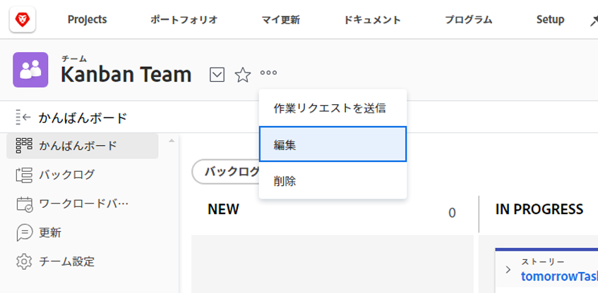

# アジャイルチームの作成

<!--Audited: 01/2024-->

[!DNL Adobe Workfront] アジャイルチームは、漸進的かつ組織的な方法で作業を完了できます。

組織内のすべてのユーザーがアジャイルチームを表示し、バックログ、イテレーション、ストーリーボード、個々のストーリーなど、チームのすべてのアジャイルコンポーネントを表示できます。ただし、[!UICONTROL 編集]アクセス権があるチームのメンバーだけが、チームに割り当てられた作業を変更することができます。

[!DNL Workfront] は、以下のアジャイル手法をサポートしています。

* **[!UICONTROL スクラム]**：チームには、完了する必要がある作業のバックログがあります。チームが特定の量の作業に取り組む準備ができると、その作業はバックログからイテレーションに移動されます。スクラムチームの管理について詳しくは、[アジャイルチームのスクラム](../../agile/use-scrum-in-an-agile-team/scrum-in-an-agile-team.md)参照してください。

* **[!UICONTROL かんばん]：** チームは、カンバンビューで事前に設定されたステータス間で作業を移動します。デフォルトのステータスは、バックログ、処理中、完了です。かんばんチームの管理について詳しくは、[アジャイルチームのかんばん](../../agile/use-kanban-in-an-agile-team/using-kanban-in-an-agile-team.md)を参照してください。

## アクセス要件

この記事の手順を実行するには、次のアクセス権が必要です。

<table style="table-layout:auto"> 
 <col> 
 </col> 
 <col> 
 </col> 
 <tbody> 
  <tr> 
   <td role="rowheader"><strong>[!DNL Adobe Workfront] プラン*</strong></td> 
   <td> 
任意
 </td> 
  </tr> 
  <tr> 
   <td role="rowheader"><strong>[!DNL Adobe Workfront] ライセンス*</strong></td> 
   <td> 
新規：標準

   現在： 
   <ul><li>
[!UICONTROL プラン ] を使用して新しいアジャイルチームを作成
</li> 
   <li>
[!UICONTROL Work] 以降：チームをアジャイルチームに変換する場合
</li></ul> </td> 
  </tr> 
 </tbody> 
</table>

&#42;ご利用のプランやライセンスのタイプを確認するには、[!DNL Workfront] 管理者に連絡してください。

## アジャイル方法論の決定

アジャイルチームには、スクラムアジャイル方法論、またはかんばんアジャイル方法論を使用できます。それぞれの方法論には様々なメリットがあります。アジャイルチームの作業方法によって、選択して使用するアジャイル方法論が決まります。

[!DNL Workfront] のスクラムアジャイル方法論とかんばんアジャイル方法論の両方を使用すると、ストーリーボード上でストーリーを移動して、ストーリーのステータスの変更と進行状況を示すことができます。

[!DNL Workfront] のスクラムアジャイル方法論とかんばんアジャイル方法論は、以下のように異なります。

### [!DNL Workfront] でかんばんを使用するメリット

[!DNL Workfront] で [!DNL Kanban] アジャイル方法論 を使用すると、処理中の作業量を制限しながら、アジャイルストーリーボード全体でストーリーをより簡単に移動できるようになります。[!DNL Kanban] アジャイル方法論を使用する際に、開始日と終了日は設定されません。

以下の機能が、この方法論をサポートします。

* [!DNL Kanban] アジャイルストーリーボードにバックログを表示。\
   詳しくは、[バックログを[!UICONTROL かんばん]ボードに追加](../../agile/use-kanban-in-an-agile-team/view-the-backlog-on-the-kanban-board.md)を参照してください。

* 他の項目が完了に等しいステータスに移動された場合に、バックログの項目が自動的に[!UICONTROL かんばん]アジャイルストーリーボードに追加されるように設定します。\
   詳しくは、[かんばんを設定](../../agile/get-started-with-agile-in-workfront/configure-kanban.md)の記事にある[バックログから自動的に追加されるようにストーリーを設定](../../agile/get-started-with-agile-in-workfront/configure-kanban.md#configur5)の節を参照してください。

* [!UICONTROL かんばん]アジャイルストーリーボードに表示されるように作業中（WIP）制限を設定します。\
   詳しくは、[かんばんボードでの作業中（WIP）の制限を管理](../../agile/use-kanban-in-an-agile-team/work-in-progress-limit-on-the-kanban-board.md)を参照してください。

### [!DNL Workfront] でスクラムを使用するメリット

[!DNL Workfront] のスクラムアジャイル方法論は、一連のストーリーをアジャイルイテレーションに追加し、そのイテレーション用のストーリーボードを作成します。イテレーションは、定義した開始日と終了日に基づくものです。

以下の機能が、この方法論をサポートします。

* [!UICONTROL スクラム]ストーリーボードにイシューを含めます。
* アジャイルチームのバックログに関するイシューを含める
* サブタスクは、[!UICONTROL スクラム]ストーリーボードに表示可能
* バーンダウンチャートを表示して、イテレーション中のストーリーに対する進行状況を確認します\
   詳しくは、[アジャイルバーンダウンチャートの概要](../../agile/use-scrum-in-an-agile-team/burndown/burndown-chart-overview.md)を参照してください。

## アジャイルチームの作成

{{step1-to-team}}

1. 次をクリック： **[!UICONTROL チームの切り替え]** アイコン を選択し、次に **[!UICONTROL 新しいチームを作成]**.

   

   [ 新しいチーム ] ボックスが表示されます。

1. 次の情報を指定します。

   <table style="table-layout:auto"> 
    <col> 
    <col> 
    <tbody> 
     <tr> 
      <td role="rowheader"><strong>[!UICONTROL Team Name]</strong> </td> 
      <td>新しいアジャイルチームの名前を入力します。</td> 
     </tr> 
     <tr> 
      <td role="rowheader"><strong>[!UICONTROL This is an Agile Team]</strong> </td> 
      <td>この新しいチームをアジャイルチームに設定するには、このオプションを選択します。</td> 
     </tr>

   <tr> 
      <td role="rowheader"><strong>[!UICONTROL Is Active]</strong> </td> 
      <td>このチームを有効化するには、このオプションを選択します。 非アクティブなチームは、他のユーザーが作業に割り当てる際には表示されません。 </td> 
     </tr>

   <tr data-mc-conditions="QuicksilverOrClassic.Quicksilver"> 
      <td role="rowheader"><strong>[!UICONTROL Group]</strong> </td> 
      <td> 
チームに追加するグループの名前を入力し、ドロップダウンリストに表示されたら、名前を選択します。
 
<b>メモ</b>
 
 チームがグループまたはサブグループに割り当てられると、そのグループまたはサブグループのグループ管理者は、チームのメンバーにならずにチームを管理できます。 管理するグループに割り当てられているすべてのチームのリストを表示するには、グループ管理者は、[!UICONTROL Main Menu] から [!UICONTROL Teams] 領域に移動し、[!UICONTROL Switch Teams] 矢印  をクリックできます。
 </td> 
     </tr> 
     <tr> 
      <td role="rowheader"><strong>[!UICONTROL Team Members]</strong> </td> 
      <td>チームに参加するユーザーの名前の入力を開始し、ドロップダウンリストに表示されたら、名前を選択します。 複数のユーザーをチームに追加するには、このプロセスを繰り返します。 ユーザーは複数のチームに参加できるので、アジャイルチームと非アジャイルチームの両方に参加できます。</td> 
     </tr> 
     <tr> 
      <td role="rowheader"><strong>[!UICONTROL Description]</strong> </td> 
      <td>
チームの説明を入力します。
 
チームを選択すると、[!UICONTROL Teams] 領域の右上に説明が表示されます。

      
説明が長い場合は、クリックすると完全な説明がポップアップで表示されます。[!UICONTROL team settings] を編集するアクセス権がある場合は、ポップアップで直接説明を編集することもできます。
</td>
     </tr> 
    </tbody> 
   </table>

1. 「**[!UICONTROL 作成]**」をクリックします。

   アジャイルチームの設定について詳しくは、次の記事を参照してください。

   * [[!UICONTROL かんばん]の設定](../../agile/get-started-with-agile-in-workfront/configure-kanban.md)
   * [[!UICONTROL スクラム]の設定](../../agile/get-started-with-agile-in-workfront/configure-scrum.md)

## 既存のチームからアジャイルチームへの変換

既存のチームをアジャイルチームに変換できます。

1. [!DNL Adobe Workfront] の右上隅にある&#x200B;**[!UICONTROL メインメニュー]**&#x200B;アイコン 、「**[!UICONTROL ボード]**」の順にクリックします。
1. **[!UICONTROL チームの切り替え]**&#x200B;アイコン  をクリックし、ドロップダウンメニューから新しいチームを選択するか、検索バーでチームを検索します。

1. アジャイルチームに変換するチームを選択します。
1. **[!UICONTROL 詳細]**&#x200B;メニューをクリックして、「**[!UICONTROL 編集]**」を選択します。\
   このオプションは、[!UICONTROL Plan] または [!UICONTROL Work] ライセンスを持つチームメンバーのみに表示されます。\
   

1. **[!UICONTROL アジャイル]**&#x200B;セクションで、「**[!UICONTROL アジャイルチームです]**」を選択します。

1. **[!UICONTROL 方法論]**&#x200B;セクションで、チームが&#x200B;**[!UICONTROL スクラム]**&#x200B;アジャイル方法論を使用するか&#x200B;**[!UICONTROL カンバン]**&#x200B;アジャイル方法論を使用するかを選択します。

1. 「**変更を保存**」をクリックします。

   チームはアジャイルチームとして保存されます。 チームの編集時に、新しいチームをスクラムまたはかんばんチームとして設定できます。

   詳しくは、次の記事を参照してください。

   * [[!UICONTROL かんばん]の設定](../../agile/get-started-with-agile-in-workfront/configure-kanban.md)
   * [[!UICONTROL スクラム]の設定](../../agile/get-started-with-agile-in-workfront/configure-scrum.md)
