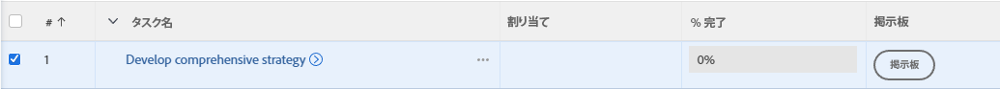
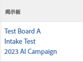

# 既存のタスクまたはイシューを [!DNL Adobe Workfront] ボードまたはワークストリームに追加

>[!IMPORTANT]
>
>ワークストリームは、特定の顧客グループのみが使用できます。

任意のタスクまたはイシューを、リスト表示やレポート表示、またはオブジェクトの詳細から [!DNL Adobe Workfront] のボードもしくはワークストリームに追加できます。

## アクセス要件

この記事の手順を実行するには、次のアクセス権が必要です。

<table style="table-layout:auto">
 <col>
 <col>
 <tbody>
  <tr>
   <td role="rowheader"><strong>[!DNL Adobe Workfront] プラン*</strong></td>
   <td> 
任意
 </td>
  </tr>
  <tr>
   <td role="rowheader"><strong>[!DNL Adobe Workfront] ライセンス*</strong></td>
   <td> 
[!UICONTROL Work] 以上
 </td>
  </tr>
  <tr>
   <td role="rowheader"><strong>オブジェクト権限</strong></td>
   <td> 
タスクまたはイシューに対する[!UICONTROL View]以上の権限
 
追加のアクセス権のリクエストについて詳しくは、<a href="/help/quicksilver/workfront-basics/grant-and-request-access-to-objects/request-access.md" class="MCXref xref">オブジェクトへのアクセス権のリクエスト</a>を参照してください。
 </td>
  </tr>
 </tbody>
</table>

&#42;ご利用のプラン、ライセンスタイプ、アクセス権を確認するには、[!DNL Workfront] 管理者にお問い合わせください。

## リストのボードまたはワークストリームに既存のタスクまたはイシューを追加

1. [!DNL Adobe Workfront] の右上隅にある&#x200B;**[!UICONTROL メインメニュー]**&#x200B;アイコン  をクリックします。
1. **[!UICONTROL プロジェクト]**、**[!UICONTROL レポート]**&#x200B;または&#x200B;**[!UICONTROL ダッシュボード]**&#x200B;のいずれかを選択します。
1. ボードまたはワークストリームに追加するタスクまたはイシューが含まれるプロジェクト、レポート、またはダッシュボードに移動します。
1. 1 つ以上のタスクまたはイシューを選択します。

   サブタスクを選択すると、そのサブタスクはボード上にカードとしても追加されます。

1. [!UICONTROL **その他**]／[!UICONTROL **ボードに追加**]&#x200B;または&#x200B;[!UICONTROL **ワークストリームに追加**]&#x200B;をクリックします。
1. [!UICONTROL 追加先]ダイアログボックスで、項目を追加するボードまたはワークストリームを選択します。

   ボードの場合は、スタンドアロンボードのみが使用可能で、ワークストリームの一部であるボードは使用できません。

1. 「[!UICONTROL **追加**]」をクリックします。

   ボードの場合：タスクまたはイシューはカードとしてボードに追加されます。 ボードにステータス用の列ポリシーが適用されている場合、そのステータスに対応する列にカードが追加されます。それ以外の場合は、左側の最初の列に表示され、取り込み列は含まれません。

   列のポリシーについて詳しくは、[ボード列を管理](/help/quicksilver/agile/get-started-with-boards/manage-board-columns.md)を参照してください。

   ワークストリームの場合：タスクまたはイシューは、予定外のカードとしてワークストリームのカードリストに追加されます。

## オブジェクトの詳細からボードまたはワークストリームに既存のタスクまたはイシューを追加

1. [!DNL Adobe Workfront] の右上隅にある&#x200B;**[!UICONTROL メインメニュー]**&#x200B;アイコン  をクリックします。
1. [!UICONTROL **プロジェクト**]&#x200B;をクリックし、プロジェクトの名前をクリックして開きます。
1. 左パネルの「[!UICONTROL **タスク**]」または「[!UICONTROL **イシュー**]」をクリックします。
1. ボードまたはワークストリームに追加するタスク、サブタスク、またはイシューをクリックします。
1. オブジェクト名の横にある&#x200B;**[!UICONTROL その他]**&#x200B;メニューをクリックし、[!UICONTROL **ボードに追加**]&#x200B;または [!UICONTROL **ワークストリームに追加**]&#x200B;を選択します。
1. [!UICONTROL 追加先]ダイアログボックスで、項目を追加するボードまたはワークストリームを選択します。

   ボードの場合は、スタンドアロンボードのみが使用可能で、ワークストリームの一部であるボードは使用できません。

1. 「[!UICONTROL **追加**]」をクリックします。

   ボードの場合：タスクまたはイシューはカードとしてボードに追加されます。 ボードにステータス用の列ポリシーが適用されている場合、そのステータスに対応する列にカードが追加されます。それ以外の場合は、左側の最初の列に表示され、取り込み列は含まれません。

   列のポリシーについて詳しくは、[ボード列を管理](/help/quicksilver/agile/get-started-with-boards/manage-board-columns.md)を参照してください。

   ワークストリームの場合：タスクまたはイシューは、予定外のカードとしてワークストリームのカードリストに追加されます。

## リストのタスクまたはイシューに関連するボードを表示

1. ボード情報を表示するタスクまたはイシューが含まれるプロジェクト、レポート、またはダッシュボードに移動します。
1. 「ボード」列を含むビューを選択するか、「ボード」列を含む新しいビューを作成します。
ビューについて詳しくは、[Adobe Workfront でビューを作成または編集](/help/quicksilver/reports-and-dashboards/reports/reporting-elements/create-edit-views.md)を参照してください。
1. 列の&#x200B;[!UICONTROL **表示**]&#x200B;をクリックし、タスクまたはイシューがオンになっているボードのリストを表示します。

   

1. ボード名をクリックして、ボード上の接続されたタスクまたはイシューを開きます。

   
