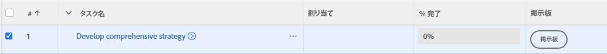
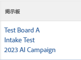

# 既存のタスクまたは問題を[!DNL Workfront] ボードに追加

>[!IMPORTANT]
>
>ワークストリームは、特定の顧客グループのみが使用できます。

任意のタスクまたはイシューを、リスト表示やレポート表示、またはオブジェクトの詳細から [!DNL Adobe Workfront] のボードもしくはワークストリームに追加できます。

## アクセス要件

+++ 展開すると、この記事の機能のアクセス要件が表示されます。

<table style="table-layout:auto">
 <col>
 <col>
 <tbody>
  <tr>
   <td role="rowheader">Adobe Workfront パッケージ</td>
   <td> 
任意
 </td>
  </tr>
  <tr>
   <td role="rowheader">Adobe Workfront プラン</td>
   <td>
   
標準
 
   
Work またはそれ以上

   </td>
  </tr>
  <tr>
   <td role="rowheader">オブジェクト権限</td>
   <td>タスクまたは問題に対する表示権限またはそれ以上の権限 </td>
  </tr>
 </tbody>
</table>

詳しくは、[Workfront ドキュメントのアクセス要件](/help/quicksilver/administration-and-setup/add-users/access-levels-and-object-permissions/access-level-requirements-in-documentation.md)を参照してください。

+++

## リストのボードまたはワークストリームに既存のタスクまたはイシューを追加

{{step1-click-main-menu}}

1. 次のいずれかを選択します：**[!UICONTROL プロジェクト]**、**[!UICONTROL レポート]**、または&#x200B;**[!UICONTROL ダッシュボード]**。
1. ボードまたはワークストリームに追加するタスクまたはイシューが含まれるプロジェクト、レポート、またはダッシュボードに移動します。
1. 1 つ以上のタスクまたはイシューを選択します。

   サブタスクを選択すると、ボード上にカードとしても追加されます。

1. [!UICONTROL **その他**]／[!UICONTROL **ボードに追加**]&#x200B;または&#x200B;[!UICONTROL **ワークストリームに追加**]&#x200B;をクリックします。
1. [!UICONTROL 追加先]ダイアログボックスで、項目を追加するボードまたはワークストリームを選択します。

   ボードの場合は、スタンドアロンボードのみが使用可能で、ワークストリームの一部であるボードは使用できません。

1. 「[!UICONTROL **追加**]」をクリックします。

   ボードの場合：タスクまたはイシューがカードとしてボードに追加されます。 ボードにステータス用の列ポリシーが適用されている場合、そのステータスに対応する列にカードが追加されます。 それ以外の場合は、左側の最初の列に表示され、取り込み列は含まれません。

   列のポリシーについて詳しくは、[ボード列を管理](/help/quicksilver/agile/get-started-with-boards/manage-board-columns.md)を参照してください。

   ワークストリームの場合：タスクまたはイシューは、予定外のカードとしてワークストリームのカードリストに追加されます。

## オブジェクトの詳細からボードまたはワークストリームに既存のタスクまたはイシューを追加

{{step1-click-main-menu}}

1. [!UICONTROL **プロジェクト**]&#x200B;をクリックし、プロジェクトの名前をクリックして開きます。
1. 左パネルの「[!UICONTROL **タスク**]」または「[!UICONTROL **イシュー**]」をクリックします。
1. ボードまたはワークストリームに追加するタスク、サブタスクまたはイシューをクリックします。
1. オブジェクト名の横にある&#x200B;**[!UICONTROL その他]**&#x200B;メニューをクリックし、[!UICONTROL **ボードに追加**]&#x200B;または [!UICONTROL **ワークストリームに追加**]&#x200B;を選択します。
1. [!UICONTROL 追加先]ダイアログボックスで、項目を追加するボードまたはワークストリームを選択します。

   ボードの場合は、スタンドアロンボードのみが使用可能で、ワークストリームの一部であるボードは使用できません。

1. 「[!UICONTROL **追加**]」をクリックします。

   ボードの場合：タスクまたはイシューがカードとしてボードに追加されます。 ボードにステータス用の列ポリシーが適用されている場合、そのステータスに対応する列にカードが追加されます。 それ以外の場合は、左側の最初の列に表示され、取り込み列は含まれません。

   列のポリシーについて詳しくは、[ボード列を管理](/help/quicksilver/agile/get-started-with-boards/manage-board-columns.md)を参照してください。

   ワークストリームの場合：タスクまたはイシューは、予定外のカードとしてワークストリームのカードリストに追加されます。

## リストのタスクまたはイシューに関連するボードを表示

1. ボード情報を表示するタスクまたはイシューが含まれるプロジェクト、レポート、またはダッシュボードに移動します。
1. 「ボード」列を含むビューを選択するか、「ボード」列を含む新しいビューを作成します。
ビューについて詳しくは、[Adobe Workfront でビューを作成または編集](/help/quicksilver/reports-and-dashboards/reports/reporting-elements/create-edit-views.md)を参照してください。
1. 列の&#x200B;[!UICONTROL **表示**]&#x200B;をクリックし、タスクまたはイシューがオンになっているボードのリストを表示します。

   

1. ボード名をクリックして、ボード上の接続されたタスクまたはイシューを開きます。

   
