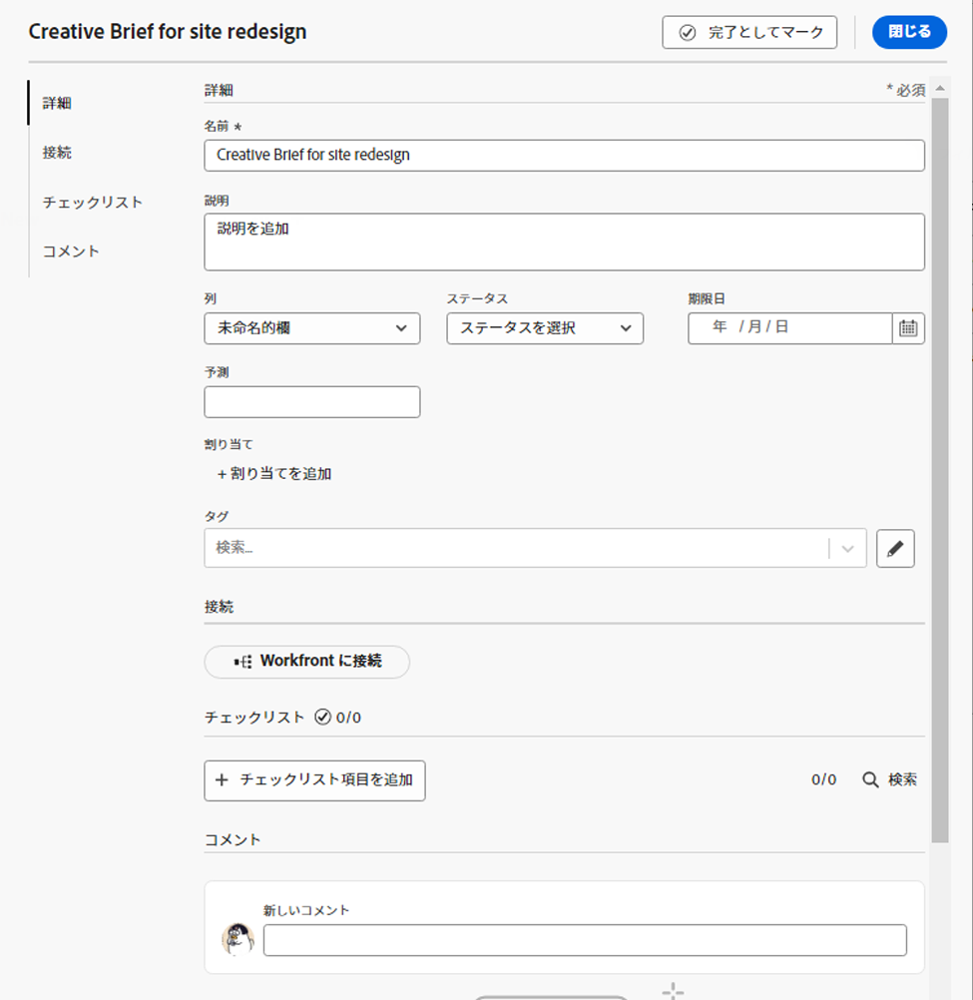

# ボードへのアドホックカードの追加

カードをボードにすばやく追加して、ボード上のメンバーに割り当てることができます。カードは、タスク、イシュー、ユーザー、グループまたはボードに含める任意のタイプのアイテムを表すことができます。

>[!NOTE]
>
>ボード上のアドホックカードは、[!DNL Adobe Workfront] の作業アイテムには接続されません。接続されたカードについて詳しくは、[ボードでの接続されたカードの使用](/help/quicksilver/agile/get-started-with-boards/connected-cards.md)を参照してください。

## アクセス要件

この記事の手順を実行するには、次のアクセス権が必要です。

<table style="table-layout:auto"> 
 <col> 
 </col> 
 <col> 
 </col> 
 <tbody> 
  <tr> 
   <td role="rowheader"><strong>[!DNL Adobe Workfront] プラン*</strong></td> 
   <td> 
任意
 </td> 
  </tr> 
  <tr> 
   <td role="rowheader"><strong>[!DNL Adobe Workfront] ライセンス*</strong></td> 
   <td> 
[!UICONTROL Request] 以降
 </td> 
  </tr> 
 </tbody> 
</table>

&#42;ご利用のプラン、ライセンスタイプ、アクセスを確認するには、[!DNL Workfront] 管理者にお問い合わせください。

## 詳細を含んだアドホックカードの追加

アドホックカードは [!DNL Adobe Workfront] の作業アイテムには接続されていません。

1. [!DNL Adobe] Workfront の右上隅の&#x200B;**[!UICONTROL メインメニュー]**&#x200B;アイコン  をクリックしたあと、「**[!UICONTROL ボード]**」をクリックします。
1. ボードにアクセスします。詳しくは、[ボードの作成または編集](../../agile/get-started-with-boards/create-edit-board.md)を参照してください。
1. **[!UICONTROL カードを追加]／[!UICONTROL 新規カード]**&#x200B;をクリックします。

   The [!UICONTROL カードの詳細] 」ボックスが表示されます。

   >[!NOTE]
   >
   >「名前」フィールドの外側をクリックすると、アドホックカードは自動的に左端の列の下部に「名称未設定」として保存されます。 カードを保存せずに終了するには、 [!UICONTROL **キャンセル**] 内の他の場所をクリックせずに [!UICONTROL カードの詳細] ボックス。

1. **[!UICONTROL カードの詳細]**&#x200B;ボックスに、以下の情報を追加します。

   <table style="table-layout:auto"> 
    <col> 
    <col> 
    <tbody> 
     <tr> 
      <td role="rowheader"><strong>[!UICONTROL Name]</strong> </td> 
      <td>カードの名前。</td> 
     </tr> 
     <tr> 
      <td role="rowheader"><strong>[!UICONTROL Description]</strong> </td> 
      <td>カードの説明。説明に URL を追加すると、カードの保存時にクリック可能なリンクになります。</td>
     </tr>
     <tr> 
      <td role="rowheader"><strong>[!UICONTROL Column]</strong> </td> 
      <td>カードの列を選択します。「<strong>[!UICONTROL Column]</strong>」フィールドを空のままにすると、カードはボードの左側の最初の列に配置されます。</td>
     </tr>
     <tr> 
      <td role="rowheader"><strong>[!UICONTROL Status]</strong> </td> 
      <td>カードのステータスを選択します。カードの上部にある「<strong>[!UICONTROL Mark Complete]</strong>」をクリックすると、ステータスが自動的に「[!UICONTROL Complete]」に変わります。</td> 
     </tr>
     <tr> 
      <td role="rowheader"><strong>[!UICONTROL Due date]</strong></td> 
      <td>カードの期限を選択します。 </td>
     </tr>
     <tr> 
      <td role="rowheader"><strong>[!UICONTROL Estimation]</strong></td> 
      <td>カードが完了するまでの推定時間数を入力します。これは手動のエントリのみです。</td>
     </tr>
     <tr> 
      <td role="rowheader"><strong>[!UICONTROL 割り当て ]</strong> </td> 
      <td>カードを割り当てるには、 <strong>[!UICONTROL 割り当てを追加 ]</strong> 検索フィールドに名前を入力し始めます。 次に、結果のリストに表示される場合に選択します。 個人とチームの両方を追加し、1 つのカードに複数のユーザーまたはチームを割り当てることができます。</td>
     </tr>     
     <tr> 
      <td role="rowheader"><strong>[!UICONTROL Tags]</strong></td> 
      <td>カードのタグを検索して選択します。新規タグの作成については、<a href="../../agile/get-started-with-boards/add-tags.md" class="MCXref xref">タグの追加</a>を参照してください。</td> 
     </tr>
     <tr>
      <td role="rowheader"><strong>[!UICONTROL Connection]</strong> </td>
      <td>アドホックカードを [!DNL Workfront] タスクまたはイシューに接続することができます。詳しくは、<a href="/help/quicksilver/agile/get-started-with-boards/connected-cards.md">ボードでの接続されたカードの使用</a>の記事の「アドホックカードから接続済みカードへの変換」を参照してください。</td>
     </tr>
     <tr> 
      <td role="rowheader"><strong>[!UICONTROL Checklist]</strong> </td> 
      <td> 
「<strong>[!UICONTROL Add checklist item]</strong>」をクリックします。次に、項目のタイトルを入力し、Enter キーを押します。別の項目が自動的に追加されます。引き続きタイトルを入力して、さらに項目を追加します。
 
チェックリストの上部にあるカウンターは、完了した項目の数と合計項目数を示します。
 
チェックリスト項目について詳しくは、<a href="/help/quicksilver/agile/get-started-with-boards/manage-checklist-items.md">カードのチェックリスト項目の管理</a>を参照してください。
 </td> 
     </tr>
     <tr>
      <td role="rowheader"><strong>[!UICONTROL Comments]</strong></td>
      <td>
「<strong>[!UICONTROL New comment]</strong>」フィールド内をクリックして、コメントを入力します。書式設定ツールを使用してテキストの書式を設定し、<strong>添付ファイルを追加</strong>アイコン  をクリックして、コメントにファイルを添付します。ユーザーまたはチームにタグ付けするには、コメントエリアの下部にある検索ボックスを使用します。ユーザーは、ボード上のメンバーである必要はありません。

<strong>メモ：</strong> 現時点では、アドホックカードのコメントでタグ付けされたユーザーにはメール通知は送信されません。
      

「<strong>[!UICONTROL Submit]</strong>」をクリックして、コメントをカードに追加します。

      
<strong>メモ：</strong> カードのコメントエリアでは、Adobe Workfront の新しいコメント機能が使用されます。詳しくは、<a href="/help/quicksilver/workfront-basics/updating-work-items-and-viewing-updates/update-work.md">作業の更新</a>を参照してください。
</td>
     </tr>
    </tbody> 
   </table>

   

   左のナビゲーションパネルを使用すると、カードの詳細でフィールドのセクション間を移動できます。

1. 「**[!UICONTROL 閉じる]**」をクリックして、カードをボードに追加します。

   割り当て先、タグ、期限、チェックリストカウンター、推定時間数およびステータスがカードに表示されます。

## アドホックカードのクイック追加

タイトルのみを含んだアドホックカードを追加して、ボードにすばやく入力できます。

1. カードの追加先となるボードにアクセスします。
1. カードを追加する列で&#x200B;**[!UICONTROL 追加]**&#x200B;アイコン  をクリックします。
1. カード名を入力し、Enter キーを押します。

   新規カードの下に、別のカードが自動的に追加されます。

1. カード名の入力を続けて、更にカードを追加します。
1. カードの追加を止めるには、列の外側をクリックします。
1. 詳細をさらに追加するには、カードを編集する必要があります。詳しくは、この記事の[既存のカードの編集](#edit-an-existing-card)を参照してください。

## 既存のカードの編集 {#edit-an-existing-card}

1. ボードにアクセスします。
1. カード名をクリックして、名前を編集します。
1. カードの詳細を編集するには、（カード名ではなく）カードをクリックします。

   または

   カードの&#x200B;**[!UICONTROL その他]**&#x200B;メニュー ![[!UICONTROL その他のメニュー]](assets/more-icon-spectrum.png) をクリックし、「**[!UICONTROL 編集]**」を選択します。

1. [!UICONTROL カードの詳細]ボックスで、必要に応じて情報を更新し、「**[!UICONTROL 閉じる]**」をクリックしてボードに戻ります。

   フィールド値の更新に対して列ポリシーが有効になっている場合、カードのステータスを変更すると、対応する列にカードが自動的に移動します。詳しくは、[ボード列の管理](/help/quicksilver/agile/get-started-with-boards/manage-board-columns.md)の記事の「列の設定とポリシーの定義」を参照してください。
