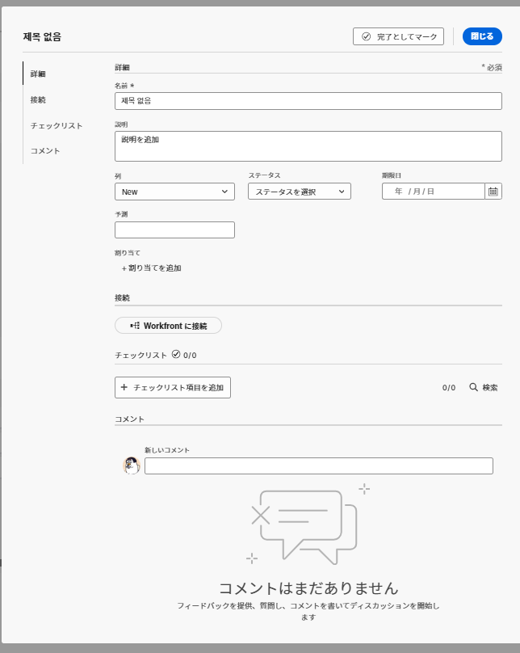
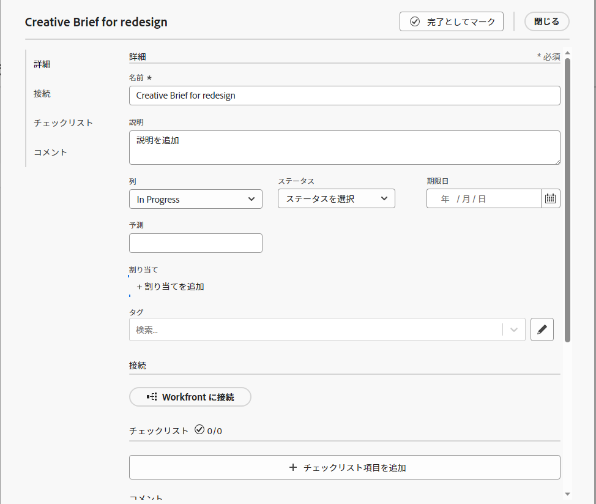

# ボードへのアドホックカードの追加

カードをボードにすばやく追加し、ボード上のメンバーに割り当てることができます。 カードは、タスク、問題、人物、グループ、またはボードに含める任意の種類の項目を表すことができます。

>[!NOTE]
>
>ボード上のアドホックカードは、 [!DNL Adobe Workfront]. 接続されたカードの詳細については、 [ボードでの接続済みカードの使用](/help/quicksilver/agile/get-started-with-boards/connected-cards.md).

## アクセス要件

この記事の手順を実行するには、次のアクセス権が必要です。

<table style="table-layout:auto"> 
 <col> 
 </col> 
 <col> 
 </col> 
 <tbody> 
  <tr> 
   <td role="rowheader"><strong>[!DNL Adobe Workfront] 計画*</strong></td> 
   <td> 
任意
 </td> 
  </tr> 
  <tr> 
   <td role="rowheader"><strong>[!DNL Adobe Workfront] ライセンス*</strong></td> 
   <td> 
[!UICONTROL リクエスト ] 以降
 </td> 
  </tr> 
 </tbody> 
</table>

&#42;ご利用のプラン、ライセンスの種類、アクセス権を確認するには、 [!DNL Workfront] 管理者。

## 詳細情報を含むアドホックカードの追加

アドホックカードは、 [!DNL Adobe Workfront].

1. 次をクリック： **[!UICONTROL メインメニュー]** アイコン  右上隅に [!DNL Adobe] Workfront、 **[!UICONTROL ボード]**.
1. ボードにアクセスします。 詳しくは、 [ボードの作成または編集](../../agile/get-started-with-boards/create-edit-board.md).
1. クリック **[!UICONTROL カードを追加] > [!UICONTROL 新しいカード]**.
1. 内 **[!UICONTROL カードの詳細]** ボックスに、次の情報を追加します。

   <table style="table-layout:auto"> 
    <col> 
    <col> 
    <tbody> 
     <tr> 
      <td role="rowheader"><strong>[!UICONTROL 名前 ]</strong> </td> 
      <td>カードの名前。</td> 
     </tr> 
     <tr> 
      <td role="rowheader"><strong>[!UICONTROL 説明 ]</strong> </td> 
      <td>カードの説明。 説明に URL を追加すると、カードを保存する際にクリック可能なリンクになります。</td>
     </tr> 
     <tr> 
      <td role="rowheader"><strong>[!UICONTROL 担当者 ]</strong> </td> 
      <td> 
カードを割り当てるには、検索フィールドに名前を入力し始め、カードがリストに表示されたら選択します。 個人とチームの両方を追加し、1 つのカードに複数の人またはチームを割り当てることができます。
 
割り当て先は、ボード上のメンバーである必要があります。メンバーでない場合、選択リストには表示されません。 チームがボード上のメンバーの場合、個々のチームメンバーをカードに割り当てることができます。
</td>
     </tr> 
     <tr> 
      <td role="rowheader"><strong>[!UICONTROL 列 ]</strong> </td> 
      <td>カードの列を選択します。 もし <strong>[!UICONTROL 列 ]</strong> フィールドが空の場合、カードはボードの左側の最初の列に配置されます。</td>
     </tr>
     <tr> 
      <td role="rowheader"><strong>[!UICONTROL ステータス ]</strong> </td> 
      <td>カードのステータスを選択します。 次をクリックした場合： <strong>[!UICONTROL 完了をマーク ]</strong> カードの上部にあるステータスが自動的に [!UICONTROL 完了 ] に変わります。</td> 
     </tr>
     <tr> 
      <td role="rowheader"><strong>[!UICONTROL 推定 ]</strong></td> 
      <td>カードが完了する推定時間数を入力します。 これは手動のエントリのみです。</td>
     </tr>
     <tr> 
      <td role="rowheader"><strong>[!UICONTROL 期限 ]</strong></td> 
      <td>カードの期限を選択します。 </td>
     </tr>
     <tr> 
      <td role="rowheader"><strong>[!UICONTROL タグ ]</strong></td> 
      <td>カードのタグを検索して選択します。 新しいタグの作成について詳しくは、 <a href="../../agile/get-started-with-boards/add-tags.md" class="MCXref xref">タグを追加</a>.</td> 
     </tr>  
     <tr> 
      <td role="rowheader"><strong>[!UICONTROL チェックリスト項目 ]</strong> </td> 
      <td> 
クリック <strong>[!UICONTROL チェックリスト項目を追加 ]</strong>. 次に、項目のタイトルを入力し、Enter キーを押します。 別の項目が自動的に追加されます。 引き続きタイトルを入力して、さらに項目を追加します。
 
チェックリストの上部にあるカウンターは、完了した項目の数と合計項目数を示します。
 
チェックリスト項目の詳細については、 <a href="/help/quicksilver/agile/get-started-with-boards/manage-checklist-items.md">カードのチェックリスト項目を管理</a>.
 </td> 
     </tr> 
    </tbody> 
   </table>

   早期の機能アクセスが有効になっていない実稼動環境でのカード詳細画像の例：
   

   実稼動環境での、早期機能アクセスを有効にしたカード詳細画像の例：
   

   左側のナビゲーションパネルを使用して、カード詳細上のフィールドのグループ間を移動します。

   >[!NOTE]
   >
   >左側のナビゲーションパネルと「説明」フィールドにクリック可能なリンクを追加する機能は、Workfrontボードの初期機能オプトインからのみ使用できます。

1. クリック **[!UICONTROL 閉じる]** カードをボードに追加します。

   割り当て先、タグ、期限、チェックリストカウンター、推定時間、ステータスがカードに表示されます。

## アドホックカードのクイック追加

タイトルのみを含むアドホックカードを追加して、ボードにすばやく入力できます。

1. カードを追加するボードにアクセスします。
1. 次をクリック： **[!UICONTROL 追加]** アイコン  をクリックします。
1. カード名を入力し、Enter キーを押します。

   新しいカードの下に、別のカードが自動的に追加されます。

1. カード名の入力を続けて、カードを追加します。
1. カードの追加を停止するには、列の外側をクリックします。
1. 詳細を追加するには、カードを編集する必要があります。 詳しくは、 [既存のカードの編集](#edit-an-existing-card) 」を参照してください。

## 既存のカードの編集 {#edit-an-existing-card}

1. ボードにアクセスします。
1. 名前を編集するには、カード名をクリックします。
1. カードの詳細を編集するには、（カード名ではなく）カードをクリックします。

   または

   次をクリック： **[!UICONTROL 詳細]** メニュー ![[!UICONTROL その他のメニュー]](assets/more-icon-spectrum.png) を選択し、 **[!UICONTROL 編集]**.

1. 内 [!UICONTROL カードの詳細] ボックスで、必要に応じて情報を更新し、 **[!UICONTROL 閉じる]** ボードに戻る

   フィールド値の更新が有効な列ポリシーがある場合、カードのステータスを変更すると、カードは対応する列に自動的に移動します。 詳しくは、この記事の「列設定とポリシーの定義」を参照してください [ボード列を管理](/help/quicksilver/agile/get-started-with-boards/manage-board-columns.md).
