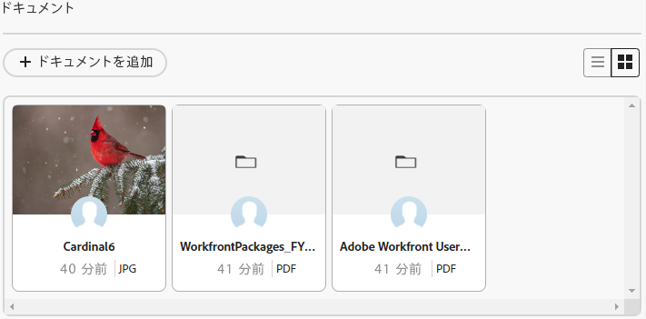

# カードへのドキュメントの追加

Adobe Workfrontボードの接続されたカードにドキュメントを追加できます。 カードに追加したドキュメントは、接続されたタスクまたはイシューの「ドキュメント」タブで使用でき、タスクまたはイシューに追加したドキュメントは、カードに表示されます。 両方の領域で同じファイルタイプがサポートされています。 Workfrontのドキュメントについて詳しくは、 [ファイルシステムからAdobe Workfrontにドキュメントを追加する](/help/quicksilver/documents/adding-documents-to-workfront/add-documents-from-file-system.md).

>[!NOTE]
>
>ドキュメントは、接続されたカードでのみ使用できます。 詳しくは、 [ボードでの接続済みカードの使用](/help/quicksilver/agile/get-started-with-boards/connected-cards.md).

## アクセス要件

この記事の手順を実行するには、次のアクセス権が必要です。

<table style="table-layout:auto"> 
 <tbody> 
  <tr> 
   <td role="rowheader"><strong>[!DNL Adobe Workfront] 計画*</strong></td> 
   <td> 
任意
 </td> 
  </tr> 
  <tr> 
   <td role="rowheader"><strong>[!DNL Adobe Workfront] ライセンス*</strong></td> 
   <td> 
[!UICONTROL リクエスト ] 以降
 </td> 
  </tr> 
  <tr>
   <td role="rowheader"><strong>アクセスレベル設定*</strong></td>
   <td>
ドキュメントへの [!UICONTROL 編集 ] アクセス

注意：まだアクセス権がない場合は、Workfront管理者に、アクセスレベルに追加の制限が設定されているかどうかを問い合わせてください。 Workfront管理者がアクセスレベルを変更する方法について詳しくは、 <a href="/help/quicksilver/administration-and-setup/add-users/configure-and-grant-access/create-modify-access-levels.md" class="MCXref xref">カスタムアクセスレベルの作成または変更</a>.
</td>
  </tr>
 </tbody> 
</table>

&#42;ご利用のプラン、ライセンスの種類、アクセス権を確認するには、 [!DNL Workfront] 管理者。

## カードへのドキュメントの追加

{{step1-to-boards}}

1. ドキュメントを追加する接続済みのカードを開きます。
1. ファイルを [!UICONTROL ドキュメント] 領域を選択するか、 [!UICONTROL **ドキュメントを追加**] をクリックして、ファイルを選択します。

   ファイルが [!UICONTROL ドキュメント] 領域。

   

## カードから既存のドキュメントを表示

1. カードで、 [!UICONTROL ドキュメント] 領域。 クリック  リスト内のすべてのドキュメントを表示するには、以下をクリックします。  ギャラリーでドキュメントを表示するには
1. ドキュメントのサムネールの上にマウスポインターを置いて、 [!UICONTROL **プレビュー**] ファイルをブラウザーに表示するには、または [!UICONTROL **ダウンロード**] をクリックして、ファイルをコンピューターにダウンロードします。
