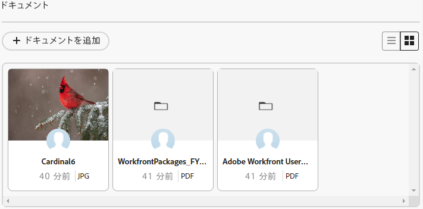

# カードへのドキュメントの追加

Adobe Workfront ボードで、接続されたカードにドキュメントを追加できます。 カードに追加したドキュメントは、接続されたタスクまたはイシューの「ドキュメント」タブで使用でき、タスクまたはイシューに追加したドキュメントはカードに表示されます。 どちらのエリアでも、同じファイルタイプがサポートされています。 Workfront のドキュメントについて詳しくは、[ファイルシステムから Adobe Workfront へのドキュメントの追加](/help/quicksilver/documents/adding-documents-to-workfront/add-documents-from-file-system.md)を参照してください。

>[!NOTE]
>
>ドキュメントは、接続されたカードでのみ使用できます。 詳しくは、[ボードでの接続カードの使用](/help/quicksilver/agile/get-started-with-boards/connected-cards.md)を参照してください。

## アクセス要件

+++ 展開すると、この記事の機能のアクセス要件が表示されます。

<table style="table-layout:auto"> 
 <col> 
 <col> 
 <tbody> 
  <tr> 
   <td role="rowheader">Adobe Workfront パッケージ</td> 
   <td> 
任意
 </td> 
  </tr> 
  <tr> 
   <td role="rowheader">Adobe Workfront プラン</td> 
   <td> 
   
コントリビューター以上
 
   
リクエスト以上

   </td> 
  </tr> 
   <tr>
   <td role="rowheader">アクセスレベル設定</td>
   <td>ドキュメントへのアクセスを編集</td>
  </tr>
 </tbody> 
</table>

詳しくは、[Workfront ドキュメントのアクセス要件](/help/quicksilver/administration-and-setup/add-users/access-levels-and-object-permissions/access-level-requirements-in-documentation.md)を参照してください。

+++

## カードにドキュメントを追加

{{step1-to-boards}}

1. ドキュメントの追加先となる接続されたカードを開きます。
1. [!UICONTROL ドキュメント]エリアにファイルをドラッグ＆ドロップするか、「[!UICONTROL **ドキュメントを追加**]」をクリックしてファイルを選択します。

   [!UICONTROL ドキュメント]エリアにファイルが表示されます。

   

## カードから既存のドキュメントを表示

1. カードで[!UICONTROL ドキュメント]エリアを見つけます。  をクリックしてリスト内のすべてのドキュメントを表示するか、 をクリックしてギャラリー内のドキュメントを表示します。
1. ドキュメントのサムネールにポインタを合わせて「[!UICONTROL **プレビュー**]」をクリックしてブラウザーにファイルを表示するか、「[!UICONTROL **ダウンロード**]」をクリックしてファイルをお使いのコンピューターにダウンロードします。

   >[!NOTE]
   >
   >PDF にはサムネール画像は表示されません。
