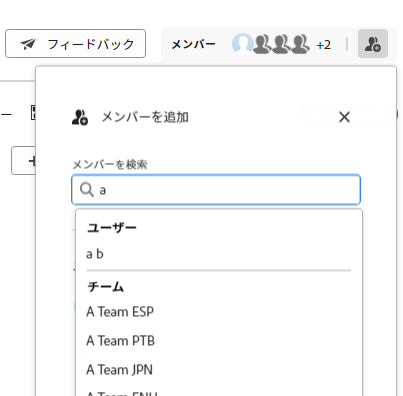
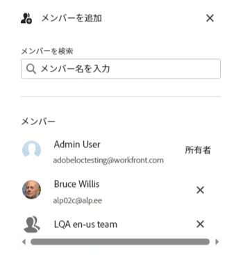

# ボードへのメンバーの追加または削除

ユーザーとチームは、ボードを表示する前に、メンバーとしてボードに追加する必要があります。

## アクセス要件

この記事の手順を実行するには、次のアクセス権が必要です。

<table style="table-layout:auto"> 
 <col> 
 </col> 
 <col> 
 </col> 
 <tbody> 
  <tr> 
   <td role="rowheader"><strong>[!DNL Adobe Workfront] プラン*</strong></td> 
   <td> 
任意
 </td> 
  </tr> 
  <tr> 
   <td role="rowheader"><strong>[!DNL Adobe Workfront] ライセンス*</strong></td> 
   <td> 
[!UICONTROL Request] 以降
 </td> 
  </tr> 
 </tbody> 
</table>

&#42;ご利用のプラン、ライセンスタイプ、アクセス権を確認するには、[!DNL Workfront] 管理者にお問い合わせください。

## ボードへのメンバーの追加

1. [!DNL Adobe] Workfront 右上隅の&#x200B;**[!UICONTROL メインメニュー]**&#x200B;アイコン  をクリックし、**[!UICONTROL ボード]**&#x200B;をクリックします。
1. 新しいボードを作成するか、既存のボードを編集します。詳しくは、[ボードの作成または編集](../../agile/get-started-with-boards/create-edit-board.md)を参照してください。
1. **[!UICONTROL メンバーを追加]**&#x200B;アイコン  をクリックします。
1. 「**[!UICONTROL メンバーを追加]**」ボックスに名前を入力し、リストに表示されたら選択します。

   個々のメンバーまたはチームを選択できます。チームを選択すると、チーム自体がボードに追加されます。

   >[!NOTE]
   >
   >ボードを表示するには、個々のユーザーは、「**[!UICONTROL 表示]**」または「**[!UICONTROL 編集]**」オプションをチームのアクセスレベルに設定する必要があります。

   

## ボードからのメンバーの削除

1. [!DNL Adobe] Workfront 右上隅の&#x200B;**[!UICONTROL メインメニュー]**&#x200B;アイコン  をクリックし、**[!UICONTROL ボード]**&#x200B;をクリックします。
1. 新しいボードを作成するか、既存のボードを編集します。詳しくは、[ボードの作成または編集](../../agile/get-started-with-boards/create-edit-board.md)を参照してください。
1. **[!UICONTROL メンバーを追加]**&#x200B;アイコン  をクリックします。
1. 「**[!UICONTROL メンバーを追加]**」ボックスで、個人名またはチーム名の横にある「X」をクリックして、ボードから削除します。

   

   メンバーをボードから削除しても、割り当てられているカードからは削除されません。 接続されたカードの場合は、割り当ても [!DNL Workfront] タスクまたはイシューで更新されます。

   メンバーはこのボードからのみ削除されます。属している他のボードからは削除されません。

   >[!NOTE]
   >
   >ボードの所有者を削除することはできません。
