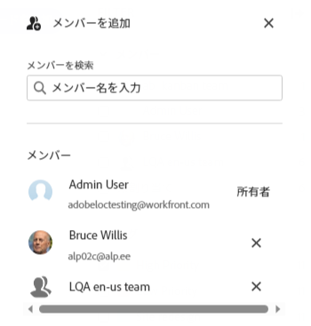

# ボードへのメンバーの追加または削除

ボードを表示できるようにするには、まず人物とチームをボードにメンバーとして追加する必要があります。

ボードの作成者は、デフォルトでは所有者です。 ボードの所有者は、そのボードを削除したり、設定パネルでフィルターを更新したりできる唯一のユーザーです。 ボード所有者を変更できるのは、システム管理者または現在のボード所有者のみです。

## アクセス要件

+++ 展開すると、この記事の機能のアクセス要件が表示されます。

<table style="table-layout:auto"> 
 <col> 
 <col> 
 <tbody> 
  <tr> 
   <td role="rowheader">Adobe Workfront パッケージ</td> 
   <td> 
任意
 </td> 
  </tr> 
  <tr> 
   <td role="rowheader">Adobe Workfront プラン</td> 
   <td> 
   
コントリビューター以上
 
   
リクエスト以上

   </td> 
  </tr> 
 </tbody> 
</table>

この表の情報について詳しくは、[Workfront ドキュメントのアクセス要件](/help/quicksilver/administration-and-setup/add-users/access-levels-and-object-permissions/access-level-requirements-in-documentation.md)を参照してください。

+++

## ボードへのメンバーの追加

{{step1-to-boards}}

1. 新しいボードを作成するか、既存のボードを編集します。詳しくは、[ボードの作成または編集](../../agile/get-started-with-boards/create-edit-board.md)を参照してください。
1. **[!UICONTROL メンバーを追加]**&#x200B;アイコン  をクリックします。
1. 「**[!UICONTROL メンバーを追加]**」ボックスに名前を入力し、リストに表示されたら選択します。

   個々のメンバーまたはチームを選択できます。チームを選択すると、そのチームがボードに追加されます。

   >[!NOTE]
   >
   >ボードを表示するには、個々のユーザーは、「**[!UICONTROL 表示]**」または「**[!UICONTROL 編集]**」オプションをチームのアクセスレベルに設定する必要があります。

   

## ボードからのメンバーの削除

{{step1-to-boards}}

1. 新しいボードを作成するか、既存のボードを編集します。詳しくは、[ボードの作成または編集](../../agile/get-started-with-boards/create-edit-board.md)を参照してください。
1. **[!UICONTROL メンバーを追加]**&#x200B;アイコン  をクリックします。
1. 「**[!UICONTROL メンバーを追加]**」ボックスで、個人名またはチーム名の横にある「X」をクリックして、ボードから削除します。

   

   ボードからメンバーを削除すると、そのメンバーは割り当てられていたカードから削除されます。接続されたカードの場合は、割り当ても [!DNL Workfront] タスクまたはイシューで更新されます。

   メンバーはこのボードからのみ削除されます。属している他のボードからは削除されません。

   >[!NOTE]
   >
   >ボードの所有者を削除することはできません。

## 掲示板の所有者を変更する

>[!NOTE]
>
>ボード所有者を変更できるのは、システム管理者または現在のボード所有者のみです。 ボードには所有者を1人しか設定できません。
>
>ボード所有者を変更する機能は、基本ボード、レトロスペクティブボード、カンバンボードで利用できますが、動的ボードでは利用できません。

1. ボードにアクセスします。
1. ボード名の横にある&#x200B;**[!UICONTROL 詳細]** メニューをクリックし、「**[!UICONTROL ボード所有者を変更]**」を選択します。
1. 掲示板の所有者を変更ダイアログボックスで、所有者にするユーザーを検索して選択します。

   既にボードのメンバーであるユーザーを検索することはできません。 既存のメンバーをオーナーにするには、まずボードからメンバーを削除する必要があります。 ユーザーをボード所有者にすることで、ボードにユーザーを追加できます。

   ボードの所有者になれるのはユーザーのみです。 チームはオーナーにはなれません。

1. 「[!UICONTROL **更新**]」をクリックします。
