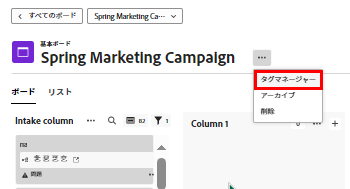

# タグの追加

カードにタグを追加して、類似性を視覚的に示すことができます。そうすると、追加したタグでフィルタリングして、関連するカードを表示できます。

>[!NOTE]
>
>タグは、ボード間では共有されません。

## アクセス要件

この記事の手順を実行するには、次のアクセス権が必要です。

<table style="table-layout:auto"> 
 <col> 
 </col> 
 <col> 
 </col> 
 <tbody> 
  <tr> 
   <td role="rowheader"><strong>[!DNL Adobe Workfront] プラン*</strong></td> 
   <td> 
任意
 </td> 
  </tr> 
  <tr> 
   <td role="rowheader"><strong>[!DNL Adobe Workfront] ライセンス*</strong></td> 
   <td> 
[!UICONTROL Request] 以降
 </td> 
  </tr> 
 </tbody> 
</table>

&#42;ご利用のプラン、ライセンスタイプ、アクセス権を確認するには、[!DNL Workfront] 管理者にお問い合わせください。

## ボードのタグを作成

{{step1-to-boards}}

1. ボードにアクセスします。詳しくは、[ボードを作成または編集](../../agile/get-started-with-boards/create-edit-board.md)を参照してください。
1. ボード名の横にある&#x200B;**[!UICONTROL 詳細]**&#x200B;メニューのをクリックし、「**[!UICONTROL タグマネージャー]**」を選択します。

   

1. [!UICONTROL タグマネージャー]ダイアログボックスで、「[!UICONTROL ボードタグ]」セクション内の「[!UICONTROL **タグを追加**]」を選択します。
1. 強調表示されたボックスにタグ名を入力し、ドロップダウンメニューからこのタグ用のカラーを選択します。タグは自動的に保存されます。
1. （条件付き）手順 4～5 を繰り返して、追加のタグを作成します。
1. 右上隅にある「**[!UICONTROL 完了]**」をクリックします。

   

## ワークストリームのタグを作成

>[!IMPORTANT]
>
>ワークストリームは、特定の顧客グループのみが使用できます。

ワークストリーム内のすべてのボードで、ワークストリームタグを使用できます。

{{step1-to-boards}}

1. ダッシュボードで、「[!UICONTROL **ワークストリームを表示**]」をクリックして、ワークストリームを開きます。
1. ボードを開きます。ボード名の横にある&#x200B;**[!UICONTROL 詳細]**&#x200B;メニュー  をクリックし、**[!UICONTROL タグマネージャー]**&#x200B;を選択します。

   または

   「[!UICONTROL **設定**]」をクリックして、[!UICONTROL ワークストリームを設定]パネルを開きます。次に、**[!UICONTROL タグマネージャー]**&#x200B;をクリックします。

1. [!UICONTROL タグマネージャー]ダイアログボックスで、「ワークストリームタグ」セクション内の「[!UICONTROL **タグを追加**]」を選択します。
1. 強調表示されたボックスにタグ名を入力し、ドロップダウンメニューからこのタグ用のカラーを選択します。タグは自動的に保存されます。
1. （条件付き）手順 4～5 を繰り返して、追加のタグを作成します。
1. 右上隅にある「**[!UICONTROL 完了]**」をクリックします。

   

## カードにタグを追加

1. ボードにアクセスします。
1. カードの詳細を編集するには、（カード名ではなく）カードをクリックします。

   または

   カード上の&#x200B;**[!UICONTROL 詳細]**&#x200B;メニュー ![[!UICONTROL 詳細メニュー]](assets/more-icon-spectrum.png) をクリックしてから、「**[!UICONTROL 編集]**」を選択します。

1. 「**[!UICONTROL タグ]**」ボックスに既存のタグの名前を入力し、この名前を検索結果から選択します。\
   または\
   **[!UICONTROL 編集]**&#x200B;アイコン  をクリックし、タグマネージャーで新しいタグを作成します。「**完了**」をクリックし、カードのタグを選択します。
1. 「**閉じる**」をクリックします。

## タグを編集

1. ボードにアクセスします。
1. ボード名の横にある&#x200B;**[!UICONTROL 詳細]**&#x200B;メニュー  をクリックし、**[!UICONTROL タグマネージャー]**&#x200B;を選択します。

   

1. （条件付き）タグ名をクリックして、テキストを編集します。
1. （条件付き）[!UICONTROL カラー]ドロップダウンメニューをクリックして、タグの色を変更します。
1. 「**[!UICONTROL 完了]**」をクリックします。

## カードからタグを削除

1. ボードにアクセスします。
1. カードの詳細を編集するには、（カード名ではなく）カードをクリックします。

   または

   カード上の&#x200B;**[!UICONTROL 詳細]**&#x200B;メニュー ![[!UICONTROL 詳細メニュー]](assets/more-icon-spectrum.png) をクリックしてから、「**[!UICONTROL 編集]**」を選択します。

1. カードから削除するタグを見つけ、**[!UICONTROL 削除]**&#x200B;アイコン  をクリックします。
1. 「**[!UICONTROL 閉じる]**」をクリックします。

## タグを削除

1. ボードにアクセスします。
1. ボード名の横にある&#x200B;**[!UICONTROL 詳細]**&#x200B;メニュー ![[!UICONTROL 詳細メニュー]](assets/more-icon-spectrum.png) をクリックし、**[!UICONTROL タグマネージャー]**&#x200B;を選択します。

   

1. 削除するタグを見つけ、**[!UICONTROL 削除]**&#x200B;アイコン  をクリックします。
1. 「**[!UICONTROL 完了]**」をクリックします。
