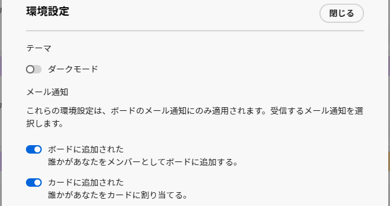

# 電子メール通知と環境設定をボード

[!DNL Adobe Workfront] [!UICONTROL ボード] は、あなたがボードに追加されたとき、およびカードが割り当てられたときに電子メールを送信します。 通知はデフォルトでオンになっており、ボードの設定で受信するメールを選択できます。

## アクセス要件

この記事の手順を実行するには、次のアクセス権が必要です。

<table style="table-layout:auto"> 
 <col> 
 </col> 
 <col> 
 </col> 
 <tbody> 
  <tr> 
   <td role="rowheader"><strong>[!DNL Adobe Workfront] 計画*</strong></td> 
   <td> 
任意
 </td> 
  </tr> 
  <tr> 
   <td role="rowheader"><strong>[!DNL Adobe Workfront] ライセンス*</strong></td> 
   <td> 
[!UICONTROL リクエスト ] 以降
 </td> 
  </tr> 
 </tbody> 
</table>

&#42;ご利用のプラン、ライセンスの種類、アクセス権を確認するには、 [!DNL Workfront] 管理者。

## ボードメールの設定

{{step1-to-boards}}

1. クリック [!UICONTROL **環境設定**] 」をボードダッシュボードに追加します。
1. ボードに追加されてカードに割り当てられる電子メールを受信するかどうかを選択します。

   

   電子メールに設定した設定は、すべてのボードに適用されます。

<!--

## Set the dark mode preference

>[!NOTE]
>
>If your organization's instance of Workfront has been onboarded to the Adobe Unified Experience, you can enable dark theme formatting for all of Adobe Experience Cloud through your preferences menu (your profile picture), and you will not see a separate dark mode option for Workfront Boards. For more information, see [Adobe Unified Experience for Workfront](/help/quicksilver/workfront-basics/navigate-workfront/workfront-navigation/adobe-unified-experience.md).

{{step1-to-boards}}

1. Click [!UICONTROL **Preferences**] on the boards dashboard.
1. In the Themes area, enable or disable Dark mode.

   The preference you set for dark mode applies to all of your boards and workstreams, and the dashboard.

-->