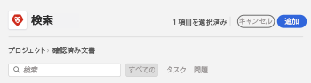
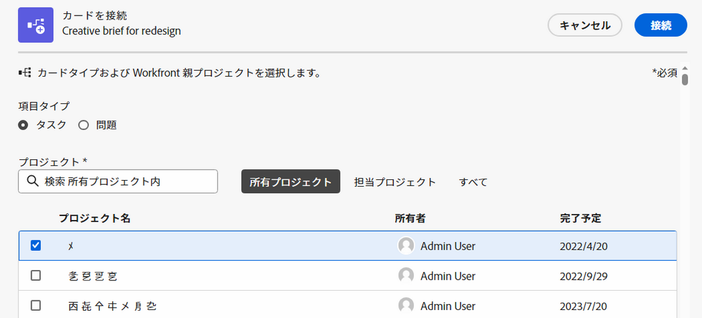
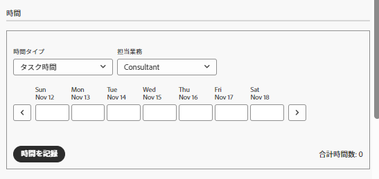

# ボードでの接続済みカードの使用

{{highlighted-preview}}

ボードに、 [!DNL Workfront].

ある場所のカードについて、次のいずれかの詳細が更新されると、別の場所で自動的に更新されます。

* [!UICONTROL 名前]
* [!UICONTROL 説明]
* [!UICONTROL 割り当て先]
* [!UICONTROL ステータス]
* [!UICONTROL 完了予定日]
* [!UICONTROL 推定] / [!UICONTROL ストーリーポイント]

>[!NOTE]
>1 つの接続されたタスクまたはイシューは、ボードごとに 1 回だけ追加できます。 同じタスクまたは問題を複数のボードに接続できます。

## アクセス要件

この記事の手順を実行するには、次のアクセス権が必要です。

<table style="table-layout:auto"> 
 <tbody> 
  <tr> 
   <td role="rowheader"><strong>[!DNL Adobe Workfront] 計画*</strong></td> 
   <td> 
任意
 </td> 
  </tr> 
  <tr> 
   <td role="rowheader"><strong>[!DNL Adobe Workfront] ライセンス*</strong></td> 
   <td> 
[!UICONTROL リクエスト ] 以降
 </td> 
  </tr> 
  <tr>
   <td role="rowheader"><strong>アクセスレベル設定*</strong></td>
   <td>
[!UICONTROL 表示 ] 以降のタスクおよび問題へのアクセス権
</td>
  </tr>
  <tr>
   <td role="rowheader"><strong>オブジェクト権限</strong></td>
   <td>
Workfrontタスクまたはイシューに対する [!UICONTROL 表示 ] 以上の権限
</td>
  </tr>
 </tbody> 
</table>

&#42;ご利用のプラン、ライセンスの種類、アクセス権を確認するには、 [!DNL Workfront] 管理者。

## 接続されたカードを追加

1. 次をクリック： **[!UICONTROL メインメニュー]** アイコン  Adobe Workfrontの右上隅で、 **[!UICONTROL ボード]**.
1. ボードにアクセスします。 詳しくは、 [ボードの作成または編集](../../agile/get-started-with-boards/create-edit-board.md).
1. クリック **[!UICONTROL カードを追加] > [!UICONTROL 接続されたカード]**.
1. プロジェクトを選択し、ボードにカードとして追加するタスクまたはイシューを選択します。

   複数のオブジェクトを選択でき、すべてが個別のカードとして追加されます。

   >[!NOTE]
   >
   >* サーチ結果には、自分が権限を持っているオブジェクトのみが表示されます。 項目が淡色表示の場合は、その項目は既にボードに追加されています。
   >* 次の条件でフィルターする場合： **[!UICONTROL 自分が所有するプロジェクト]** または **[!UICONTROL 自分がいるプロジェクト]**、「完了」、「無効」または「却下」のステータスに等しいプロジェクトは含まれません。 これらのプロジェクトは、引き続き **[!UICONTROL すべて]** フィルター。

1. クリック **[!UICONTROL 追加]**.

   

   カードが一番左の列の下に追加されます。 接続された [!DNL Workfront] オブジェクトとその割り当て先がカードに表示されます。

   >[!NOTE]
   >
   >担当者が [!DNL Workfront] タスクまたはイシューは、ボード上のメンバーではないので、カードに割り当てられません。

   

1. クリック  開く [!DNL Workfront] 新しいブラウザータブのタスクまたはイシュー。
1. カードの詳細を編集するには、（カード名ではなく）カードをクリックします。

   または

   次をクリック： **[!UICONTROL 詳細]** メニュー  を選択し、 **[!UICONTROL 編集]**.

1. 内 **[!UICONTROL カードの詳細]** ボックスで、次の情報を追加または更新します。

   <table style="table-layout:auto"> 
    <tbody> 
     <tr> 
      <td role="rowheader"><strong>[!UICONTROL 名前 ]</strong></td> 
      <td>名前を変更すると、接続された [!DNL Workfront] オブジェクト。</td> 
     </tr> 
     <tr> 
      <td role="rowheader"><strong>[!UICONTROL 説明 ]</strong></td> 
      <td>説明を変更すると、接続されているの説明も変更されます [!DNL Workfront] オブジェクト。 説明に URL を追加すると、カードを保存する際にクリック可能なリンクになります。</td> 
     </tr> 
     <tr>
      <td role="rowheader"><strong>[!UICONTROL 担当者 ]</strong></td>
      <td>
カードに他のユーザーやチームを割り当てるには、検索フィールドに名前を入力し、リストに表示されたら選択します。 個人とチームの両方を追加できます。 1 つの接続されたカードでは、1 つのチーム割り当てのみが許可されます。

      
割り当て先は、ボード上のメンバーである必要があります。メンバーでない場合、選択リストには表示されません。 チームがボード上のメンバーの場合、個々のチームメンバーをカードに割り当てることができます。

      
選択した担当者も、 [!DNL Workfront].
</td>
     </tr>
     <tr>
      <td role="rowheader"><strong>[!UICONTROL 列 ]</strong></td>
      <td>カードの列を選択します。</td>
     </tr>
     <tr>
      <td role="rowheader"><strong>[!UICONTROL ステータス ]</strong></td>
      <td>
カードのステータスを選択します。 デフォルトは [!UICONTROL 新規 ]、[!UICONTROL In Progress]、[!UICONTROL Complete] ですが、 [!DNL Workfront] は、も使用できます。

      
フィールド値の更新が有効な列ポリシーがある場合、カードのステータスを変更すると、カードは対応する列に自動的に移動します。 詳しくは、この記事の「列設定とポリシーの定義」を参照してください <a href="/help/quicksilver/agile/get-started-with-boards/manage-board-columns.md" class="MCXref xref">ボード列を管理</a>.

      
次をクリックした場合： <strong>[!UICONTROL 完了をマーク ]</strong> カードの上部にあるステータスは、自動的に「完了」に変わります。
</td>
     </tr>
     <tr>
      <td role="rowheader"><strong>[!UICONTROL 計画完了 ]</strong></td>
      <td>この日付を変更すると、接続された [!DNL Workfront] オブジェクト。</td>
     </tr>
      <tr>
      <td role="rowheader"><strong>[!UICONTROL 推定 ]</strong></td>
      <td>
カードが完了するまでの時間数。

見積もりを変更すると、接続されたストーリーポイントの値も変更されます [!DNL Workfront] オブジェクト。
</td>
     </tr>
     <tr>
      <td role="rowheader"><strong>[!UICONTROL タグ ]</strong></td>
      <td>
カードのタグを検索して選択します。

      
新しいタグの作成について詳しくは、 <a href="../../agile/get-started-with-boards/add-tags.md" class="MCXref xref">タグを追加</a>.
</td>
     </tr>
     <tr> 
      <td role="rowheader"><strong>[!UICONTROL チェックリスト項目 ]</strong> </td> 
      <td> 
クリック <strong>[!UICONTROL チェックリスト項目を追加 ]</strong>. 次に、項目のタイトルを入力し、Enter キーを押します。 別の項目が自動的に追加されます。 引き続きタイトルを入力して、さらに項目を追加します。
 
チェックリストの上部にあるカウンターは、完了した項目の数と合計項目数を示します。
 
チェックリスト項目の詳細については、 <a href="/help/quicksilver/agile/get-started-with-boards/manage-checklist-items.md">カードのチェックリスト項目を管理</a>.
</td>
     </tr>
    </tbody> 
   </table>

   左側のナビゲーションパネルを使用して、カード詳細上のフィールドのグループ間を移動します。

   >[!NOTE]
   >
   >左側のナビゲーションパネルと「説明」フィールドにクリック可能なリンクを追加する機能は、Workfrontボードの初期機能オプトインからのみ使用できます。

1. クリック **[!UICONTROL 閉じる]** ボードに戻る
接続されたオブジェクト、割り当て先、タグ、期限、チェックリストカウンター、推定時間、ステータスがカードに表示されます。

   

## 接続されたカードを取り外す

接続されたカードをWorkfrontオブジェクトから切断すると、そのカードは編集可能なアドホックカードとしてボードに残ります。

ボードレベルで切断するには：

1. ボードにアクセスします。
1. 次をクリック： **[!UICONTROL 詳細]** メニュー  接続されたカードで、を選択します。 **[!UICONTROL 切断]**.
1. クリック **[!UICONTROL 切断]** をクリックします。

カードレベルで切断するには：

1. ボードにアクセスし、接続されたカードを開きます。
1. 次をクリック： **[!UICONTROL 詳細]** メニュー  カードの詳細の「接続」領域で、「 」を選択します。 **[!UICONTROL 切断]**.
1. クリック **[!UICONTROL 切断]** をクリックします。

## アドホックカードを接続済みカードに変換する

アドホックカードを作成したら、接続されたカードに変換できます。 アドホックカードについて詳しくは、 [ボードへのアドホックカードの追加](/help/quicksilver/agile/get-started-with-boards/add-card-to-board.md).

1. ボードにアクセスし、アドホックカードを開きます。
1. カードの名前と説明を確認します。 これらは、 [!DNL Workfront].
1. 内 [!UICONTROL 接続] カードの詳細の領域で、 **[!UICONTROL Workfrontとの接続]**.
1. の [!UICONTROL カードを接続] ウィンドウで、タスクを作成するかイシューを作成するかを選択します。
1. タスクまたはイシューを追加するプロジェクトを検索して選択します。

   >[!NOTE]
   >
   >* サーチ結果には、自分が権限を持っているオブジェクトのみが表示されます。
   >* 次の条件でフィルターする場合： **[!UICONTROL 自分が所有するプロジェクト]** または **[!UICONTROL 自分がいるプロジェクト]**、 [!UICONTROL 完了], [!UICONTROL Dead]または [!UICONTROL 却下] ステータスが含まれていません。 これらのプロジェクトは、引き続き **[!UICONTROL すべて]** フィルター。

1. クリック **[!UICONTROL 接続]**.

   

   プロジェクト名は、カードの詳細の「接続」領域に表示されます。

1. クリック **[!UICONTROL 閉じる]** ボードに戻る

## 接続されたカードでのログ時間

接続されたタスクまたは問題に関する時間を記録するには、適切な権限が必要です。

デフォルトでは、接続されたカードにタイムログフィールドが表示されません。 有効にする必要があります [!UICONTROL **時間**] 内 [!UICONTROL 設定] 下の領域 [!UICONTROL カード]. 詳しくは、 [カードに表示するフィールドのカスタマイズ](/help/quicksilver/agile/get-started-with-boards/customize-fields-on-card.md).

1. タスクまたはタスクの発行時間数を入力します。
1. を選択します。 [!UICONTROL 時間タイプ] デフォルトと異なる場合は、ドロップダウンメニューから。
1. クリック [!UICONTROL **ログ時間**].

   

   カードに記録された時間は、接続されたタスクまたはイシューにも保存されます。

カードのログ記録時間は、タスクまたは問題のログ記録時間と同じです。 詳細については、この記事の「プロジェクト、タスク、または問題に対するログの記録」を参照してください [ログ時間](/help/quicksilver/timesheets/create-and-manage-timesheets/log-time.md).

