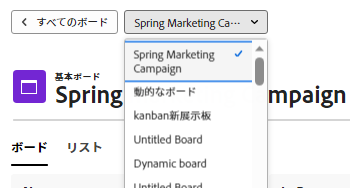

# ボードの作成または編集

<!-- Audited: 12/2023 -->

次から： [!UICONTROL ボード] ダッシュボードを使用すると、新しいボードを作成したり、既存のボードを編集したりできます。

## アクセス要件

この記事の手順を実行するには、次のアクセス権が必要です。

<table style="table-layout:auto"> 
 <col> 
 <col> 
 <tbody> 
  <tr> 
   <td role="rowheader"><strong>[!DNL Adobe Workfront] plan*</strong></td> 
   <td> 
任意
 </td> 
  </tr> 
    <tr> 
   <td role="rowheader">Adobe Workfront license*</td> 
   <td> 
新規：寄稿者以上 

 
または
 

現在： [!UICONTROL リクエスト ] 以降 
 
</td> 
  </tr> 
  <tr> 
   <td role="rowheader"><strong>[!DNL Adobe Workfront] ライセンス*</strong></td> 
   <td> 
[!UICONTROL リクエスト ] 以降
 </td> 
  </tr> 
 </tbody> 
</table>

&#42;ご利用のプラン、ライセンスの種類、アクセス権を確認するには、 [!DNL Workfront] 管理者。

## 新しいボードを作成

{{step1-to-boards}}
1. クリック **[!UICONTROL ボードを追加]**.

1. ボードのテンプレートを選択します。

   | テンプレート | 説明 |
   |---------|----------|
   | 基本ボード | 3 つのデフォルトの列がボード上に表示されます。 新しい列を追加し、デフォルトの列の名前を変更または削除できます。 
3 つのデフォルトの列がボード上に表示されます。 新しい列を追加し、デフォルトの列の名前を変更または削除できます。 |
   | かんばんボード | 「バックログ」、「新規」、「処理中」、「完了」および「保留中」の各列がボードに表示されます。 新しい列を追加し、デフォルトの列の名前を変更または削除できます。
バックログを使用するには、取り込みカラムのフィルタを設定する必要があります。 詳しくは、 [ボードに吸気柱を追加する](/help/quicksilver/agile/use-boards-agile-planning-tools/add-intake-column-to-board.md). 
各列のデフォルトのポリシーを確認するには、 [!UICONTROL **その他** メニュー] 列で、 [!UICONTROL **編集**]. これらの事前設定済みポリシーは任意に変更できます。 詳しくは、 [ボード列を管理](/help/quicksilver/agile/get-started-with-boards/manage-board-columns.md). |
   | レトロボード | ボードには次の列が用意されています：何がうまくいったのですか？ 何が改善できるのか？ 誰をお祝いしましょうか？ もっと速く動くには何ができるでしょうか？ 新しい列を追加し、デフォルトの列の名前を変更または削除できます。 
列ポリシーは適用されません。 |
   | 動的なボード | ボードには、「未選択」、「新規」、「処理中」、「保留中」および「完了」の列が表示されます。 新しい列を追加し、デフォルトの列の名前を変更または削除できます。 (「未選択」列は、名前を変更できますが、削除はできません。 この列には、ステータスが他の列のステータスのどれとも一致しないすべてのカードが含まれます。) 
デフォルトの列ポリシーでは、ステータスに基づいてカードが列に割り当てられます。 詳しくは、 [ボード列を管理](/help/quicksilver/agile/get-started-with-boards/manage-board-columns.md). |

1. ダイナミックボードの場合のみ、セットアップウィザードの手順に従います。

   1. 検索と選択 [!DNL Workfront] [!UICONTROL **プロジェクト**] 仕事や問題をボードに持ち込む。
   1. 検索と選択 [!UICONTROL **割当て**] 仕事や問題をボードに持ち込む。

      すべてのオブジェクトは、ボード上に接続されたカードとして表示されます。

      The [!UICONTROL **追加中のカード**] カウンターは、ボードに表示されるカードの数を示します。 例えば、100 個のタスクと問題を含むプロジェクトを選択した場合、カウンターには 100 と表示されます。 ユーザー割り当てを追加し、そのユーザーがプロジェクト上の 5 つのタスクに割り当てられている場合、カウンターには 5 と表示されます。

   1. （オプション）「 」を選択します。 [!UICONTROL **完了した作業を含める**] 完了したカードをボードに含めます。

      >[!NOTE]
      >
      >このオプションを選択しない場合、他のステータスのカードが完了とマークされると、そのカードはボードから「フォールオフ」され、表示されなくなります。

   1. （オプション）「 [!UICONTROL **詳細フィルターの使用**] をクリックして、追加のフィルターオプションを表示します。

      これは、吸気カラムにフィルタを作成するのと同じ手順です。 詳しくは、 [ボードに吸気柱を追加する](/help/quicksilver/agile/use-boards-agile-planning-tools/add-intake-column-to-board.md).

   1. フィルターを追加したら、 [!UICONTROL **ボードを作成**].

1. ボードの名前を **[!UICONTROL ボード]** フィールドに入力し、Enter キーを押します。
1. 必要に応じて、ボードを設定します。

   詳しくは、 [ボードに対するメンバーの追加または削除](../../agile/get-started-with-boards/add-members-to-board.md), [ボード列を管理](../../agile/get-started-with-boards/manage-board-columns.md), [ボードへのアドホックカードの追加](../../agile/get-started-with-boards/add-card-to-board.md)、および [ボードでの接続済みカードの使用](/help/quicksilver/agile/get-started-with-boards/connected-cards.md).

1. クリック **[!UICONTROL すべてのボード]** をクリックして、ボードダッシュボードに戻ります。

   また、現在のボードの名前でラベル付けされたドロップダウンメニューを見つけ、それをクリックして別のボードに切り替えることもできます。

   

## 既存のボードの編集

{{step1-to-boards}}
1. ダッシュボードで、開くボードを選択します。
1. 必要に応じて、ボードを編集します。 ボード名をクリックして名前を変更できます。

   詳しくは、 [ボードに対するメンバーの追加または削除](../../agile/get-started-with-boards/add-members-to-board.md), [ボード列を管理](../../agile/get-started-with-boards/manage-board-columns.md)、および [ボードへのカードの追加](../../agile/get-started-with-boards/add-card-to-board.md).

1. クリック **[!UICONTROL すべてのボード]** をクリックして、ボードダッシュボードに戻ります。

   また、現在のボードの名前でラベル付けされたドロップダウンメニューを見つけ、それをクリックして別のボードに切り替えることもできます。
