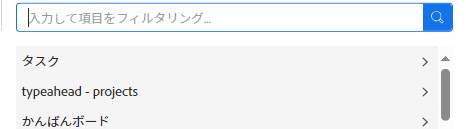

# カードに表示するフィールドのカスタマイズ

{{highlighted-preview}}

>[!NOTE]
>
>この機能は、の初期の機能オプトインでのみ使用できます。 [!DNL Workfront] [!UICONTROL ボード]. 詳しくは、 [Adobe Workfrontボードの初期機能のオプトイン](/help/quicksilver/agile/get-started-with-boards/boards-early-feature-opt-in.md).

デフォルトでは、すべての使用可能なフィールドは、カードが開いているときのフルビューと、ボード上の縮小されたカードビューの両方で、カードに表示されます。 表示するフィールドは、次の方法でカスタマイズできます。

* どちらのビューにも表示されないようにフィールドを無効にする
* 縮小されたカード表示でのフィールドの非表示

フィールドに値が含まれていて、そのフィールドを無効にした場合、後でそのフィールドを再度有効にしても、値は保持されます。

また、以前に作成したカスタムフィールドを表示することもできます。 ボード内で新しいカスタムフィールドをデザインして作成することはできません。

>[!NOTE]
>
>作業中のボードにのみ適用するフィールドのカスタマイズ。

## アクセス要件

この記事の手順を実行するには、次のアクセス権が必要です。

<table style="table-layout:auto"> 
 <col> 
 </col> 
 <col> 
 </col> 
 <tbody> 
  <tr> 
   <td role="rowheader"><strong>[!DNL Adobe Workfront] 計画*</strong></td> 
   <td> 
任意
 </td> 
  </tr> 
  <tr> 
   <td role="rowheader"><strong>[!DNL Adobe Workfront] ライセンス*</strong></td> 
   <td> 
[!UICONTROL リクエスト ] 以降
 </td> 
  </tr>
   </tbody> 
</table>

&#42;ご利用のプラン、ライセンスの種類、アクセス権を確認するには、 [!DNL Workfront] 管理者。

## カードの設定 {#configure-cards}

1. 次をクリック： **[!UICONTROL メインメニュー]** アイコン  右上隅に [!DNL Adobe Workfront]を選択し、「 **[!UICONTROL ボード]**.
1. ボードにアクセスします。 詳しくは、 [ボードの作成または編集](../../agile/get-started-with-boards/create-edit-board.md).
1. クリック [!UICONTROL **設定**] をクリックして、設定パネルを開きます。
1. 展開 [!UICONTROL **カード**].

   ほとんどのフィールドは、デフォルトで有効になっています。

1. フィールドをオフにすると、両方のカード表示で無効になります。
1. 非表示アイコンをクリックします。  縮小表示で非表示にするフィールドの横に表示されます。
1. 両方のビューにすべてのフィールドを表示するには、 [!UICONTROL **すべてのフィールドをデフォルトに戻す**].
1. クリック [!UICONTROL **設定を非表示**] をクリックして、設定パネルを閉じます。

## カードへのカスタムフィールドの追加

>[!NOTE]
>
>カードにカスタムフィールドを追加すると、カード上のデータは読み取り専用になります。 また、カスタムフィールドは、接続されたカードでのみ使用できます。

1. ボードにアクセスし、 [!UICONTROL **設定**] をクリックして、設定パネルを開きます。
1. 展開 [!UICONTROL **カード**].
1. の下 [!UICONTROL カードフィールド]をクリックし、 [!UICONTROL **カスタムフィールドを追加**].
1. 選択 [!UICONTROL **タスク**] または [!UICONTROL **問題**].

   タスクまたは問題に使用できるフィールドのカテゴリが表示されます。 カテゴリを展開して、すべてのフィールドを表示します。 また、フィールドを検索することもできます。

   

1. フィールド名を選択します。

   カスタムフィールドが使用可能フィールドのリストに追加され、デフォルトで有効になっています。 カスタムフィールドは、 [カードの設定](customize-fields-on-card.md#configure-cards) セクションを上に置くか、ボードから削除します。

