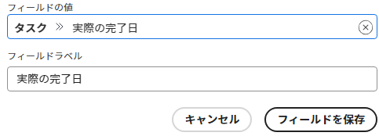

# カードに表示するフィールドのカスタマイズ

デフォルトでは、すべての使用可能なフィールドが、カードが開いているときのフルビューと、ボード上の縮小カードビューの両方で、カードに表示されます。表示するフィールドは、次の方法でカスタマイズできます。

* どちらのビューにも表示されないようにフィールドを無効にする
* 縮小カードビューでフィールドを非表示にする

フィールドに値が含まれていて、そのフィールドを無効にした場合、後でそのフィールドを再度有効にしても、値は保持されます。

セクション（カード詳細の左側のナビゲーションのオプションとして表示される）でも表示と非表示を切り替えることができます。

また、以前に作成したカスタムフィールドを表示することもできます。ボード内で新しいカスタムフィールドをデザインして作成することはできません。

>[!NOTE]
>
>フィールドのカスタマイズは、自分の作業中のボードにのみ適用されます。

## アクセス要件

この記事の手順を実行するには、次のアクセス権が必要です。

<table style="table-layout:auto"> 
 <col> 
 </col> 
 <col> 
 </col> 
 <tbody> 
  <tr> 
   <td role="rowheader"><strong>[!DNL Adobe Workfront] プラン*</strong></td> 
   <td> 
任意
 </td> 
  </tr> 
  <tr> 
   <td role="rowheader"><strong>[!DNL Adobe Workfront] ライセンス*</strong></td> 
   <td> 
[!UICONTROL Request] 以降
 </td> 
  </tr>
   </tbody> 
</table>

&#42;ご利用のプラン、ライセンスタイプ、アクセス権を確認するには、[!DNL Workfront] 管理者にお問い合わせください。

## カードを設定 {#configure-cards}

1. [!DNL Adobe Workfront] の右上隅にある&#x200B;**[!UICONTROL メインメニュー]** アイコン  をクリックし、次に「**[!UICONTROL ボード]**」をクリックします。
1. ボードにアクセスします。詳しくは、[ボードの作成または編集](../../agile/get-started-with-boards/create-edit-board.md)を参照してください。
1. ボードの右側の「[!UICONTROL **設定**]」をクリックして、設定パネルを開きます。
1. 「[!UICONTROL **カード**]」を展開します。

   ほとんどのフィールドおよびセクションは、デフォルトで有効になっています。

1. フィールドまたはセクションをオフにすると、両方のカードビューで無効になります。
1. 縮小ビューで非表示にするフィールドまたはセクションの横に表示される非表示アイコン  をクリックします。
1. 両方のビューにすべてのフィールドおよびセクションを表示するには、「[!UICONTROL **すべてのフィールドをデフォルトに復元**]」をクリックします。
1. 「[!UICONTROL **設定を非表示**]」をクリックして、設定パネルを閉じます。

## カードにカスタムフィールドを追加

カスタムフィールドは、接続されたカードで使用できます。フルカードビューでのみ表示され、ボード上の縮小ビューでは表示されません。

カスタムフィールドのデータはカード上で編集できますが、特定のカスタム要素は元のフィールドでのみ編集でき、カード上では編集できない場合があります。

1. ボードにアクセスし、「[!UICONTROL **設定**]」をクリックして、設定パネルを開きます。
1. 「[!UICONTROL **カード**]」を展開します。
1. [!UICONTROL カードフィールド]の下の「[!UICONTROL **カスタムフィールドを追加**]」をクリックします。
1. 「[!UICONTROL **タスク**]」または「[!UICONTROL **イシュー**]」を選択します。

   タスクまたはイシューに使用できるフィールドのカテゴリが表示されます。カテゴリを展開して、すべてのフィールドを表示します。また、フィールドを検索することもできます。

   

   >[!NOTE]
   >
   >Adobe XD、画像、PDF、ビデオのフィールドタイプは、カードに追加できません。

1. フィールド名を選択します。
1. （オプション）**[!UICONTROL フィールドの値]**&#x200B;フィールド内をクリックして、このカスタムフィールドを別のフィールドに変更します。
1. （オプション）**[!UICONTROL フィールドラベル]**&#x200B;を、カードに表示するフィールド名に変更します。
1. 変更を完了したら、「[!UICONTROL **フィールドを保存**]」をクリックします。

   

   カスタムフィールドが使用可能フィールドのリストに追加され、デフォルトで有効になっています。上述の[カードを設定](customize-fields-on-card.md#configure-cards)の節の手順に従い、カスタムフィールドを無効にしたり、編集したり、すべてのカードから削除したりできます。

>[!NOTE]
>
>後でWorkfrontのカスタムフィールドの名前を変更する場合、設定パネルでフィールドラベルを編集して一致させる必要があります。そうしないと、フィールドがカードに表示されません。

## アーカイブしたカードの表示/非表示を切り替える

アーカイブしたカードをボードに表示するには、構成設定をオンにする必要があります。

1. ボードにアクセスし、「[!UICONTROL **設定**]」をクリックして、設定パネルを開きます。
1. 「[!UICONTROL **カード**]」を展開します。
1. オンにする [!UICONTROL **ボードにアーカイブしたカードを表示する**].

   これで、ボードをフィルタリングして、アーカイブされたカードを表示できます。 詳しくは、 [ボード内でのフィルターと検索](/help/quicksilver/agile/get-started-with-boards/filter-search-in-board.md).

1. 「[!UICONTROL **設定を非表示**]」をクリックして、設定パネルを閉じます。

## カードの減少を設定する

一定期間後に自動的にボードからカードを削除するには、 [カードのフォールオフを設定](/help/quicksilver/agile/use-boards-agile-planning-tools/configure-card-falloff.md).
