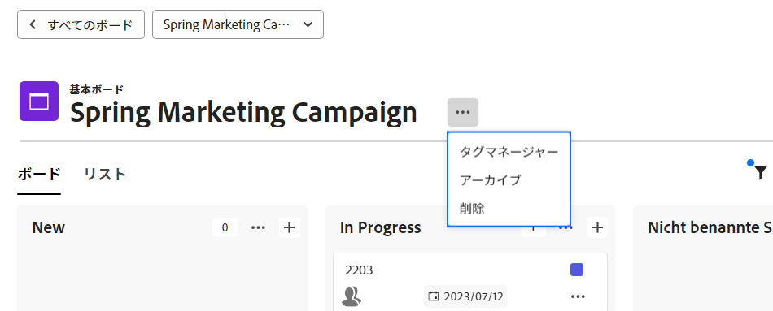
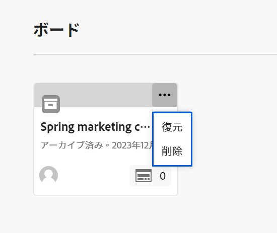

# ボードの削除またはアーカイブ

ボードは、 [!DNL Workfront]. ボードを削除すると、そのボードは完全に削除されます [!DNL Workfront]をアーカイブすると、ボードはすべてのカードを保持し、後で復元できます。

## アクセス要件

この記事の手順を実行するには、次のアクセス権が必要です。

<table style="table-layout:auto"> 
 <col> 
 </col> 
 <col> 
 </col> 
 <tbody> 
  <tr> 
   <td role="rowheader"><strong>[!DNL Adobe Workfront] 計画*</strong></td> 
   <td> 
任意
 </td> 
  </tr> 
  <tr> 
   <td role="rowheader"><strong>[!DNL Adobe Workfront] ライセンス*</strong></td> 
   <td> 
[!UICONTROL リクエスト ] 以降
 </td> 
  </tr>
   </tbody> 
</table>

&#42;ご利用のプラン、ライセンスの種類、アクセス権を確認するには、 [!DNL Workfront] 管理者。

## ボードの削除

ボードを削除すると、そのボードは次の場所から永久に削除されます： [!DNL Workfront] 復元することはできません。 ボード上のカードもボードと一緒に削除されます。

1. 次をクリック： **[!UICONTROL メインメニュー]** アイコン  右上隅に [!DNL Adobe Workfront]を選択し、「 **[!UICONTROL ボード]**.
1. ダッシュボードで、開くボードを選択します。
1. 次をクリック： **[!UICONTROL 詳細]** メニュー ![[!UICONTROL その他のメニュー]](assets/more-icon-spectrum.png) ボード名の横にあるを選択し、 **[!UICONTROL 削除]**. 次に、「 **[!UICONTROL ボードを削除]** をクリックします。

   >[!NOTE]
   >
   >削除できるのは自分で作成したボードのみで、自分が追加したボードは削除できません。

   

## ボードのアーカイブ

アーカイブされたボードは、すべてのカードと割り当てを保持します。 任意のユーザーがいつでもボードをアーカイブまたは復元できます。

1. 次をクリック： **[!UICONTROL メインメニュー]** アイコン  右上隅に [!DNL Adobe Workfront]を選択し、「 **[!UICONTROL ボード]**.
1. ダッシュボードで、開くボードを選択します。
1. 次をクリック： **[!UICONTROL 詳細]** メニュー ![[!UICONTROL その他のメニュー]](assets/more-icon-spectrum.png) ボード名の横にあるを選択し、 **[!UICONTROL アーカイブ]**.

   

## ボードの復元

アーカイブされたボードは、いつでも復元できます。 誰でも、アーカイブされたボードを復元できます。

1. 次をクリック： **[!UICONTROL メインメニュー]** アイコン  右上隅に [!DNL Adobe Workfront]を選択し、「 **[!UICONTROL ボード]**.
1. ダッシュボードで、フィルターアイコンをクリックします。  を選択し、 **[!UICONTROL アーカイブ済みボード]**.
1. 復元するボードを見つけ、 **[!UICONTROL 詳細]** メニュー  ボード名の横にあるを選択し、 **[!UICONTROL 復元]**.

   
