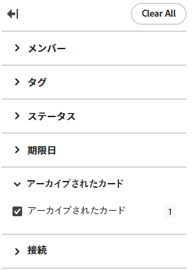

# ボードからカードを削除またはアーカイブする

ボードからカードを削除すると、そのカードは完全に削除され、復元できません。カードをアーカイブすると、アーカイブに送信され、後でボードに復元できます。

## アクセス要件

この記事の手順を実行するには、次のアクセス権が必要です。

<table style="table-layout:auto"> 
 <col> 
 <col> 
 <tbody> 
  <tr> 
   <td role="rowheader"><strong>[!DNL Adobe Workfront] プラン*</strong></td> 
   <td> 
任意
 </td> 
  </tr> 
  <tr> 
   <td role="rowheader"><strong>[!DNL Adobe Workfront] ライセンス*</strong></td> 
   <td> 
[!UICONTROL Request] 以降
 </td> 
  </tr> 
 </tbody> 
</table>

&#42;ご利用のプラン、ライセンスタイプ、アクセス権を確認するには、[!DNL Workfront] 管理者にお問い合わせください。

## ボードからのカードを削除する

1. [!DNL Adobe Workfront] の右上隅にある&#x200B;**[!UICONTROL メインメニュー]** アイコン  をクリックし、次に「**[!UICONTROL ボード]**」をクリックします。
1. ボードにアクセスします。詳しくは、[ボードの作成または編集](../../agile/get-started-with-boards/create-edit-board.md)を参照してください。
1. カード上の&#x200B;**[!UICONTROL 詳細]**&#x200B;メニューをクリックしてから、「**[!UICONTROL 削除]**」を選択します。
1. 確認メッセージで「**[!UICONTROL 削除]**」をクリックします。

## ボードからのカードをアーカイブする

1. ボードにアクセスします。
1. カード上の&#x200B;**[!UICONTROL 詳細]**&#x200B;メニューをクリックしてから、「**[!UICONTROL アーカイブ]**」を選択します。

   アーカイブしたカードは、表示するフィルターを適用しない限り、ボードに表示されません。詳しくは、[ボードをフィルタリングしてアーカイブされたカードを表示](#filter-a-board-to-show-archived-cards)を参照してください。

   [!UICONTROL アーカイブ]アイコン  は、アーカイブされたカードに表示されます。アーカイブしたカードは編集できませんが、削除したり、別の列に移動したりすることはできます。

1. アーカイブしたカードを復元するには、**[!UICONTROL その他]**&#x200B;メニュー  をクリックし、「**[!UICONTROL 復元]**」を選択します。

## ボードをフィルタリングしてアーカイブされたカードを表示する {#filter-a-board-to-show-archived-cards}

デフォルトでは、アクティブなカードのみがボードに表示されます。ボードをフィルタリングして、アーカイブしたカードも表示できます。

1. ボードにアクセスします。
1. ボードの右側の「[!UICONTROL **設定**]」をクリックして、設定パネルを開きます。
1. 「[!UICONTROL **カード**]」を展開します。
1. オンにする [!UICONTROL **ボードにアーカイブしたカードを表示する**].
1. 「[!UICONTROL **フィルター**]」をクリックし、「[!UICONTROL アーカイブされたカード]」セクションを展開して、**[!UICONTROL アーカイブされたカード]**&#x200B;を選択してアーカイブされたカードを表示します。

   フィルターには、アーカイブされたカードの数が表示されます。

   

   >[!NOTE]
   >
   >The [!UICONTROL アーカイブ済みカード] アーカイブされたカードを表示する設定をオンにしていない場合、セクションはフィルターで使用できません。 詳しくは、[カードに表示するフィールドのカスタマイズ](/help/quicksilver/agile/get-started-with-boards/customize-fields-on-card.md)を参照してください。

1. 「**[!UICONTROL アーカイブされたカード]**」を再び選択し、オプションをクリアして、アクティブなカードのみを表示します。
