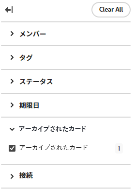

# ボードからカードを削除またはアーカイブする

When you delete an ad hoc card from a board, it is permanently deleted and can&#39;t be restored. Connected cards can be manually added back to a board after they are deleted.

If you delete a connected card from a dynamic board, it will reappear when you refresh the board because this board type pulls in all tasks and issues from a specific project. To delete the card, you must delete the connected task or issue from the Workfront project.

When you delete a connected card from any other board type that has an intake column, the card will reappear in the intake column when you refresh the board if the connected task or issue is not yet marked complete. For more information on intake columns, see [Add an intake column to a board](/help/quicksilver/agile/use-boards-agile-planning-tools/add-intake-column-to-board.md).

カードをアーカイブすると、アーカイブに送信され、後でボードに復元できます。

Archived cards do not sync to Workfront tasks and issues. カードを復元すると、再度同期されます。

## アクセス要件

+++ 展開すると、この記事の機能のアクセス要件が表示されます。

<table style="table-layout:auto"> 
 <col> 
 <col> 
 <tbody> 
  <tr> 
   <td role="rowheader">Adobe Workfront パッケージ</td> 
   <td> 
任意
 </td> 
  </tr> 
  <tr> 
   <td role="rowheader">Adobe Workfront プラン</td> 
   <td> 
   
コントリビューター以上
 
   
リクエスト以上

   </td> 
  </tr> 
 </tbody> 
</table>

この表の情報について詳しくは、[Workfront ドキュメントのアクセス要件](/help/quicksilver/administration-and-setup/add-users/access-levels-and-object-permissions/access-level-requirements-in-documentation.md)を参照してください。

+++

## ボードからのカードを削除する

{{step1-to-boards}}

1. ボードにアクセスします。詳しくは、[ボードの作成または編集](../../agile/get-started-with-boards/create-edit-board.md)を参照してください。
1. カード上の&#x200B;**[!UICONTROL 詳細]**&#x200B;メニューをクリックしてから、「**[!UICONTROL 削除]**」を選択します。
1. 確認メッセージで「**[!UICONTROL 削除]**」をクリックします。

## ボードからのカードをアーカイブする

1. ボードにアクセスします。
1. カード上の&#x200B;**[!UICONTROL 詳細]**&#x200B;メニューをクリックしてから、「**[!UICONTROL アーカイブ]**」を選択します。

   アーカイブしたカードは、表示するフィルターを適用しない限り、ボードに表示されません。詳しくは、[ボードをフィルタリングしてアーカイブされたカードを表示](#filter-a-board-to-show-archived-cards)を参照してください。

   [!UICONTROL アーカイブ]アイコン  は、アーカイブされたカードに表示されます。アーカイブしたカードは編集できませんが、削除したり、別の列に移動したりすることはできます。

1. アーカイブしたカードを復元するには、**[!UICONTROL その他]**&#x200B;メニュー  をクリックし、「**[!UICONTROL 復元]**」を選択します。

## ボードをフィルタリングしてアーカイブされたカードを表示する

デフォルトでは、アクティブなカードのみがボードに表示されます。ボードをフィルタリングして、アーカイブしたカードも表示できます。

1. ボードにアクセスします。
1. ボードの右側の「[!UICONTROL **設定**]」をクリックして、設定パネルを開きます。
1. 「[!UICONTROL **カード**]」を展開します。
1. 「[!UICONTROL **ボードにアーカイブされたカードを表示**]」をオンにします。
1. 「[!UICONTROL **フィルター**]」をクリックし、「[!UICONTROL アーカイブされたカード]」セクションを展開して、**[!UICONTROL アーカイブされたカード]**&#x200B;を選択してアーカイブされたカードを表示します。

   フィルターには、アーカイブされたカードの数が表示されます。

   

   >[!NOTE]
   >
   >アーカイブされたカードを表示する設定をオンにしていない場合、「[!UICONTROL アーカイブされたカード]」セクションはフィルターで使用できません。詳しくは、[カードに表示するフィールドのカスタマイズ](/help/quicksilver/agile/get-started-with-boards/customize-fields-on-card.md)を参照してください。

1. 「**[!UICONTROL アーカイブされたカード]**」を再び選択し、オプションをクリアして、アクティブなカードのみを表示します。
