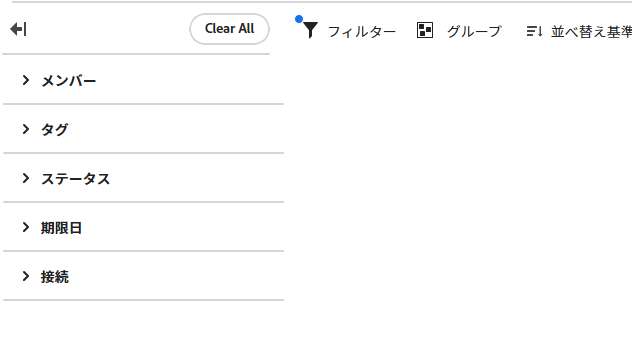
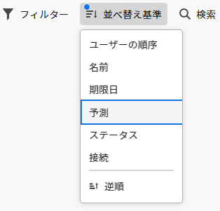

# ボード内でのフィルターと検索

ボードをフィルタリングして表示できます。

* 特定のユーザーに割り当てられたカード
* 特定のタグを含むカード
* 特定のステータスを含むカード
* 特定の時間枠内で期限が切れたカード
* アーカイブされたカード
* 特定のプロジェクトに接続されたカード

ボードの並べ替えは、列のすべてのカードを並べ替えます。1 つの列を並べ替えられません。また、バックログ列または取り込み列は並べ替えられません。

検索は、ボードにある特定のカードを探すのにも役立ちます。

フィルターを適用すると、のインジケーターが表示されます。「**[!UICONTROL すべてクリア]**」をクリックしてボードからすべてのフィルターを削除し、折りたたみアイコンをクリックしてフィルターパネルを閉じます。

## アクセス要件

+++ 展開すると、この記事の機能のアクセス要件が表示されます。

<table style="table-layout:auto"> 
 <col> 
 <col> 
 <tbody> 
  <tr> 
   <td role="rowheader">Adobe Workfront パッケージ</td> 
   <td> 
任意
 </td> 
  </tr> 
  <tr> 
   <td role="rowheader">Adobe Workfront プラン</td> 
   <td> 
   
投稿者以上
 
   
リクエスト以上

   </td> 
  </tr> 
 </tbody> 
</table>

この表の情報について詳しくは、[Workfront ドキュメントのアクセス要件](/help/quicksilver/administration-and-setup/add-users/access-levels-and-object-permissions/access-level-requirements-in-documentation.md)を参照してください。

+++

## 割り当て先によるボードのフィルタリング

{{step1-to-boards}}

1. ボードにアクセスします。詳しくは、[ボードの作成または編集](../../agile/get-started-with-boards/create-edit-board.md)を参照してください。
1. 「[!UICONTROL **フィルター**]」をクリックし、「[!UICONTROL メンバー]」セクションを展開して、表示するカードを持つユーザーを選択します。未割り当てのカードを表示することもできます。

   

## タグでボードをフィルタリング

1. ボードにアクセスします。
1. 「[!UICONTROL **フィルター**]」をクリックし、「[!UICONTROL タグ]」セクションを展開して、表示するタグを選択します。

   

## ステータスでボードをフィルタリング

1. ボードにアクセスします。
1. 「[!UICONTROL **フィルター**]」をクリックし、「[!UICONTROL ステータス]」セクションを展開して、表示するステータスを選択します。

   完成したカードを非表示にすることもできます。

   

## 期限日別にボードをフィルタリング

1. ボードにアクセスします。
1. 「[!UICONTROL **フィルター**]」をクリックし、「[!UICONTROL 期限日]」セクションを展開して、表示する日付のオプションを選択します。

   選択した日付範囲のカードのみが表示されます。

   

## ボードをフィルタリングしてアーカイブされたカードを表示する

デフォルトでは、アクティブなカードのみがボードに表示されます。ボードをフィルタリングして、アーカイブしたカードも表示できます。

1. ボードにアクセスします。
1. ボードの右側の「[!UICONTROL **設定**]」をクリックして、設定パネルを開きます。
1. 「[!UICONTROL **カード**]」を展開します。
1. 「[!UICONTROL **ボードにアーカイブされたカードを表示**]」をオンにします。
1. 「[!UICONTROL **フィルター**]」をクリックし、「[!UICONTROL アーカイブされたカード]」セクションを展開して、**[!UICONTROL アーカイブされたカード]**&#x200B;を選択してアーカイブされたカードを表示します。

   フィルターには、アーカイブされたカードの数が表示されます。

   

   >[!NOTE]
   >
   >アーカイブされたカードを表示する設定をオンにしていない場合、「[!UICONTROL アーカイブされたカード]」セクションはフィルターで使用できません。詳しくは、[カードに表示するフィールドのカスタマイズ](/help/quicksilver/agile/get-started-with-boards/customize-fields-on-card.md)を参照してください。

1. 「**[!UICONTROL アーカイブされたカード]**」を再び選択し、オプションをクリアして、アクティブなカードのみを表示します。

## 接続でボードをフィルタリング

1. ボードにアクセスします。
1. 「[!UICONTROL **フィルター**]」をクリックし、「[!UICONTROL 接続]」セクションを展開し、表示する接続されたカードの [!DNL Workfront] プロジェクトを選択します。

   また、プロジェクトに接続されていないカードを表示することもできます。

   

## ボードでの並べ替え

並べ替えの基準となるオプションを選択すると、すべての列が並べ替えられます。1 つの列を並べ替えられません。また、バックログ列または取り込み列は並べ替えられません。

1. ボードにアクセスします。
1. 「[!UICONTROL **並べ替え基準**]」をクリックし、「[!UICONTROL **名前**]」、「[!UICONTROL **期日**]」、「[!UICONTROL **見積もり**]」、「[!UICONTROL **ステータス**]」、「[!UICONTROL **接続**]」のいずれかを選択します。

   接続（プロジェクト名）は、接続されたカードにのみ適用され、その他のオプションは、列内の接続されたカードとアドホックカードの両方を並べ替えます。

   「ユーザーの順序」オプションは、他の並べ替えオプションが適用される前に、手動で設定された順序にカードを返します。これは列のデフォルトの並べ替えです。

1. 「[!UICONTROL **逆順**]」を選択すると、並び替えオプションの逆順で列を並び替えます。

   並べ替えアイコンの矢印は、列が昇順または降順のどちらで並べ替えられているかを示します。

   デフォルト以外の並べ替えが適用されると、並べ替えアイコン  にインジケーターが表示されます。

   

## ボードでの検索

1. ボードにアクセスします。
1. 「[!UICONTROL **検索**]」をクリックし、検索語を入力します。次に、Enter キーを押します。

   検索語を含むすべてのカードが表示されます。

   「 X 」をクリックして検索をクリアします。

   
