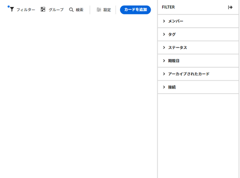
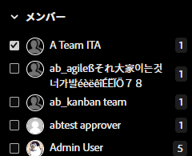
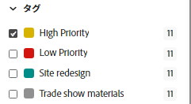
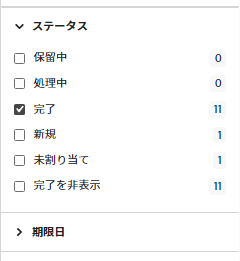
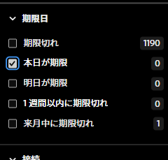
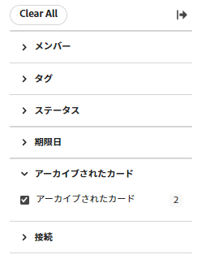
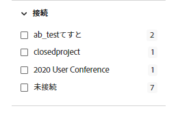

# ボードでのフィルターと検索

ボードをフィルタリングして表示できます。

* 特定のユーザーに割り当てられたカード
* 特定のタグを含むカード
* 特定のステータスを持つカード
* 特定の期間内に期限が切れるカード
* アーカイブしたカード
* 特定のプロジェクトに接続されたカード

検索は、ボード上の特定のカードを探すのにも役立ちます。

フィルターを適用すると、ボードにインジケーターが表示されます . クリック **[!UICONTROL すべてクリア]** すべてのフィルタをボードから削除するには、をクリックします。 **[!UICONTROL フィルターを非表示]** をクリックして、フィルターパネルを閉じます。

## アクセス要件

この記事の手順を実行するには、次のアクセス権が必要です。

<table style="table-layout:auto"> 
 <col> 
 <col> 
 <tbody> 
  <tr> 
   <td role="rowheader"><strong>[!DNL Adobe Workfront] 計画*</strong></td> 
   <td> 
任意
 </td> 
  </tr> 
  <tr> 
   <td role="rowheader"><strong>[!DNL Adobe Workfront] ライセンス*</strong></td> 
   <td> 
[!UICONTROL リクエスト ] 以降
 </td> 
  </tr> 
 </tbody> 
</table>

&#42;ご利用のプラン、ライセンスの種類、アクセス権を確認するには、 [!DNL Workfront] 管理者。

## 割り当て先によるボードのフィルタリング

1. 次をクリック： **[!UICONTROL メインメニュー]** アイコン  右上隅に [!DNL Adobe Workfront]を選択し、「 **[!UICONTROL ボード]**.
1. ボードにアクセスします。 詳しくは、 [ボードの作成または編集](../../agile/get-started-with-boards/create-edit-board.md).
1. クリック [!UICONTROL **フィルター**]、を展開します。 [!UICONTROL メンバー] 」セクションに移動し、表示する 1 人または複数のカードを持つユーザーを選択します。 未割り当てのカードを表示することもできます。

   

## タグでボードをフィルター

1. ボードにアクセスします。
1. クリック [!UICONTROL **フィルター**]、を展開します。 [!UICONTROL タグ] 」セクションで、表示するタグを選択します。

   

## ステータスでボードをフィルター

1. ボードにアクセスします。
1. クリック [!UICONTROL **フィルター**]、を展開します。 [!UICONTROL ステータス] 」セクションで、表示するステータスのタイプを選択します。

   完成したカードを非表示にすることもできます。

   

## 期限別にボードをフィルター

1. ボードにアクセスします。
1. クリック [!UICONTROL **フィルター**]、を展開します。 [!UICONTROL 期限] 」セクションで、表示する日付オプションを選択します。

   選択した日付範囲のカードのみが表示されます。

   

## ボードをフィルターしてアーカイブされたカードを表示

デフォルトでは、アクティブなカードのみがボードに表示されます。 ボードをフィルタリングして、アーカイブしたカードも表示できます。

1. ボードにアクセスします。
1. クリック [!UICONTROL **フィルター**]、を展開します。 [!UICONTROL アーカイブ済みカード] セクションを選択し、 **[!UICONTROL アーカイブしたカード]** アーカイブされたカードを表示します。

   フィルターには、アーカイブされたカードの数が表示されます。

   

1. 選択 **[!UICONTROL アーカイブしたカード]** を再びクリアし、アクティブなカードのみを表示します。

## ボードを接続でフィルター

1. ボードにアクセスします。
1. クリック [!UICONTROL **フィルター**]、を展開します。 [!UICONTROL 接続] セクションで、 [!DNL Workfront] 表示する接続済みカードのプロジェクトです。

   また、プロジェクトに接続されていないカードを表示することもできます。

   

## ボードでの検索

1. ボードにアクセスします。
1. クリック [!UICONTROL **検索**] 検索語句を入力します。 次に、Enter キーを押します。

   検索語句を含むすべてのカードが表示されます。

   「 X 」をクリックして検索をクリアします。

   
