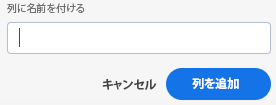
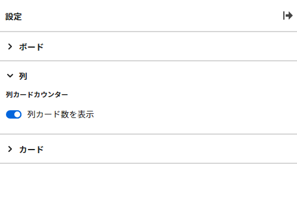
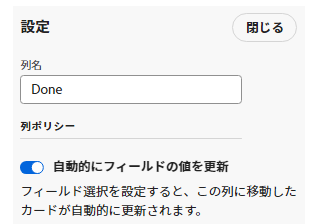
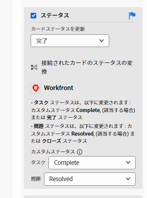
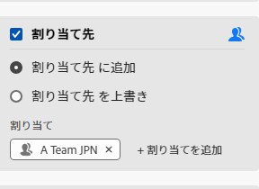
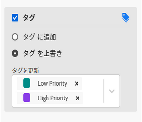
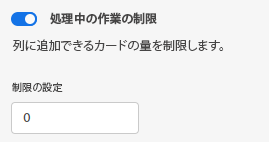

# ボード列を管理

新しいボードには、デフォルトで 3 つの列が含まれています。 列の追加、列の順序の変更、列の名前の変更、不要な列の削除を行うことができます。

列設定にはポリシーが含まれ、カードをその列に移動したときにカードがどうなるかに関するオプションを定義できます。

## アクセス要件

この記事の手順を実行するには、次のアクセス権が必要です。

<table style="table-layout:auto"> 
 <col> 
 </col> 
 <col> 
 </col> 
 <tbody> 
  <tr> 
   <td role="rowheader"><strong>[!DNL Adobe Workfront] 計画*</strong></td> 
   <td> 
任意
 </td> 
  </tr> 
  <tr> 
   <td role="rowheader"><strong>[!DNL Adobe Workfront] ライセンス*</strong></td> 
   <td> 
[!UICONTROL リクエスト ] 以降
 </td> 
  </tr> 
 </tbody> 
</table>

&#42;ご利用のプラン、ライセンスの種類、アクセス権を確認するには、 [!DNL Workfront] 管理者。

## ボードに列を追加する

1. 次をクリック： **[!UICONTROL メインメニュー]** アイコン  右上隅に [!DNL Adobe Workfront]を選択し、「 **[!UICONTROL ボード]**.
1. ボードにアクセスします。 詳しくは、 [ボードの作成または編集](../../agile/get-started-with-boards/create-edit-board.md).
1. クリック **[!UICONTROL 列を追加]** をクリックします。
1. 新しい列に名前を入力し、 **[!UICONTROL 列を追加]**.

   

>[!TIP]
>
>吸気柱を追加するには、 [ボードに吸気柱を追加する](/help/quicksilver/agile/use-boards-agile-planning-tools/add-intake-column-to-board.md).

## ボード上の列の並べ替え

1. ボードにアクセスします。
1. 列を正しい順序にドラッグ&amp;ドロップします。 列を別の場所にドラッグする前に、列の上部を必ず選択してください。

   

## ボード列の名前を変更する

1. ボードにアクセスします。
1. 列名をクリックし、新しい名前を入力して、Enter キーを押します。

   または

   次をクリック： **[!UICONTROL 詳細]** メニュー  をクリックし、「 **[!UICONTROL 編集]**. 設定領域で、新しい名前を **[!UICONTROL 列名]** 「 」フィールドで「 」をクリックし、 **[!UICONTROL 閉じる]**.

## ボード列の削除

1. ボードにアクセスします。
1. 次をクリック： **[!UICONTROL 詳細]** メニュー  列で、を選択します。 **[!UICONTROL 削除]**.

   >[!NOTE]
   >
   >アーカイブされたカードを含むカードを含む列は削除できません。 カードを含む列を削除しようとする場合は、それらのカード用に別の列を選択する必要があります。

## カード数を表示

設定を使用して、各列のカード数を表示できます。

ある列に WIP 制限を使用している場合、別のカードカウンターは追加されません。 WIP 制限の詳細は、 [の管理 [!UICONTROL 作業中] (WIP) ボード上限](/help/quicksilver/agile/use-boards-agile-planning-tools/manage-wip-limit-on-board.md).

1. ボードにアクセスします。
1. クリック **[!UICONTROL 設定]** をクリックして、設定パネルを開きます。
1. 展開 **[!UICONTROL 列]**.
1. オンにする **[!UICONTROL 列カード数を表示]**.

   

   各列の上部にカードカウンターが表示されます。

1. クリック **[!UICONTROL 設定を非表示]** 閉じる [!UICONTROL 設定] パネル。

## 列設定とポリシーの定義

1. ボードにアクセスします。
1. 次をクリック： **[!UICONTROL 詳細]** メニュー  列で、を選択します。 **[!UICONTROL 編集]**.

   この [!UICONTROL 設定] 領域が表示されます。 この **[!UICONTROL 列名]** を使用すると、設定を定義する列を把握できます。

1. を有効にします。 **[!UICONTROL フィールド値を自動的に更新]** 特定のフィールド値を、カードがこの列に移動されたときに自動的に変更するポリシーです。

   

1. （オプション）カードのステータスの値を設定します。

   1. を選択します。 **[!UICONTROL ステータス]** チェックボックスをオンにします。

   1. カードがこの列に移動されたときにカードに適用するステータスを選択します。

      

      接続されたカードのステータス翻訳オプションも表示されます。 （ステータス翻訳はアドホックカードには適用されません）。 これらのオプションは、 [!DNL Workfront] 接続されたカードがこの列に移動されたとき。

   1. デフォルトのステータス翻訳の選択を変更するには、 **[!UICONTROL 編集]** アイコン .
   1. タスクのステータスと問題のステータスを選択します。 デフォルトの [!DNL Workfront] ステータスは利用できます。カスタムステータスは利用できません。

   >[!NOTE]
   >
   >カスタムステータスを [!DNL Workfront]をクリックした場合、最初に接続されたカードをこの列に移動すると、ステータスを選択するよう求められます。 たとえば、接続されたプロジェクトに複数のステータスタイプがあり、すべてが [!UICONTROL 完了]を使用する場合は、で使用するステータスを選択する必要があります [!DNL Workfront]. カードを列に移動するたびに選択を行う必要がなくなるよう、デフォルトとして選択を設定できます。
   >ステータスについて詳しくは、 [ステータスの概要](/help/quicksilver/administration-and-setup/customize-workfront/creating-custom-status-and-priority-labels/statuses-overview.md).

1. （オプション）カードの割り当て先の値を設定します。

   1. を選択します。 **[!UICONTROL 担当者]** チェックボックスをオンにします。
   1. アクションを選択します。

      * **[!UICONTROL 担当者に追加]:** 選択した担当者は、この列に移動されると、カード上の既存の担当者リストに追加されます。
      * **[!UICONTROL 担当者の上書き]:** 選択した担当者は、他のすべての担当者より優先され、この列に移動すると、カード上の唯一の担当者になります。
   1. ドロップダウンリストから担当者を選択します。 ボード上のメンバーのみが選択できます。 詳しくは、 [ボードに対するメンバーの追加または削除](/help/quicksilver/agile/get-started-with-boards/add-members-to-board.md).

      

1. （オプション）カードタグの値を設定します。

   1. を選択します。 **[!UICONTROL カード]** チェックボックスをオンにします。
   1. アクションを選択します。

      * **[!UICONTROL タグに追加]:** 選択したタグは、この列に移動されると、カード上のタグの既存のリストに追加されます。
      * **[!UICONTROL タグの上書き]:** 選択したタグは、他のすべてのタグより優先され、この列に移動されたときに、カード上の唯一のタグになります。
   1. ドロップダウンリストからタグを選択します。 で既に作成されているタグのみ [!UICONTROL タグマネージャー] は、から選択できます。 新しいタグの追加について詳しくは、 [タグを追加](/help/quicksilver/agile/get-started-with-boards/add-tags.md).

      

1. を有効にします。 **[!UICONTROL 作業中の制限]** ポリシーを使用して、列に追加できるカードの数を制限します。 次に、 **[!UICONTROL 制限を設定]** フィールドに入力します。

   

   詳しくは、 [ボード上の WIP 制限の管理](/help/quicksilver/agile/use-boards-agile-planning-tools/manage-wip-limit-on-board.md).

1. クリック **[!UICONTROL 閉じる]** をクリックして「設定」領域を閉じ、列とそのカードを表示します。
