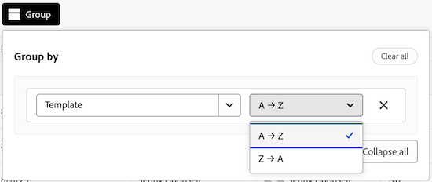

# ボードの管理者ビューの管理

ボード管理者ビューには、アカウント内のすべてのボードのリストが含まれています。システム管理者はこのリストを使用して、ボードの最終更新日時、各ボードに含まれるカードの数など、ボードの全体詳細のスナップショットをすばやく取得できます。

この領域から、次のアクションを実行できます。

* 掲示板リストのフィルタリング
* ボードのリスト列の設定
* 掲示板リストのグループ化

## アクセス要件

+++ 展開すると、アクセス要件が表示されます。

<table style="table-layout:auto"> 
 <col> 
 </col> 
 <col> 
 </col> 
 <tbody> 
  <tr> 
   <td role="rowheader">Adobe Workfront プラン</td> 
   <td> 
任意
 </td> 
  </tr> 
  <tr> 
   <td role="rowheader">Adobe Workfront ライセンス</td> 
   <td> 
投稿者以上 

        
 リクエスト以上 
</td> 
  </tr> 
 </tbody> 
</table>

この表の情報について詳しくは、[Workfront ドキュメントのアクセス要件](/help/quicksilver/administration-and-setup/add-users/access-levels-and-object-permissions/access-level-requirements-in-documentation.md)を参照してください。

+++

## 前提条件

管理者ビューから表示するには、まずボードを作成する必要があります。

詳しくは、[ボードの作成または編集](/help/quicksilver/agile/get-started-with-boards/create-edit-board.md)を参照してください。

## 掲示板リストのフィルタリング

{{step1-to-boards}}

1. **ボード** ページで「**管理者ビュー**」タブを選択します。

1. **フィルター** を選択します。 **フィルター** パネルが開きます。

1. フィルターを設定するには、次の手順に従います。

   1. （オプション） **カレンダー** アイコン  をクリックして、その期間内に最後に変更されたボードでフィルタリングする日付範囲を選択します。

   1. （オプション）「**テンプレート**」セクションで、リストでフィルタリングするボードテンプレートのタイプを選択します。 複数のテンプレートタイプを選択できます。
ボードテンプレートタイプについて詳しくは、[ ボードの作成または編集 ](/help/quicksilver/agile/get-started-with-boards/create-edit-board.md) を参照してください。

   1. （オプション）「**アーカイブ済み**」セクションで、アーカイブ済みまたはアーカイブされていないボードを表示するかどうかを選択します。 複数のオプションを選択できます。

      

1. **フィルター** パネルの外側をクリックして閉じます。 フィルターの選択内容は、デフォルトの表示に戻すまで、掲示板リストに適用されたままになります。

   >[!NOTE]
   >
   >フィルターを削除するには、**フィルター** パネルを開き、右上隅にある **デフォルトに戻る** をクリックします。

## ボードのリスト列の設定

{{step1-to-boards}}

1. **ボード** ページで「**管理者ビュー**」タブを選択します。

1. **列** を選択します。 **フィールドの表示と順序** パネルが開きます。

1. 各列にインラインの切り替えを選択または選択解除することで、ボードリストに表示する列を設定します。

   * **所有者**
   * **最終更新日**
   * **メンバー**
   * **アーカイブ済み**
   * **テンプレート**
   * **カード数**

1. （オプション）フィールドの表示順序を調整するには、フィールドの左側にある **ドラッグ** アイコンをクリックしたままにし、新しい位置にドラッグします。

   

1. **フィールドの表示と順序** パネルの外側をクリックして、パネルを閉じます。 列の設定は、変更されるまで、掲示板リストに適用されたままになります。

   >[!NOTE]
   >
   > ボードリストの列の表示が変更されると、**列** アイコンの上に青い点が表示され、現在のビューがデフォルトから変更されたことを示します。

## 掲示板リストを特定のフィールドでグループ化

{{step1-to-boards}}

1. **ボード** ページで「**管理者ビュー**」タブを選択します。

1. **グループ** を選択します。 **グループ化** パネルが開きます。

1. 掲示板リストをグループ化するフィールドの選択基準：

   * **アーカイブ済み**
   * **所有者**
   * **テンプレート**

1. （オプション） **グループ化の条件** パネルからグループ化を展開または折りたたむには、**すべて折りたたむ** または **すべて展開** をクリックします。

   

1. （オプション）グループ化の表示順序を A～Z から Z～A に変更するには、リストが現在グループ化されているフィールドを選択し、ドロップダウンから「**Z～A**」を選択します。

   

1. **グループ化** パネルの外側をクリックして閉じます。 ここから、グループ化タイトルの横にある矢印を選択して、リストで適用されたグループ化を折りたたんだり展開したりできます。

   

   >[!NOTE]
   >   
   >ボードリストのグループ化の表示が変更されると、**グループ** アイコンの上に青い点が表示され、現在のビューがデフォルトと異なることを示します。 
   >グループ化を削除する場合は、**グループ化** パネルを開き、右上隅にある **すべてクリア** を選択します。
