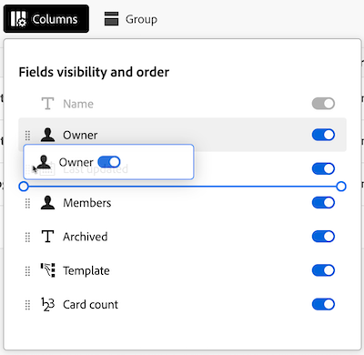
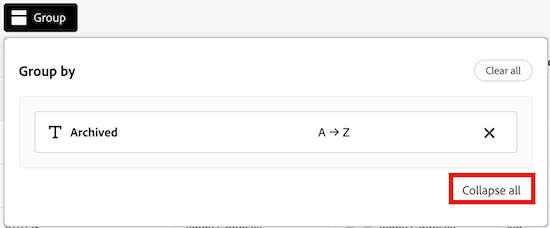

# ボードの管理者ビューの管理

ボード管理者ビューには、アカウント内のすべてのボードのリストが含まれており、システム管理者はボード全体の詳細を簡単にスナップショットで確認することができます。これには、前回の更新日時、各ボードのカード数などが含まれます。

この領域から、次のアクションを実行できます。

* 掲示板リストのフィルター
* 掲示板リスト列の設定
* 掲示板リストのグループ化

## アクセス要件

+++ 展開すると、この記事の機能のアクセス要件が表示されます。

<table style="table-layout:auto"> 
 <col> 
 </col> 
 <col> 
 </col> 
 <tbody> 
  <tr> 
   <td role="rowheader">Adobe Workfront パッケージ</td> 
   <td> 
任意
 </td> 
  </tr> 
  <tr> 
   <td role="rowheader">Adobe Workfront プラン</td> 
   <td> 
標準

        
 プラン 
</td> 
  </tr> 
    <tr> 
   <td role="rowheader">アクセスレベル設定</td> 
   <td> 
システム管理者 

        </td> 
  </tr> 
 </tbody> 
</table>

詳しくは、[Workfront ドキュメントのアクセス要件](/help/quicksilver/administration-and-setup/add-users/access-levels-and-object-permissions/access-level-requirements-in-documentation.md)を参照してください。

+++

## 前提条件

管理者ビューからボードを表示するには、ボードを作成する必要があります。

詳しくは、[ボードの作成または編集](/help/quicksilver/agile/get-started-with-boards/create-edit-board.md)を参照してください。

## 掲示板リストのフィルター

{{step1-to-boards}}

1. **ボード** ページで、「**管理者ビュー**」タブを選択します。

1. **フィルター**&#x200B;を選択します。 **フィルター** パネルが開きます。

1. フィルターを設定するには、次の手順に従います。

   1. （オプション）「**カレンダー**」アイコン「」をクリックし、その期間内に最後に変更されたボードでフィルタリングする日付範囲を選択します。

   1. （オプション）「**テンプレート**」セクションで、リストでフィルタリングするボードテンプレートのタイプを選択します。複数のテンプレートタイプを選択できます。
ボード テンプレートの種類について詳しくは、[ ボードの作成または編集](/help/quicksilver/agile/get-started-with-boards/create-edit-board.md)を参照してください。

   1. （オプション）「**アーカイブ済み**」セクションで、アーカイブ済みボードとアーカイブされていないボードのどちらを表示するかを選択します。 複数のオプションを選択できます。

      です

1. **フィルター** パネルの外側をクリックして閉じます。 フィルターの選択は、デフォルトのビューに変更されるまで、ボードリストに適用されたままになります。

   >[!NOTE]
   >
   >フィルターを削除するには、**フィルター** パネルを開き、右上隅の「**デフォルトに戻る**」をクリックします。

## 掲示板リスト列の設定

{{step1-to-boards}}

1. **ボード** ページで、「**管理者ビュー**」タブを選択します。

1. **列**&#x200B;を選択します。 **フィールドの表示と順序** パネルが開きます。

1. 各列に対して切り替えスイッチを選択または選択解除することで、ボード リストに表示される列を設定します。

   * **所有者**
   * **最終更新日**
   * **メンバー**
   * **アーカイブ済み**
   * **テンプレート**
   * **カード数**

1. （オプション）フィールドが表示される順序を調整するには、フィールドの左側にある&#x200B;**ドラッグ** アイコンをクリックしたまま、新しい位置にドラッグします。

   

1. **フィールドの表示と順序** パネルの外側をクリックして閉じます。 列の設定は、変更されるまでボードリストに適用されたままになります。

   >[!NOTE]
   >
   > 掲示板リストの列の表示が変更されると、現在のビューがデフォルトから変更されたことを示す青い点が&#x200B;**列** アイコンの上に表示されます。

## 特定のフィールドで掲示板リストをグループ化する

{{step1-to-boards}}

1. **ボード** ページで、「**管理者ビュー**」タブを選択します。

1. **グループ**&#x200B;を選択します。 **グループ化** パネルが開きます。

1. 掲示板リストをグループ化するフィールドを選択します。

   * **アーカイブ済み**
   * **所有者**
   * **テンプレート**

1. （オプション）グループ化を&#x200B;**グループ化** パネルから展開または折りたたむには、**すべてを折りたたむ**&#x200B;または&#x200B;**すべてを展開**&#x200B;をクリックします。

   

1. （オプション）グループ化の表示順序をA ～ ZからZ ～ Aに変更するには、リストが現在グループ化されているフィールドを選択し、ドロップダウンから&#x200B;**Z ～ A**&#x200B;を選択します。

   

1. **グループ化** パネルの外側をクリックして閉じます。 ここから、グループ化タイトルの横にある矢印を選択して、リスト内の適用されたグループ化を折りたたんだり展開したりできます。

   

   >[!NOTE]
   >   
   >掲示板リストのグループ化表示を変更すると、**グループ** アイコンの上に青いドットが表示され、現在のビューがデフォルトと異なることを示します。 
   >グループ化を削除する場合は、**グループ化** パネルを開き、右上隅の「**すべてクリア**」を選択します。
