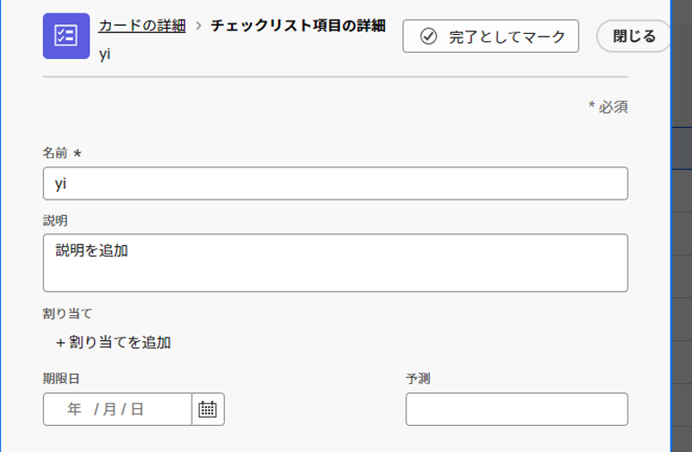
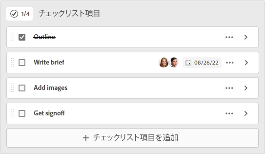

# カードのチェックリスト項目を管理

カードのチェックリストを使用すると、作業をより少ない増分に分類したり、カードにメモを追加したりできます。 チェックリスト項目は、アドホックカードと接続されたカードの両方で使用できます。

カードについて詳しくは、 [ボードへのアドホックカードの追加](/help/quicksilver/agile/get-started-with-boards/add-card-to-board.md), [ボードでの接続済みカードの使用](/help/quicksilver/agile/get-started-with-boards/connected-cards.md)、および [カードの管理](/help/quicksilver/agile/get-started-with-boards/move-board-items.md).

## アクセス要件

この記事の手順を実行するには、次のアクセス権が必要です。

<table style="table-layout:auto"> 
 <col> 
 </col> 
 <col> 
 </col> 
 <tbody> 
  <tr> 
   <td role="rowheader"><strong>[!DNL Adobe Workfront] 計画*</strong></td> 
   <td> 
任意
 </td> 
  </tr> 
  <tr> 
   <td role="rowheader"><strong>[!DNL Adobe Workfront] ライセンス*</strong></td> 
   <td> 
[!UICONTROL リクエスト ] 以降
 </td> 
  </tr> 
 </tbody> 
</table>

&#42;ご利用のプラン、ライセンスの種類、アクセス権を確認するには、 [!DNL Workfront] 管理者。

## カードへのチェックリストの追加

1. 次をクリック： **[!UICONTROL メインメニュー]** アイコン  Adobe Workfrontの右上隅で、 **[!UICONTROL ボード]**.
1. ボードにアクセスします。 詳しくは、 [ボードの作成または編集](../../agile/get-started-with-boards/create-edit-board.md).
1. カードをクリックして、 [!UICONTROL カードの詳細] ボックス

   または

   次をクリック： **[!UICONTROL 詳細]** メニュー  を選択し、 **[!UICONTROL 編集]**.

1. 新しい項目を追加するには、 **[!UICONTROL チェックリスト項目を追加]**. 次に、項目のタイトルを入力し、Enter キーを押します。 別の項目が自動的に追加されます。 引き続きタイトルを入力して、さらに項目を追加します。

   チェックリストの上部にあるカウンターは、完了した項目の数と合計項目数を示します。

1. クリック  開く [!UICONTROL チェックリスト項目の詳細] ボックス

   

1. （オプション）チェックリスト項目の説明、担当者、期限、推定時間を追加します。

   これらのフィールドについて詳しくは、 [ボードへのアドホックカードの追加](/help/quicksilver/agile/get-started-with-boards/add-card-to-board.md) または [ボードでの接続済みカードの使用](/help/quicksilver/agile/get-started-with-boards/connected-cards.md).

1. クリック **[!UICONTROL 閉じる]** をクリックして、カードの詳細とチェックリスト項目の完全なリストに戻ります。

   担当者と期限が項目に表示されます。

1. 項目をコピーするには、 **[!UICONTROL 詳細]** メニュー  を選択し、 **[!UICONTROL コピー]**.
1. チェックリスト項目を削除するには、 **[!UICONTROL 詳細]** メニュー  を選択し、 **[!UICONTROL 削除]**.

## チェックリスト項目を完了

1. ボードにアクセスし、チェックリストが表示されているカードを探します。
1. カードをクリックして、 [!UICONTROL カードの詳細] ボックス

   または

   次をクリック： **[!UICONTROL 詳細]** メニュー  を選択し、 **[!UICONTROL 編集]**.

1. 完了した項目の横にあるチェックボックスをオンにします。

   カウンターが更新され、完了した項目が表示されます。

   項目をリストに再度追加する必要がある場合は、このチェックボックスをオフにできます。

   

1. クリック **[!UICONTROL 閉じる]** ボードに戻る

   カードのカウンターも更新されます。
