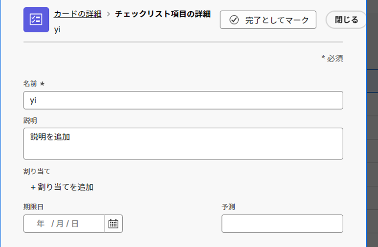
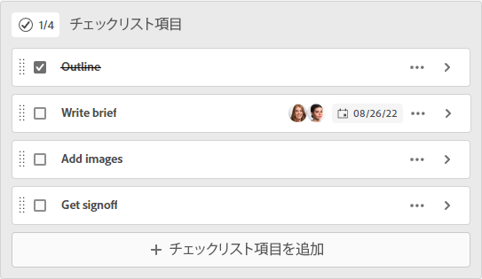

# カードのチェックリスト項目を管理する

カードのチェックリストを使用すると、作業をより少ない単位に分割したり、カードにメモを追加したりできます。 チェックリスト項目は、アドホックカードと接続されたカードの両方で使用できます。

カードについて詳しくは、[ボードへのアドホックカードの追加](/help/quicksilver/agile/get-started-with-boards/add-card-to-board.md)、[ボードでの接続されたカードの使用](/help/quicksilver/agile/get-started-with-boards/connected-cards.md)、および[カードの管理](/help/quicksilver/agile/get-started-with-boards/move-board-items.md)を参照してください。

## アクセス要件

+++ 展開すると、この記事の機能のアクセス要件が表示されます。

<table style="table-layout:auto"> 
 <col> 
 <col> 
 <tbody> 
  <tr> 
   <td role="rowheader">Adobe Workfront パッケージ</td> 
   <td> 
任意
 </td> 
  </tr> 
  <tr> 
   <td role="rowheader">Adobe Workfront プラン</td> 
   <td> 
   
コントリビューター以上
 
   
リクエスト以上

   </td> 
  </tr> 
 </tbody> 
</table>

詳しくは、[Workfront ドキュメントのアクセス要件](/help/quicksilver/administration-and-setup/add-users/access-levels-and-object-permissions/access-level-requirements-in-documentation.md)を参照してください。

+++

## カードにチェックリストを追加

{{step1-to-boards}}

1. ボードにアクセスします。 詳しくは、[ボードの作成または編集](../../agile/get-started-with-boards/create-edit-board.md)を参照してください。
1. カードをクリックして、[!UICONTROL カードの詳細]ボックスを開きます。

   または

   カード上の&#x200B;**[!UICONTROL その他]**&#x200B;メニュー  をクリックし、「**[!UICONTROL 編集]**」を選択します。

1. 新しい項目を追加するには、「**[!UICONTROL チェックリスト項目を追加]**」をクリックします。 次に、項目のタイトルを入力し、Enter キーを押します。 別の項目が自動的に追加されます。 引き続きタイトルを入力して、さらに項目を追加します。

   チェックリストの上部にあるカウンターは、完了した項目の数と合計項目数を示します。

1.  をクリックして[!UICONTROL チェックリスト項目の詳細]ボックスを開きます。

   

1. （オプション）チェックリスト項目の説明、割り当て先、期限、見積もり時間を追加します。

   これらのフィールドについて詳しくは、[ボードへのアドホックカードの追加](/help/quicksilver/agile/get-started-with-boards/add-card-to-board.md)、または[ボードでの接続されたカードの使用](/help/quicksilver/agile/get-started-with-boards/connected-cards.md)を参照してください。

1. 「**[!UICONTROL 閉じる]**」をクリックして、カードの詳細とチェックリスト項目の完全なリストに戻ります。

   割り当て先と期限が項目に表示されます。

1. 項目をコピーするには、その項目の&#x200B;**[!UICONTROL その他]**&#x200B;メニュー  をクリックし、「**[!UICONTROL コピー]**」を選択します。
1. チェックリスト項目を削除するには、その項目の&#x200B;**[!UICONTROL その他]**&#x200B;メニュー  をクリックし、「**[!UICONTROL 削除]**」を選択します。

## チェックリスト項目を完了

1. ボードにアクセスし、チェックリストが含まれているカードを探します。
1. カードをクリックして、[!UICONTROL カードの詳細]ボックスを開きます。

   または

   カード上の&#x200B;**[!UICONTROL その他]**&#x200B;メニュー  をクリックし、「**[!UICONTROL 編集]**」を選択します。

1. 完了した項目の横にあるチェックボックスを選択します。

   カウンターが更新され、完了した項目が表示されます。

   項目をリストに再度追加する必要がある場合は、このチェックボックスをクリアできます。

   

1. 「**[!UICONTROL 閉じる]**」をクリックしてボードに戻ります。

   カードのカウンターも更新されます。
