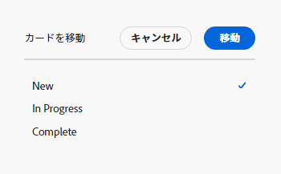
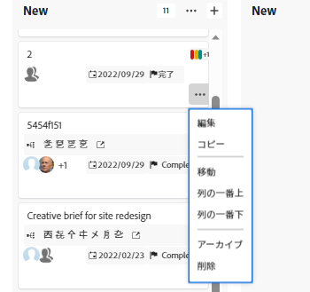

# カードの管理

カードは、ボード上の任意の列に移動したり、カードをコピーしたりできます。

フィールド値の更新を有効にする列ポリシーがある場合、カードを別の列に移動すると、ステータス、割り当て先、タグが自動的に更新されます。 詳しくは、この記事の「列設定とポリシーの定義」を参照してください [ボード列を管理](/help/quicksilver/agile/get-started-with-boards/manage-board-columns.md).

>[!NOTE]
>
>あるボードから別のボードにカードを移動することはできません。

## アクセス要件

この記事の手順を実行するには、次のアクセス権が必要です。

<table style="table-layout:auto"> 
 <col> 
 </col> 
 <col> 
 </col> 
 <tbody> 
  <tr> 
   <td role="rowheader"><strong>[!DNL Adobe Workfront] 計画*</strong></td> 
   <td> 
任意
 </td> 
  </tr> 
  <tr> 
   <td role="rowheader"><strong>[!DNL Adobe Workfront] ライセンス*</strong></td> 
   <td> 
[!UICONTROL リクエスト ] 以降
 </td> 
  </tr> 
 </tbody> 
</table>

&#42;ご利用のプラン、ライセンスの種類、アクセス権を確認するには、 [!DNL Workfront] 管理者。

## 列間でカードを移動

1. 次をクリック： **[!UICONTROL メインメニュー]** アイコン  右上隅に [!DNL Adobe Workfront]を選択し、「 **[!UICONTROL ボード]**.
1. ボードにアクセスします。 詳しくは、 [ボードの作成または編集](../../agile/get-started-with-boards/create-edit-board.md).
1. カードを別の列の表示位置にドラッグ&amp;ドロップします。

   または

   次をクリック： **[!UICONTROL 詳細]** メニュー  を選択し、 **[!UICONTROL 移動]**. 次に、 **[!UICONTROL 項目を移動]** ボックス、別の列を選択し、「 」を選択します。 **[!UICONTROL 移動]**.

   

   >[!NOTE]
   >
   >を使用する場合、 **[!UICONTROL 項目を移動]** 」ボックスに入力した場合、カードは常に列の先頭に移動されます。

## カードを列の上または下に移動する

1. ボードにアクセスします。
1. カードを、列に表示する位置にドラッグ&amp;ドロップします。

   または

   次をクリック： **[!UICONTROL 詳細]** メニュー  を選択し、 **[!UICONTROL 列の先頭]** または **[!UICONTROL 列の下部]**.

   

## カードのコピー

アドホックカードをコピーすると、チェックリスト項目を含む、カード上のすべてのフィールドが複製されます。

>[!NOTE]
>
>接続されたカードはコピーできません。

1. ボードにアクセスします。
1. 次をクリック： **[!UICONTROL 詳細]** メニュー ![[!UICONTROL その他のメニュー]](assets/more-icon-spectrum.png) を選択し、 **[!UICONTROL コピー]**.

   

   同じ列に新しいカードが追加され、タイトルは「 — のコピー」 [元のカード名].&quot;
