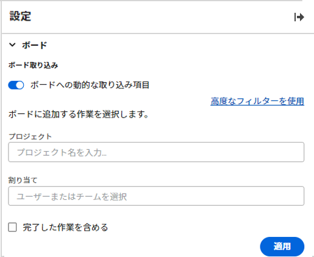
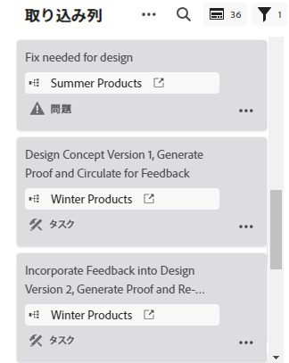
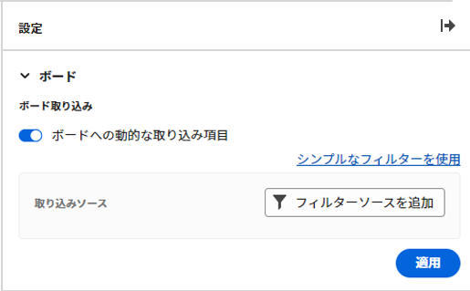
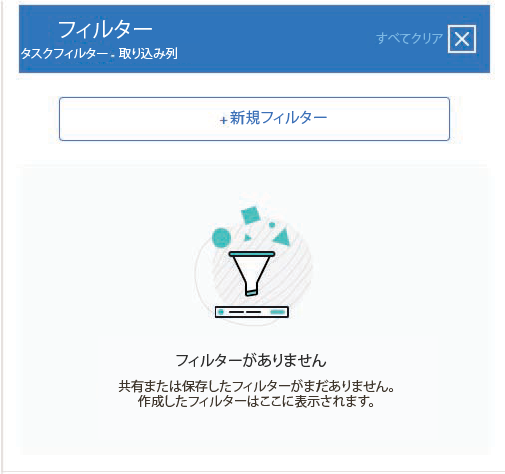
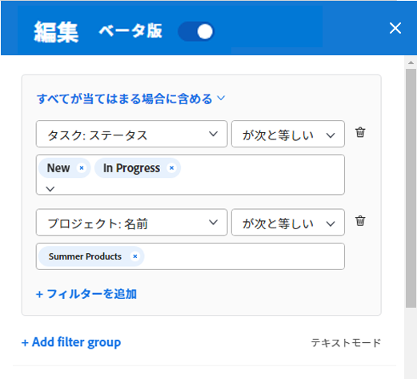
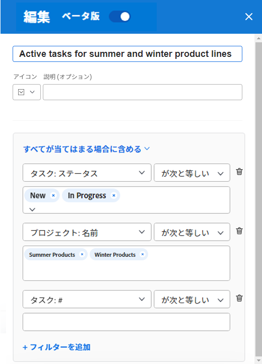
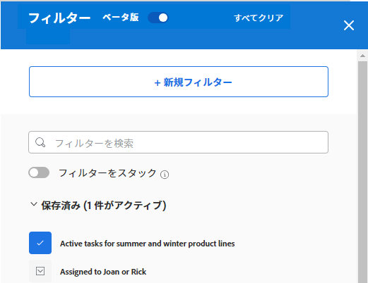

# ボードに吸気柱を追加する

必要に応じて、ボードに取り込みカラムを追加し、追加時に接続されたカードとしてタスクと問題を自動的に引き込むことができます。 [!DNL Workfront]：定義したフィルターに基づきます。 取り入れ列は、かんばんチームのバックログ列、サポートチームの取り入れ場所として、要求キューに追加された問題を確認するための取り入れ場所、または必要なその他の目的に使用できます。

1 つのボード上で許可される取り込みカラムは 1 つだけで、常に一番左のカラムとして表示されます。

取り込みカラムはダイナミックボード上では使用できません。

取り込みカラムは、300 タスクと 300 問題に制限されます。 取り込み口列の項目のデフォルトの順序は次のとおりです。

タスク：

* プライマリの順序：プロジェクト名
* セカンダリの順序：作業分割構成

問題:

* プライマリの順序：プロジェクト名
* セカンダリの順序：参照番号

列について詳しくは、 [ボード列を管理](/help/quicksilver/agile/get-started-with-boards/manage-board-columns.md). 接続されたカードについて詳しくは、 [ボードでの接続済みカードの使用](/help/quicksilver/agile/get-started-with-boards/connected-cards.md).

## アクセス要件

この記事の手順を実行するには、次のアクセス権が必要です。

<table style="table-layout:auto"> 
 <col> 
 </col> 
 <col> 
 </col> 
 <tbody> 
  <tr> 
   <td role="rowheader"><strong>[!DNL Adobe Workfront] 計画*</strong></td> 
   <td> 
任意
 </td> 
  </tr> 
  <tr> 
   <td role="rowheader"><strong>[!DNL Adobe Workfront] ライセンス*</strong></td> 
   <td> 
[!DNL Request] またはそれ以降
 </td> 
  </tr> 
 </tbody> 
</table>

&#42;ご利用のプラン、ライセンスの種類、アクセス権を確認するには、 [!DNL Workfront] 管理者。

## 単純なフィルタを使用して吸気柱を作成する

1. 次をクリック： **[!UICONTROL メインメニュー]** アイコン  Adobe Workfrontの右上隅で、 **[!UICONTROL ボード]**.
1. ボードにアクセスします。 詳しくは、 [ボードの作成または編集](../../agile/get-started-with-boards/create-edit-board.md).
1. クリック **[!UICONTROL 設定]** をクリックして、設定パネルを開きます。
1. 展開 **[!UICONTROL ボード]**.
1. オンにする **[!UICONTROL ボードに対する項目の動的取り込み]**.

   

   取り込みカラムは、ボードの左側に追加されます。 フィルターを適用するまで空白のままです。

1. （オプション）を検索して選択します。 [!DNL Workfront] [!UICONTROL **プロジェクト**].
1. （オプション）ユーザーまたはチームを検索して選択します。 [!UICONTROL **割当て**].
1. 選択 [!UICONTROL **完了した作業を含める**] タスクと問題のステータスが「完了」の場合は、インテーク列に表示されます。

   >[!NOTE]
   >
   >このオプションを選択しない場合、他のステータスのカードが完了とマークされると、そのカードはボードから「フォールオフ」され、表示されなくなります。

1. クリック [!UICONTROL **適用**].

   すべてのオブジェクトは、接続されたカードとしてボードインテーク列に表示されます。

   

## 詳細フィルターを使用した取り込みカラムの作成

1. 次をクリック： **[!UICONTROL メインメニュー]** アイコン  Adobe Workfrontの右上隅で、 **[!UICONTROL ボード]**.
1. ボードにアクセスします。 詳しくは、 [ボードの作成または編集](../../agile/get-started-with-boards/create-edit-board.md).
1. クリック **[!UICONTROL 設定]** をクリックして、設定パネルを開きます。
1. 展開 **[!UICONTROL ボード]**.
1. オンにする **[!UICONTROL ボードに対する項目の動的取り込み]**.

   取り込みカラムは、ボードの左側に追加されます。 フィルターを適用するまで空白のままです。

1. クリック [!UICONTROL **詳細フィルターの使用**].
1. クリック **[!UICONTROL フィルターソースを追加]** を選択し、 **[!UICONTROL タスク]** または **[!UICONTROL 問題]**.

   

   >[!NOTE]
   >
   >取り込みカラムをフィルタして、タスクと問題の両方を含めることができますが、オブジェクトタイプごとに個別にフィルタを設定する必要があります。
   >
   >また、保存済みのフィルターとシステムのデフォルトのフィルターも選択できます。

1. フィルターパネルで、 **[!UICONTROL 新しいフィルター]** をクリックして開始します。

   

1. フィルターを作成して、 **[!UICONTROL 新規として保存]**.

   

   次の例は、特定のプロジェクトのタスクのフィルターを示しています。このフィルターは、「 [!UICONTROL 新規] または [!UICONTROL 処理中].

   >[!NOTE]
   >
   >ボードフィルターでは、「Me」（ログインユーザー）ワイルドカードを使用しないことをお勧めします。これは、常にログインユーザーのタスクや問題を表示する保証がないからです。 適切なタスクと問題を含むボードを設定した後、ボードをフィルタリングして、特定の担当者の項目を表示できます。 詳しくは、 [ボード内でのフィルターと検索](/help/quicksilver/agile/get-started-with-boards/filter-search-in-board.md).

   フィルターの作成の詳細については、この記事の「標準ビルダーでのフィルターの作成または編集」の節を参照してください [でフィルターを作成または編集 [!DNL Adobe Workfront]](/help/quicksilver/reports-and-dashboards/reports/reporting-elements/create-filters.md).

1. フィルターに名前を付け、「 **[!UICONTROL 保存]**.

   

   フィルターに一意の名前を付けると、後で検索できます。

1. 保存されたフィルターのリストにフィルターが表示され、自動的にインテーク列に適用されます。 フィルターパネルの上部にある X キーをクリックして閉じます。

   

1. （オプション）フィルターを他のユーザーと共有するには、保存されているフィルターの上にマウスポインターを置いて、 **[!UICONTROL その他]** メニュー をクリックし、次を選択します。 **[!UICONTROL 共有]**. [ フィルタ共有 ] ボックスで、共有するユーザーまたはチームを選択します。 詳しくは、 [フィルター、表示またはグループ化の共有](/help/quicksilver/reports-and-dashboards/reports/reporting-elements/share-filter-view-grouping.md).
1. （オプション）取り込み条件の列にタスクと問題の両方を含めるには、 **[!UICONTROL ソースをフィルター]** 別のフィルタを作成するには、他のオブジェクトを選択します。
1. フィルターの追加が完了したら、取り込みカラムを確認して、正しいタスクと問題が表示されることを確認します。

   

   >[!NOTE]
   >
   >フィルターは、いつでも更新できます。更新するには、設定パネルを開いて、 **[!UICONTROL ソースをフィルター]**、選択 **[!UICONTROL タスク]** または **[!UICONTROL 問題]**.

## インテーク列を使用する

取り込みカラムのカードは、他のボードカラムに移動するまで編集できません。 カードをクリックして読み取り専用ビューで開くか、  をクリックして、タスクまたはイシューを新しいブラウザータブで開きます。

インテーク列の項目は、手動で並べ替えることができます。

インテーク列の右上にあるアイコンは、現在列にあるカードの数と、適用されているフィルターの数を示します。

1. （オプション）取り込み口列で項目を検索するには、  」と入力します。
1. （オプション）インテークカラムから別のカラムにカードを移動するには、カードを表示したい位置にドラッグ&amp;ドロップします。

   または

   次をクリック： **[!UICONTROL その他]** メニュー  を選択し、 **[!UICONTROL 移動]**. 次に、 **[!UICONTROL 項目を移動]** ボックス、別の列を選択し、「 」を選択します。 **[!UICONTROL 移動]**.

1. （オプション）取り込み口列を削除するには、 **[!UICONTROL その他]** メニュー  を選択し、 **[!UICONTROL 削除]**.
