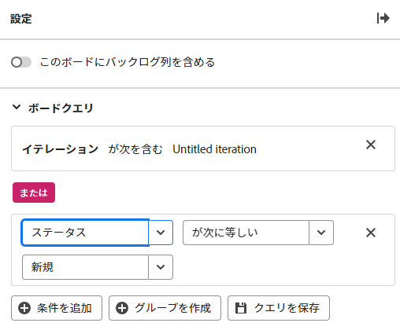

# ワークストリームボード上のバックログの設定

ワークストリーム内のボードにバックログ列を表示することを選択し、ワークストリームカードリストからボードバックログに取り込まれるカードの問合せを定義できます。 これらのオプションは、スタンドアロンボードでは使用できません。 スタンドアロンボードに取り込みカラムを追加する方法については、 [ボードに吸気柱を追加する](/help/quicksilver/agile/use-boards-agile-planning-tools/add-intake-column-to-board.md).

## アクセス要件

この記事の手順を実行するには、次のアクセス権が必要です。

<table style="table-layout:auto"> 
 <col> 
 </col> 
 <col> 
 </col> 
 <tbody> 
  <tr> 
   <td role="rowheader"><strong>[!DNL Adobe Workfront] 計画*</strong></td> 
   <td> 
任意
 </td> 
  </tr> 
  <tr> 
   <td role="rowheader"><strong>[!DNL Adobe Workfront] ライセンス*</strong></td> 
   <td> 
[!UICONTROL リクエスト ] 以降
 </td> 
  </tr> 
 </tbody> 
</table>

&#42;ご利用のプラン、ライセンスの種類、アクセス権を確認するには、 [!DNL Workfront] 管理者。

## ワークストリームボード上のバックログの設定

{{step1-to-boards}}

1. 作業するワークストリームを開きます。 ワークストリームを開くには、 [!UICONTROL **ワークストリームを表示**].
1. ワークストリーム内の任意のボードをクリックして開きます。
1. クリック [!UICONTROL **設定**] をクリックして、設定パネルを開きます。
1. オンにする [!UICONTROL **このボードにバックログ列を含める**].

   ボードの左側にバックログ列が追加されます。 クエリを適用するまで空白のままです。

1. 展開 [!UICONTROL **バックログクエリ**].

   >[!NOTE]
   >
   >デフォルトのクエリがバックログに既に適用されていて、カードリストの中で、反復に属さず、完了ステータスにないすべての作業項目が表示されている可能性があります。

1. クリック [!UICONTROL **条件を追加**] 「空の」フィールドをクリックします。
1. クエリを実行するフィールドを選択します。

   カードのデフォルトのフィールドから選択できます。

1. クエリ修飾子を選択します。

   修飾子のオプションは、適用できるフィールドによって異なります。 例えば、「名前」フィールドには、修飾子の選択肢として「次より大きい」または「次より小さい」はありません。これらの修飾子は数値にのみ適用されます。

1. 値を選択します。

   この値は、修飾子として「exists」または「not exists」を使用する場合は使用できません。

   例えば、「期限」と「存在する」を選択した場合、バックログには期限が割り当てられたカードが表示されます。 期限のないカードは、バックログに取り込まれません。

1. （オプション）「 [!UICONTROL **条件を追加**] をクエリに追加します。

   

1. （オプション）「 [!UICONTROL **グループ化**] をクリックして、OR 演算子で最初の条件に接続された条件のグループを追加します。
1. クリック [!UICONTROL **クエリを保存**].

   クエリが適用され、条件を満たすカードが「バックログ」列に表示されます。
