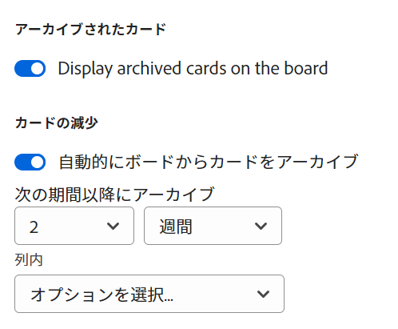

# カードのフォールオフを設定

カードをスケジュールに従ってアーカイブしたり、ボードから「フォールオフ」したりするようにボードを設定できます。 特定の列にカードを設定して、一定の日数または週数でボードから外れるようにすることができます。

カードがボードから外れると、アーカイブされます。 フィルター付きのアーカイブ済みカードを表示できます。 詳しくは、 [ボードでのフィルターと検索](/help/quicksilver/agile/get-started-with-boards/filter-search-in-board.md).

## アクセス要件

この記事の手順を実行するには、次のアクセス権が必要です。

<table style="table-layout:auto"> 
 <col> 
 </col> 
 <col> 
 </col> 
 <tbody> 
  <tr> 
   <td role="rowheader"><strong>[!DNL Adobe Workfront] 計画*</strong></td> 
   <td> 
任意
 </td> 
  </tr> 
  <tr> 
   <td role="rowheader"><strong>[!DNL Adobe Workfront] ライセンス*</strong></td> 
   <td> 
[!UICONTROL リクエスト ] 以降
 </td> 
  </tr> 
 </tbody> 
</table>

&#42;ご利用のプラン、ライセンスの種類、アクセス権を確認するには、 [!DNL Workfront] 管理者。

## カードのフォールオフを設定

1. 次をクリック： **[!UICONTROL メインメニュー]** アイコン  右上隅に [!DNL Adobe Workfront]を選択し、「 **[!UICONTROL ボード]**.
1. ボードにアクセスします。 詳しくは、 [ボードの作成または編集](../../agile/get-started-with-boards/create-edit-board.md).
1. クリック **[!UICONTROL 設定]** をクリックして、設定パネルを開きます。
1. 展開 **[!UICONTROL カード]**.
1. オンにする **[!UICONTROL ボードからカードを自動的にアーカイブ]**.

   

1. カードをボードからアーカイブするタイミングを選択します。 最大 8 週間または最大 60 日まで選択できます。

   日付は、カードが最後に変更された日時から決定されます。

1. カードを削除する列を選択します。
1. クリック **[!UICONTROL 保存]** をクリックします。
1. クリック **[!UICONTROL 設定を非表示]** 閉じる [!UICONTROL 設定] パネル。 設定は、ボードを更新すると自動的に適用されます。
