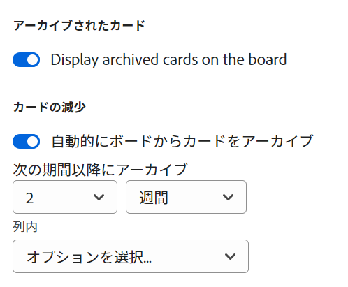

# カードの減少を設定する

カードをスケジュールに従ってアーカイブしたり、ボードから「フォールオフ」したりするようにボードを設定できます。 特定の列にカードを設定して、一定の日数または週数でボードから外れるように設定できます。

カードがボードから外れると、そのカードはアーカイブされます。 フィルター付きのアーカイブ済みカードを表示できます。 詳しくは、[フィルタリングおよびボード内で検索](/help/quicksilver/agile/get-started-with-boards/filter-search-in-board.md)を参照してください。

## アクセス要件

+++ 展開すると、この記事の機能のアクセス要件が表示されます。

<table style="table-layout:auto"> 
 <col> 
 <col> 
 <tbody> 
  <tr> 
   <td role="rowheader">Adobe Workfront パッケージ</td> 
   <td> 
任意
 </td> 
  </tr> 
  <tr> 
   <td role="rowheader">Adobe Workfront プラン</td> 
   <td> 
   
コントリビューター以上
 
   
リクエスト以上

   </td> 
  </tr> 
 </tbody> 
</table>

詳しくは、[Workfront ドキュメントのアクセス要件](/help/quicksilver/administration-and-setup/add-users/access-levels-and-object-permissions/access-level-requirements-in-documentation.md)を参照してください。

+++

## カードの減少を設定する

{{step1-to-boards}}

1. ボードにアクセスします。 詳しくは、[ボードの作成または編集](../../agile/get-started-with-boards/create-edit-board.md)を参照してください。
1. ボードの右側の「**[!UICONTROL 設定]**」をクリックして、設定パネルを開きます。
1. 「**[!UICONTROL カード]**」を展開します。
1. **[!UICONTROL ボードからカードを自動的にアーカイブ]**&#x200B;オンにします。

   

1. カードをボードからアーカイブするタイミングを選択します。 最大 8 週間または最大 60 日まで選択できます。

   日付は、カードが最後に変更された日から決定されます。

1. カードを削除する列を選択します。
1. 確認メッセージで「**[!UICONTROL 保存]**」をクリックします。
1. 「**[!UICONTROL 設定を非表示]**」をクリックして「[!UICONTROL 設定]」パネルを閉じます。 設定は、ボードを更新すると自動的に適用されます。
