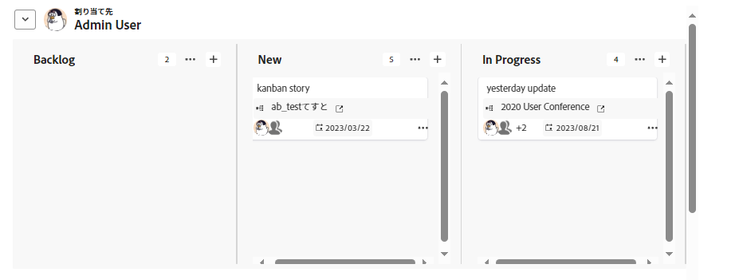

# ボード上でのグループの使用

ボード上のカードは、担当者またはタグでグループ化できます。 グループ化するオプションを選択すると、カードはスイムレーン形式で表示されます。 未割り当てのカードやタグのないカードは、独自のスイムレーンに表示されます。

>[!NOTE]
>
>取り込みカラム内のカードはグループに含まれません。 インテークカラムについて詳しくは、 [ボードに吸気柱を追加する](/help/quicksilver/agile/use-boards-agile-planning-tools/add-intake-column-to-board.md).

## アクセス要件

この記事の手順を実行するには、次のアクセス権が必要です。

<table style="table-layout:auto"> 
 <col> 
 </col> 
 <col> 
 </col> 
 <tbody> 
  <tr> 
   <td role="rowheader"><strong>[!DNL Adobe Workfront] 計画*</strong></td> 
   <td> 
任意
 </td> 
  </tr> 
  <tr> 
   <td role="rowheader"><strong>[!DNL Adobe Workfront] ライセンス*</strong></td> 
   <td> 
[!UICONTROL リクエスト ] 以降
 </td> 
  </tr> 
 </tbody> 
</table>

&#42;ご利用のプラン、ライセンスの種類、アクセス権を確認するには、 [!DNL Workfront] 管理者。

## ボード上のカードのグループ化

1. 次をクリック： **[!UICONTROL メインメニュー]** アイコン  ～の右上隅に [!DNL Adobe Workfront]を選択し、次に **[!UICONTROL ボード]**.
1. ボードにアクセスします。 詳しくは、 [ボードの作成または編集](../../agile/get-started-with-boards/create-edit-board.md).
1. クリック **[!UICONTROL グループ化]** をクリックして、ボードの左側にあるグループパネルを開きます。

   >[!NOTE]
   >
   >グループ化のデフォルト設定は次のとおりです。 **[!UICONTROL なし]**. このオプションを選択すると、いつでもグループを削除して、ボード上の列のみを表示できます。

1. カードをグループ化するには、「 」を選択します。 **[!UICONTROL 割り当て先]** または **[!UICONTROL タグ]**.

   カードは自動的にグループ化されます。 グループ名の横にある矢印をクリックして、グループを折りたたんで展開します。

   

1. カードを別のグループに移動した場合の動作を選択します。

   * **[!UICONTROL 割り当て先に追加] / [!UICONTROL タグに追加]:** 新しいグループの担当者またはタグが、カード上の担当者またはタグの既存のリストに追加されます。
   * **[!UICONTROL 割り当て先の上書き] / [!UICONTROL タグの上書き]:** 新しいグループの担当者またはタグは、他のすべての担当者またはタグより優先され、カード上の唯一の担当者またはタグになります。

   ![[!UICONTROL グループ — オプション別]](assets/group-by-rail.png)

1. クリック **[!UICONTROL グループを非表示]** をクリックして、グループパネルを非表示にし、ボード全体を表示します。
