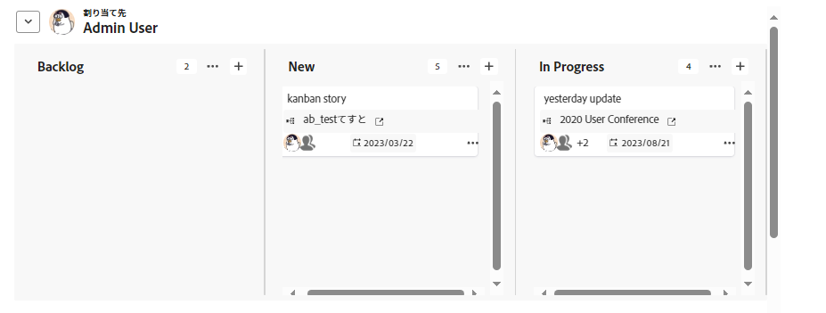

# ボードでのグループの使用

ボード上のカードは、担当者またはタグでグループ化できます。 グループ化のオプションを選択すると、カードがスイムレーン形式で表示されます。 未割り当てのカードまたはタグのないカードは、独自のスイムレーンに表示されます。

>[!NOTE]
>
>取り込み列内のカードはグループには含まれず、グループが適用されると取り込み列は非表示になります。 取り込み列について詳しくは、[ボードに取り込み列を追加](/help/quicksilver/agile/use-boards-agile-planning-tools/add-intake-column-to-board.md)を参照してください。

## アクセス要件

+++ 展開すると、この記事の機能のアクセス要件が表示されます。

<table style="table-layout:auto"> 
 <col> 
 <col> 
 <tbody> 
  <tr> 
   <td role="rowheader">Adobe Workfront パッケージ</td> 
   <td> 
任意
 </td> 
  </tr> 
  <tr> 
   <td role="rowheader">Adobe Workfront プラン</td> 
   <td> 
   
コントリビューター以上
 
   
リクエスト以上

   </td> 
  </tr> 
 </tbody> 
</table>

詳しくは、[Workfront ドキュメントのアクセス要件](/help/quicksilver/administration-and-setup/add-users/access-levels-and-object-permissions/access-level-requirements-in-documentation.md)を参照してください。

+++

## ボードのカードをグループ化

{{step1-to-boards}}

1. ボードにアクセスします。 詳しくは、[ボードの作成または編集](../../agile/get-started-with-boards/create-edit-board.md)を参照してください。
1. **[!UICONTROL グループ]**&#x200B;をクリックして、ボードの左側にあるグループパネルを開きます。

   >[!NOTE]
   >
   >グループのデフォルト設定は&#x200B;**[!UICONTROL なし]**&#x200B;です。 グループを削除し、ボード上の列のみを表示するには、いつでもこのオプションを選択できます。

1. カードをグループ化するには、**[!UICONTROL 割り当て先]**&#x200B;または&#x200B;**[!UICONTROL タグ]**&#x200B;を選択します。

   カードは自動的にグループ化されます。 グループ名の横にある矢印をクリックして、グループを折りたたんだり展開したりします。

   

1. カードを別のグループに移動した場合の動作を選択します。

   * **[!UICONTROL 割り当て先に追加] / [!UICONTROL タグに追加]：**&#x200B;新しいグループの割り当て先またはタグが、カード上の割り当て先またはタグの既存のリストに追加されます。
   * **[!UICONTROL 割り当て先を上書き] / [!UICONTROL タグを上書き]：**&#x200B;新しいグループの割り当て先またはタグは、他のすべての割り当て先またはタグを上書きし、カード上の唯一の割り当て先またはタグになります。

   ![[!UICONTROL オプション別グループ化]](assets/group-by-rail.png)

1. 「**[!UICONTROL グループを非表示]**」をクリックして、グループパネルを非表示にし、ボード全体を表示します。
