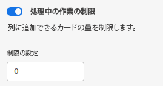

# の管理 [!UICONTROL 作業中] (WIP) ボード上限

次の項目を設定できます。 [!UICONTROL 作業中] (WIP) ボード上の各列の制限。

WIP 限度は単に視覚的な警告であり、各列に設定した限度を超える品目が表示されることを制限しません。

## アクセス要件

この記事の手順を実行するには、次のアクセス権が必要です。

<table style="table-layout:auto"> 
 <col> 
 </col> 
 <col> 
 </col> 
 <tbody> 
  <tr> 
   <td role="rowheader"><strong>[!DNL Adobe Workfront] 計画*</strong></td> 
   <td> 
任意
 </td> 
  </tr> 
  <tr> 
   <td role="rowheader"><strong>[!DNL Adobe Workfront] ライセンス*</strong></td> 
   <td> 
[!UICONTROL リクエスト ] 以降
 </td> 
  </tr> 
 </tbody> 
</table>

&#42;ご利用のプラン、ライセンスの種類、アクセス権を確認するには、 [!DNL Workfront] 管理者。

## WIP の制限を列に設定

1. 次をクリック： **[!UICONTROL メインメニュー]** アイコン  右上隅に [!DNL Adobe Workfront]を選択し、「 **[!UICONTROL ボード]**.
1. ボードにアクセスします。 詳しくは、 [ボードの作成または編集](../../agile/get-started-with-boards/create-edit-board.md).
1. WIP 制限を追加する列を見つけます。

   新しい列を追加するには、 [ボード列を管理](/help/quicksilver/agile/get-started-with-boards/manage-board-columns.md).

1. 次をクリック： **[!UICONTROL 詳細]** 列のメニューで、「 」を選択します。 **[!UICONTROL 編集]** をクリックして、「設定」領域を開きます。
1. の下 [!UICONTROL 列ポリシー]、を有効にします。 **[!UICONTROL 作業中] 制限** ポリシーを使用して、列に追加できるカードの数を制限します。
1. 制限値を **[!UICONTROL 制限を設定]** フィールドに入力します。

   

   カードの数と制限が列の上部に表示されます。 列に制限を超えるカードが含まれている場合、カウンターが赤に変わります。

   

1. クリック **[!UICONTROL 閉じる]** 出る [!UICONTROL 設定] をクリックし、列とそのカードを表示します。
