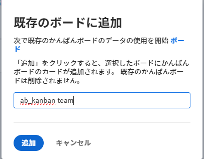
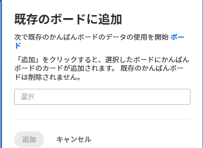

# アジャイルチームかんばんカードをWorkfrontボードに移行

作業項目をアジャイルチームかんばんボードから新しいまたは既存のWorkfrontボードに移行できます。 移行を実行すると、かんばんボード上のすべてのカードがWorkfrontボードにコピーされます。 特定のカードを選択することはできません。

Workfrontボードでのカードの配置は、列ポリシーに基づいています。 ( 例えば、ポリシーを使用すると、ステータスが「処理中」のすべてのカードを特定の列に移動できます。 列ポリシーの詳細については、 [ボード列を管理](/help/quicksilver/agile/get-started-with-boards/manage-board-columns.md).) ポリシーがない場合や、カードがポリシーと一致しない場合、カードはボードの左端の列に配置されます。 現時点では、レガシーボードの「バックログ」列のカードはWorkfrontボードに追加されません。

カードはアジャイルチームかんばんボードからは削除されず、カードの状態の変更は両方のボードに同期します。 Workfrontボードに切り替える準備が整うまで、両方のボードをアクティブにしておくことができます。

## アクセス要件

この記事の手順を実行するには、次のアクセス権が必要です。

<table style="table-layout:auto">
 <col>
 </col>
 <col>
 </col>
 <tbody>
  <tr>
   <td role="rowheader"><strong>[!DNL Adobe Workfront] 計画*</strong></td>
   <td> 
任意
 </td>
  </tr>
  <tr>
   <td role="rowheader"><strong>[!DNL Adobe Workfront] ライセンス*</strong></td>
   <td> 
[!UICONTROL リクエスト ] 以降
 </td>
  </tr>
 </tbody>
</table>

&#42;ご利用のプラン、ライセンスの種類、アクセス権を確認するには、 [!DNL Workfront] 管理者。

## かんばんカードを新しいボードに移行

{{step1-to-team}}

1. かんばんボードにアクセスします。
1. クリック [!UICONTROL **ボードに追加**] を選択し、 [!UICONTROL **新しいボード**].
1. 次の日： [!UICONTROL 新しいボードに追加] ダイアログで、新しいボードの名前（現在のボードの名前）を入力します [!UICONTROL かんばん] ボードが自動的に表示されます )、をクリックします。 [!UICONTROL **追加**].

   

1. （オプション）表示される成功メッセージで、リンクをクリックして新しいボードを開きます。

## 既存のボードへのかんばんカードの移行

{{step1-to-team}}

1. かんばんボードにアクセスします。
1. クリック [!UICONTROL **ボードに追加**] を選択し、 [!UICONTROL **既存のボード**].
1. 次の日： [!UICONTROL 既存のボードに追加] ダイアログで、カードを移行するボードを検索して選択します。 次に、「 [!UICONTROL **追加**].

   

1. （オプション）表示される成功メッセージで、リンクをクリックしてボードを開きます。
