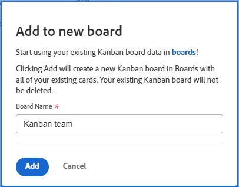

# アジャイルチームのかんばんカードの Workfront ボードへの移行

作業項目をアジャイルチームのカンバンボードから新規または既存のWorkfront ボードに移行できます。 移行を実行すると、かんばんボード上のすべてのカードが Workfront ボードにコピーされます。 特定のカードを選択することはできません。

Workfront ボードでのカードの配置は、列ポリシーに基づいています。 （例えば、ポリシーを使用すると、ステータスが「処理中」のすべてのカードを特定の列に移動できます。 列ポリシーについて詳しくは、[&#x200B; ボード列の管理](/help/quicksilver/agile/get-started-with-boards/manage-board-columns.md)を参照してください。） ポリシーがない場合、またはカードがポリシーと一致しない場合、カードはボードの一番左の列に配置されます。 現時点では、レガシーボードのバックログ列のカードは Workfront ボードに追加されません。

カードはアジャイルチームのカンバンボードから削除されないため、カードのステータスの変更は両方のボードに同期されます。 Workfront ボードに切り替える準備が整うまで、両方のボードをアクティブにしておくことができます。

## アクセス要件

+++ 展開すると、この記事の機能のアクセス要件が表示されます。

<table style="table-layout:auto"> 
 <col> 
 <col> 
 <tbody> 
  <tr> 
   <td role="rowheader">Adobe Workfront パッケージ</td> 
   <td> 
任意
 </td> 
  </tr> 
  <tr> 
   <td role="rowheader">Adobe Workfront プラン</td> 
   <td> 
   
コントリビューター以上
 
   
リクエスト以上

   </td> 
  </tr> 
 </tbody> 
</table>

詳しくは、[Workfront ドキュメントのアクセス要件](/help/quicksilver/administration-and-setup/add-users/access-levels-and-object-permissions/access-level-requirements-in-documentation.md)を参照してください。

+++

## かんばんカードを新しいボードに移行する

{{step1-to-team}}

1. かんばんボードにアクセスします。
1. 「[!UICONTROL **ボードに追加**]」をクリックして、「[!UICONTROL **新しいボード**]」を選択します。
1. [!UICONTROL 新しいボードに追加]ダイアログで、新しいボードの名前を入力し（現在の[!UICONTROL かんばん]ボードの名前が自動的に表示されます）、「[!UICONTROL **追加**]」をクリックします。

   

1. （オプション）表示される成功メッセージで、リンクをクリックして新しいボードを開きます。

## かんばんカードを既存のボードに移行する

{{step1-to-team}}

1. かんばんボードにアクセスします。
1. 「[!UICONTROL **ボードに追加**]」をクリックして、「[!UICONTROL **既存のボード**]」を選択します。
1. [!UICONTROL 既存のボードに追加]ダイアログで、カードを移行するボードを検索して選択します。 次に、「[!UICONTROL **追加**]」をクリックします。

   

1. （オプション）表示される成功メッセージで、リンクをクリックしてボードを開きます。
