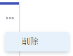

# [!UICONTROL かんばん]ボードからストーリーまたはイシューを削除

[!UICONTROL かんばん]ボードからストーリーまたはイシューを削除できます。ストーリーやイシューを削除すると、30 日間ごみ箱に移動され、システム管理者のみが復元できます。

## アクセス要件

この記事の手順を実行するには、次のアクセス権が必要です。

<table style="table-layout:auto"> 
 <col> 
 </col> 
 <col> 
 </col> 
 <tbody> 
  <tr> 
   <td role="rowheader"><strong>[!DNL Adobe Workfront] プラン*</strong></td> 
   <td> 
任意
 </td> 
  </tr> 
  <tr> 
   <td role="rowheader"><strong>[!DNL Adobe Workfront] ライセンス*</strong></td> 
   <td> 
[!UICONTROL Work] 以上
 </td> 
  </tr> 
  <tr> 
   <td role="rowheader"><strong>アクセスレベル設定*</strong></td> 
   <td> 
[!UICONTROL Worker] 以上
 
メモ：まだアクセス権がない場合は、アクセスレベルに追加の制限が設定されていないかどうか [!DNL Workfront] 管理者にお問い合わせください。[!DNL Workfront] 管理者がアクセスレベルを変更する方法について詳しくは、<a href="../../administration-and-setup/add-users/configure-and-grant-access/create-modify-access-levels.md" class="MCXref xref">カスタムアクセスレベルの作成または変更</a>を参照してください。
 </td> 
  </tr> 
  <tr> 
   <td role="rowheader"><strong>オブジェクト権限</strong></td> 
   <td> 
タスクまたはイシューへの[!UICONTROL Manage]アクセス権
 
追加のアクセス権のリクエストについて詳しくは、<a href="../../workfront-basics/grant-and-request-access-to-objects/request-access.md" class="MCXref xref">オブジェクトへのアクセス権のリクエスト</a>を参照してください。
 </td> 
  </tr> 
 </tbody> 
</table>

&#42;ご利用のプラン、ライセンスの種類、アクセス権を確認するには、[!DNL Workfront] 管理者にお問い合わせください。

## ストーリーまたはイシューの削除

1. [!DNL Adobe Workfront] の右上隅にある&#x200B;**[!UICONTROL メインメニュー]**&#x200B;アイコン 、「**[!UICONTROL ボード]**」の順にクリックします。

1. （オプション）**[!UICONTROL チームの切り替え]**&#x200B;アイコン  をクリックし、ドロップダウンメニューから新しい[!UICONTROL かんばん]チームを選択するか、検索バーでチームを検索します。
1. ストーリーまたはイシューの&#x200B;**[!UICONTROL その他]**&#x200B;アイコンをクリックし、「**[!UICONTROL 削除]**」を選択します。

   

1. 確認メッセージで、「**[!UICONTROL はい、削除します]**」をクリックします。
