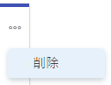

# [!UICONTROL かんばん]ボードからストーリーまたはイシューを削除

[!UICONTROL かんばん]ボードからストーリーまたはイシューを削除できます。 ストーリーやイシューを削除すると、30 日間ごみ箱に移動され、システム管理者のみが復元できます。

## アクセス要件

+++ 展開すると、この記事の機能のアクセス要件が表示されます。

<table style="table-layout:auto"> 
 <col> 
 </col> 
 <col> 
 </col> 
 <tbody> 
  <tr> 
   <td role="rowheader">Adobe Workfront パッケージ</td> 
   <td> 
任意
 </td> 
  </tr> 
  <tr> 
   <td role="rowheader">Adobe Workfront プラン</td> 
   <td> 
標準
 
   
Work またはそれ以上
 </td> 
  </tr>
  <tr> 
   <td role="rowheader">オブジェクト権限</td> 
   <td>タスクまたは問題へのアクセスを管理します </td> 
  </tr> 
 </tbody> 
</table>

詳しくは、[Workfront ドキュメントのアクセス要件](/help/quicksilver/administration-and-setup/add-users/access-levels-and-object-permissions/access-level-requirements-in-documentation.md)を参照してください。

+++

## ストーリーまたはイシューの削除

{{step1-to-team}}

1. （オプション）**[!UICONTROL チームの切り替え]**&#x200B;アイコン  をクリックし、ドロップダウンメニューから新しい[!UICONTROL かんばん]チームを選択するか、検索バーでチームを検索します。
1. ストーリーまたはイシューの&#x200B;**[!UICONTROL その他]**&#x200B;アイコンをクリックし、「**[!UICONTROL 削除]**」を選択します。

   

1. 確認メッセージで、「**[!UICONTROL はい、削除します]**」をクリックします。
