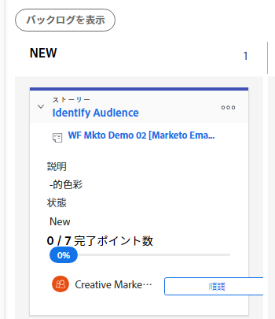

# ストーリー情報の編集

## 表示および編集できる情報について {#understand-what-information-can-be-viewed-and-edited}

ストーリータイルを[!UICONTROL かんばん]ボードで表示する場合、次の表の情報が使用できます。ほとんどの情報は、ストーリータイルから直接、インラインで編集できます。

<table style="table-layout:auto"> 
 <col> 
 <col> 
 <col> 
 <thead> 
  <tr> 
   <th><strong>情報</strong> </th> 
   <th><strong>表示されている</strong> </th> 
   <th><strong>インラインで編集可能</strong> </th> 
  </tr> 
 </thead> 
 <tbody> 
  <tr> 
   <td>タスクまたはイシューへの直接リンクを含むストーリー名</td> 
   <td>✓</td> 
   <td> </td> 
  </tr> 
  <tr> 
   <td> 
プロジェクトへの直接リンクを含むプロジェクト名
 </td> 
   <td>✓</td> 
   <td> </td> 
  </tr> 
  <tr> 
   <td> 
ストーリー上で完了したポイントまたは時間の数、およびストーリーに割り当てられたポイントまたは時間の数 これらの数値は、それぞれのストーリーの完了率を計算して表示するために使用されます。
 </td> 
   <td>✓</td> 
   <td> </td> 
  </tr> 
  <tr> 
   <td> 
それぞれのストーリーおよびイシューの [!UICONTROL Percent Complete]。 イテレーションの [!UICONTROL The Percent Complete] は、それぞれのストーリーの [!UICONTROL Percent Complete] に基づいて計算されます。 
 
ストーリーまたはイシューの [!UICONTROL Percent Complete] を更新する際に、0 と 100 の間の任意の数を選択できます。
 </td> 
   <td>✓</td> 
   <td>✓</td> 
  </tr> 
  <tr> 
   <td> 
ストーリーの担当者
 </td> 
   <td>✓</td> 
   <td>✓</td> 
  </tr> 
  <tr> 
   <td> 
タイルのカラーまたはカテゴリ
 </td> 
   <td>✓</td> 
   <td>✓</td> 
  </tr> 
  <tr> 
   <td> 
<a href="../../reports-and-dashboards/reports/reporting-elements/views-overview.md" class="MCXref xref">[!DNL Adobe Workfront]</a> のビューの概要の「アジャイルビューの作成とカスタマイズ」で説明されている、アジャイルビューの修正によってアジャイルビューに追加された可能性がある追加フィールド（カスタムフィールドを含む）。
 </td> 
   <td>✓</td> 
   <td>✓</td> 
  </tr> 
 </tbody> 
</table>

## アクセス要件

この記事の手順を実行するには、次のアクセス権が必要です。

<table style="table-layout:auto"> 
 <col> 
 <col> 
 <tbody> 
  <tr> 
   <td role="rowheader"><strong>[!DNL Adobe Workfront] プラン*</strong></td> 
   <td> 
任意
 </td> 
  </tr> 
  <tr> 
   <td role="rowheader"><strong>[!DNL Adobe Workfront] ライセンス*</strong></td> 
   <td> 
[!UICONTROL Work] 以上
 </td> 
  </tr> 
  <tr> 
   <td role="rowheader"><strong>アクセスレベル設定*</strong></td> 
   <td> 
[!UICONTROL Worker] 以上
 
メモ：それでもアクセスできない場合は、アクセスレベルに追加の制限が設定されていないかどうかを [!DNL Workfront] 管理者にお問い合わせください。[!DNL Workfront] 管理者がアクセスレベルを変更する方法について詳しくは、<a href="../../administration-and-setup/add-users/configure-and-grant-access/create-modify-access-levels.md" class="MCXref xref">カスタムアクセスレベルの作成または変更</a>を参照してください。
 </td> 
  </tr> 
 </tbody> 
</table>

&#42;ご利用のプラン、ライセンスタイプ、アクセス権を確認するには、[!DNL Workfront] 管理者にお問い合わせください。

## ストーリータイルの情報の表示と編集

1. [!DNL Adobe Workfront]の右上隅にある&#x200B;*[!UICONTROL *メインメニュー]**アイコンを選択し、次に「**[!UICONTROL チーム]**」をクリックします。

1. （オプション）**[!UICONTROL チームを切り替え]**&#x200B;アイコン  をクリックし、続いてドロップダウンメニューから新しいかんばんチームを選択するか、検索バーでチームを検索します。

1. [!UICONTROL かんばん]ボードに移動します。
1. ストーリータイルを展開して、ストーリーに関連するすべてのフィールドを表示します。

   

1. （オプション）フィールドを編集するには、フィールドをクリックして、変更を加えます。\
   ストーリータイルを編集するには、タスクまたはイシューに対する[!UICONTROL 編集]権限が必要です。\
   それぞれのフィールドと編集可能かどうかについて詳しくは、[表示および編集できる情報について](#understand-what-information-can-be-viewed-and-edited)を参照してください。

>[!NOTE]
>
>[!UICONTROL 完了率]を変更する場合は、0 から 100 の間の数値を入力する必要があります。フィールドは移動できるスライダーではありません。
