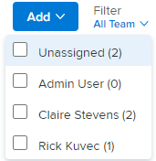

# [!UICONTROL かんばん]ボード上でユーザーでフィルタリング

[!UICONTROL かんばん]ボードでフィルターを使用して、どの作業アイテムが他のユーザーに関連付けられ、どの作業アイテムが未割り当てであるかを確認できます。

## アクセス要件

+++ 展開すると、この記事の機能のアクセス要件が表示されます。

<table style="table-layout:auto"> 
 <col> 
 </col> 
 <col> 
 </col> 
 <tbody> 
  <tr> 
   <td role="rowheader">Adobe Workfront パッケージ</td> 
   <td> 
任意
 </td> 
  </tr> 
  <tr> 
   <td role="rowheader">Adobe Workfront プラン</td> 
   <td> 
標準
 
   
Work またはそれ以上
 </td> 
  </tr>
 </tbody> 
</table>

詳しくは、[Workfront ドキュメントのアクセス要件](/help/quicksilver/administration-and-setup/add-users/access-levels-and-object-permissions/access-level-requirements-in-documentation.md)を参照してください。

+++

## かんばんボードからユーザーでフィルター

{{step1-to-team}}

1. （オプション）**[!UICONTROL チームの切り替え]**&#x200B;アイコン  をクリックしたあと、ドロップダウンメニューから新しいかんばんチームを選択するか、検索バーでチームを検索します。

1. [!UICONTROL かんばん]ボードに移動します。
1. [!UICONTROL かんばん]ボードの右側にある[!UICONTROL フィルター]ドロップダウンメニューをクリックします。
1. 1 人以上のユーザーか、「**[!UICONTROL 未割り当て]**」を選択します。

   >[!NOTE]
   >
   >* 列の合計は、フィルタリングの結果に基づいて変更されることはありません。 列の合計は、ボード上のすべての作業アイテムの合計を表示します。 デフォルトでは最大 50 枚のカードが表示されますが、「**[!UICONTROL さらに表示]**」をクリックして、追加のカードを表示することができます。
   >* フィルターは[!UICONTROL バックログ]列には適用されません。

   
